# Advanced Layouts


[Source](https://schochastics.github.io/R4SNA/visualization/ggraph-basics.html)

``` r
libraries <- list(
  "igraph", "ggraph", "graphlayouts", "patchwork",
  "networkdata", "ggforce", "tidyverse"
)
invisible(lapply(libraries, library, character.only = TRUE))
```

# Data Prep

``` r
data("got")

gotS1 <- got[[1]]

got_palette <- c(
  "#1A5878",
  "#C44237",
  "#AD8941",
  "#E99093",
  "#50594B",
  "#8968CD",
  "#9ACD32"
)

# compute a clustering for node colors
V(gotS1)$clu <- as.character(membership(cluster_louvain(gotS1)))

# compute degree as node size
V(gotS1)$size <- degree(gotS1)
```

# Large networks

`layout_with_stress()` works well up to ~20k nodes. Beyond that,
`layout_with_pdms()` or `layout_with_sparse_stree()` can be used.

# Concentric layouts

Circular layouts are generally not advisable.

``` r
ggraph(gotS1, layout = "circle") +
  geom_edge_link0(aes(edge_linewidth = weight), edge_color = "grey66") +
  geom_node_point(aes(fill = clu, size = size), shape = 21) +
  geom_node_text(aes(size = size, label = name), family = "serif") +
  scale_edge_width_continuous(range = c(0.2, 1.2)) +
  scale_size_continuous(range = c(1, 5)) +
  scale_fill_manual(values = got_palette) +
  coord_fixed() +
  theme_graph() +
  theme(legend.position = "none")
```

<div id="fig-circular-layout">

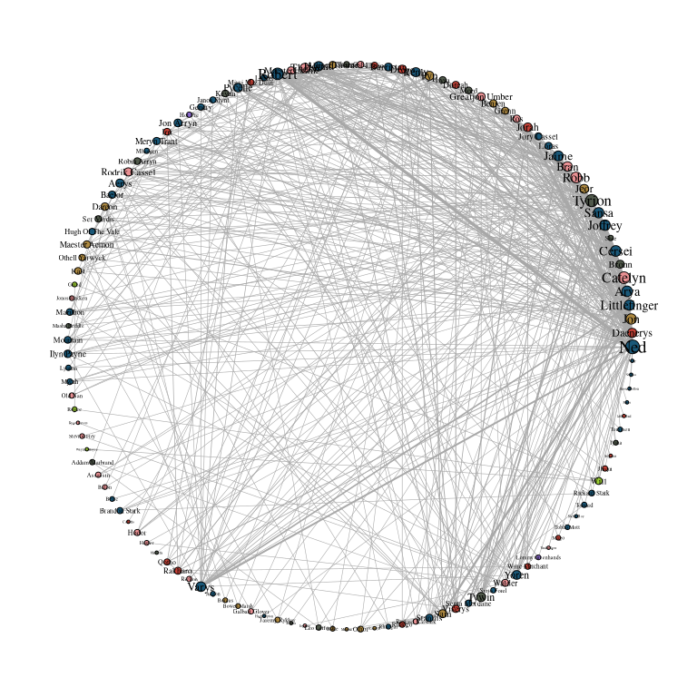

Figure 1: GoT network with a circular layout.

</div>

Concentric layouts can emphasize the position of certain nodes.

`layout_with_focus` allows to focus on a specific node and arrange all
other nodes concentrically. This layout focuses on Ned Stark.

The function coord_fixed() is used to always keep the aspect ratio at
one so that the circles always appear as a circle and not an ellipse.

``` r
ggraph(gotS1, layout = "focus", focus = 1) +
  geom_edge_link0(aes(edge_linewidth = weight), edge_color = "grey66") +
  geom_node_point(aes(fill = clu, size = size), shape = 21) +
  geom_node_text(
    aes(filter = (name == "Ned"), size = size, label = name),
    family = "serif"
  ) +
  scale_edge_width_continuous(range = c(0.2, 1.2)) +
  scale_size_continuous(range = c(1, 5)) +
  scale_fill_manual(values = got_palette) +
  coord_fixed() +
  theme_graph() +
  theme(legend.position = "none")  
```

<div id="fig-concentric-ned">

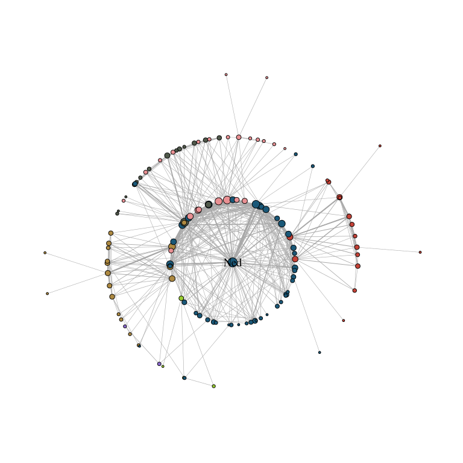

Figure 2: GoT network with concentric layout focused on Ned Stark.

</div>

Add circles.

``` r
ggraph(gotS1, layout = "focus", focus = 1) +
  draw_circle(col = "#00BFFF", use = "focus", max.circle = 3) +
  geom_edge_link0(aes(edge_linewidth = weight), edge_color = "grey66") +
  geom_node_point(aes(fill = clu, size = size), shape = 21) +
  geom_node_text(
    aes(filter = (name == "Ned"), size = size, label = name),
    family = "serif"
  ) +
  scale_edge_width_continuous(range = c(0.2, 1.2)) +
  scale_size_continuous(range = c(1, 5)) +
  scale_fill_manual(values = got_palette) +
  coord_fixed() +
  theme_graph() +
  theme(legend.position = "none")
```

<div id="fig-concentric-ned1">

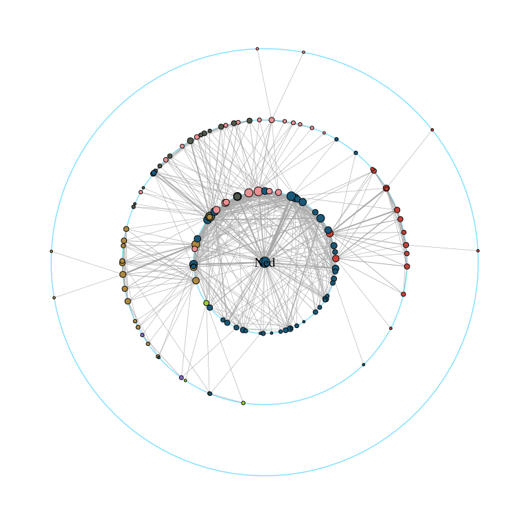

Figure 3: Concentric layout focused on Ned Stark with explicit circles
drawn.

</div>

`layout_with_centrality` creates a concentric layout where the most
central nodes are positioned in the center. This example uses the
weighted degree of the characters.

``` r
ggraph(gotS1, layout = "centrality", cent = strength(gotS1)) +
  geom_edge_link0(aes(edge_linewidth = weight), edge_color = "grey66") +
  geom_node_point(aes(fill = clu, size = size), shape = 21) +
  geom_node_text(aes(size = size, label = name), family = "serif") +
  scale_edge_width_continuous(range = c(0.2, 0.9)) +
  scale_size_continuous(range = c(1, 8)) +
  scale_fill_manual(values = got_palette) +
  coord_fixed() +
  theme_graph() +
  theme(legend.position = "none")
```

<div id="fig-concentric-weighted-deg">

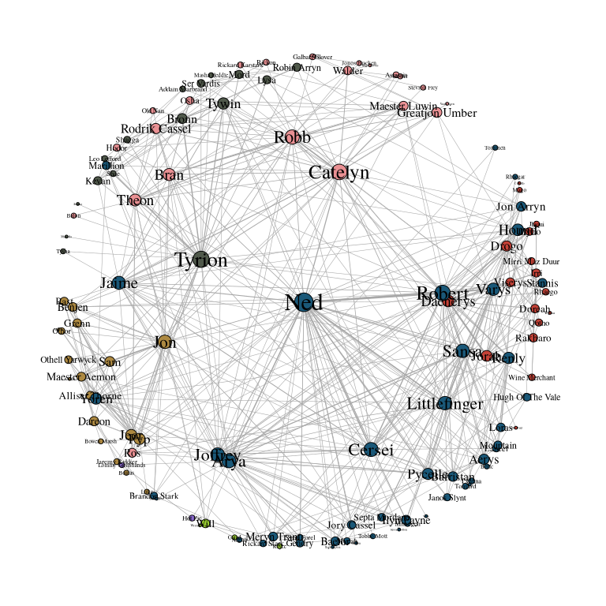

Figure 4: GoT network with concentric layout based on weighted degree
centrality.

</div>

# Backbone Layout

Many real-world networks have a small-world structure, meaning most
nodes are only a few steps apart. Visualizations become difficult
because of the dense structure. It can be useful to simplify the network
and highlight the most meaningful connections, focusing on the ties that
hold groups together.

The `graphlayouts` package offers `layout_as_backbone()` for this
purpose. To illustrate the algorithm, we create an artificial network
with a subtle group structure using `sample_islands()` from igraph.

``` r
set.seed(1108)
g <- sample_islands(9, 40, 0.4, 15)
```

Remove multiple edges

``` r
g <- simplify(g)
```

Assign the group membership as vertex attribute for coloring.

``` r
V(g)$grp <- as.character(rep(1:9, each = 40))
```

``` r
ggraph(g, layout = "stress") +
  geom_edge_link0(
    edge_color = "black",
    edge_linewidth = 0.1,
    edge_alpha = 0.5
  ) +
  geom_node_point(aes(fill = grp), shape = 21) +
  scale_fill_brewer(palette = "Set1") +
  theme_graph() +
  theme(legend.position = "none")
```

<div id="fig-island-stress">

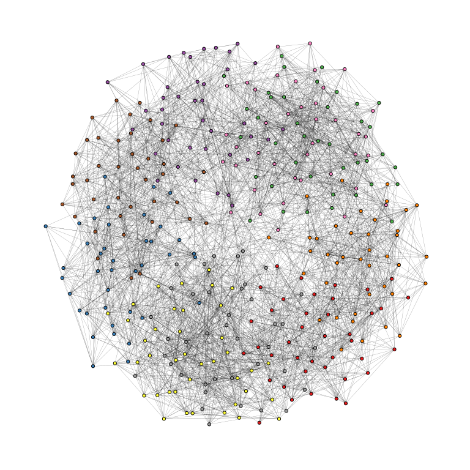

Figure 5: Island network drawn with the stress layout showing a hairball
structure.

</div>

The nine groups are not apparent in the hairball. `backbone` calculates
an embeddedness score for each vertex, and only keeps the top percent.

``` r
ggraph(g, layout = "backbone", keep = 0.4) +
  geom_edge_link0(edge_color = "grey66", edge_linewidth = 0.1) +
  geom_node_point(aes(fill = grp), shape = 21) +
  scale_fill_brewer(palette = "Set1") +
  scale_edge_color_manual(values = c(rgb(0, 0, 0, 0.3), rgb(0, 0, 0, 1))) +
  theme_graph() +
  theme(legend.position = "none")
```

<div id="fig-backbone-plot">

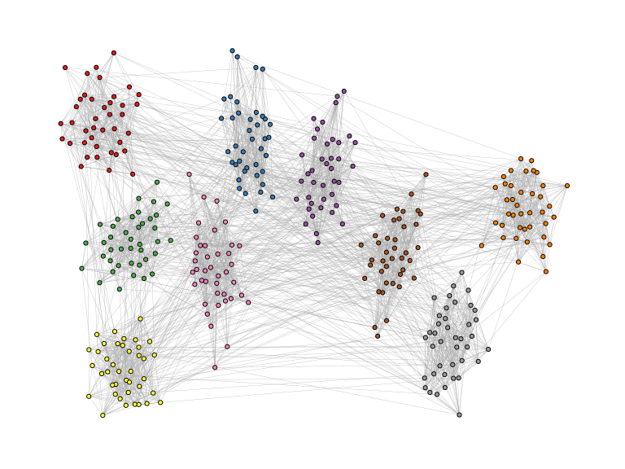

Figure 6: Island network rendered with the backbone layout.

</div>

# Longitudinal Networks

A series of snapshots need to be visualized in a way that individual
nodes are easy to trace.

The dataset consists of three networks with 50 students together with
their smoking behavior as a node attribute. The function
`layout_as_dynamic()` from `graphlayouts` can be used to visualize the
three networks. The implemented algorithm calculates a reference layout
which is a layout of the union of all networks and individual layouts
based on stress minimization and combines those in a linear combination
which is controlled by the `alpha` parameter. For `alpha = 1`, only the
reference layout is used and all graphs have the same layout. For
`alpha=0`, the stress layout of each individual graph is used. Values
in-between interpolate between the two layouts. The algorithm is not
directly usable with `ggraph`, so we need to calculate the layout
separately and then use the resulting coordinates in `ggraph` with the
“manual” layout.

``` r
xy <- layout_as_dynamic(s50, alpha = 0.2)
```

``` r
make_graph <- function(i) {
  ggraph(
    s50[[i]],
    layout = "manual",
    x = xy[[i]][, 1],
    y = xy[[i]][, 2]
  ) +
    geom_edge_link0(edge_linewidth = 0.6, edge_color = "grey66") +
    geom_node_point(shape = 21, aes(fill = as.factor(smoke)), size = 6) +
    geom_node_text(label = 1:50, repel = FALSE, color = "white", size = 4) +
    scale_fill_manual(
      values = c("forestgreen", "grey25", "firebrick"),
      guide = ifelse(i != 2, "none", "legend"),
      name = "smoking",
      labels = c("never", "occasionally", "regularly")
    ) +
    theme_graph() +
    theme(legend.position = "bottom") +
    labs(title = paste0("Wave ", i))
}

pList <- map(1:length(s50), make_graph)

wrap_plots(pList)
```

<div id="fig-static_plot">

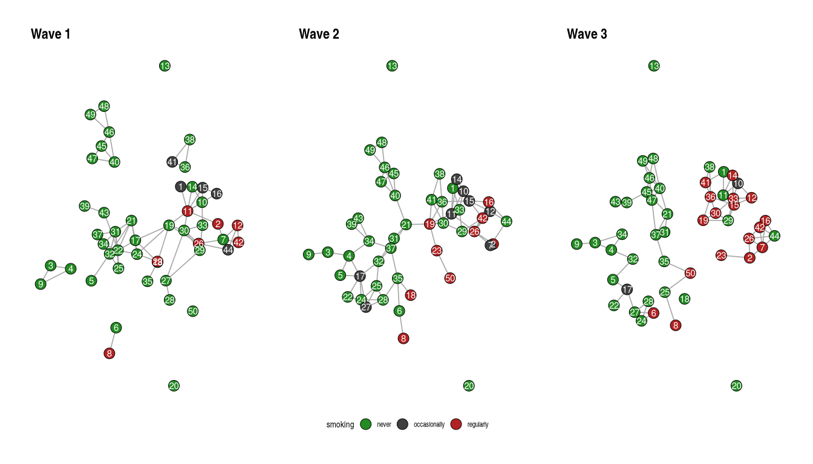

Figure 7: Longitudinal network of 50 students across three waves.

</div>

# Multilevel networks

A multilevel network consists of two (or more) levels with different
node sets and intra-level ties. For instance, one level could be
scientists and their collaborative ties, the second level are labs and
ties among them, and inter-level edges are the affiliations of
scientists and labs.

`layout_as_multilevel` assumes that a multilevel network has a vertex
attribute called `lvl` which holds the level information (1 or 2). There
are three versions.

Independent of which option is chosen, the algorithm internally produces
a 3D layout, where each level is positioned on a different y-plane. The
3D layout is then mapped to 2D with an isometric projection. The
parameters alpha and beta control the perspective of the projection. The
default values seem to work for many instances, but may not always be
optimal. As a rough guideline: beta rotates the plot around the y axis
(in 3D) and alpha moves the point of view up or down.

## Complete layout

Internally, the algorithm produces a constrained 3D stress layout (each
level on a different y plane) which is then projected to 2D. This layout
ignores potential differences in each level and optimizes only the
overall layout.

``` r
xy <- layout_as_multilevel(multilvl_ex, type = "all",
                           alpha = 25, beta = 45)
```

Draw edges with different aesthetics.

``` r
ggraph(multilvl_ex, "manual", x = xy[, 1], y = xy[, 2]) +
  geom_edge_link0(
    aes(filter = (node1.lvl == 1 & node2.lvl == 1)),
    edge_color = "firebrick3",
    alpha = 0.5,
    edge_linewidth = 0.3
  ) +
  geom_edge_link0(
    aes(filter = (node1.lvl != node2.lvl)),
    edge_color = "black",
    alpha = 0.5,
    edge_linewidth = 0.3
  ) +
  geom_edge_link0(
    aes(filter = (node1.lvl == 2 & node2.lvl == 2)),
    edge_color = "goldenrod",
    alpha = 0.5,
    edge_linewidth = 0.3
  ) +
  geom_node_point(aes(shape = as.factor(lvl)), fill = "grey25", size = 3) +
  scale_shape_manual(values = c(21, 22)) +
  theme_graph() +
  coord_cartesian(clip = "off", expand = TRUE) +
  theme(legend.position = "none")  
```

<div id="fig-multi-all-example">

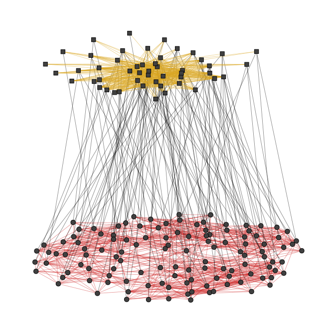

Figure 8: Multilevel network with a complete 3D stress layout.

</div>

## Seperate layouts for both levels

In our artificial network, level 1 has a hidden group structure and
level 2 has a core-periphery structure.

To use this layout option, set type = “separate” and specify two layout
functions with FUN1 and FUN2. You can change internal parameters of
these layout functions with named lists in the params1 and params2
argument. Note that this version optimizes inter-level edges only
minimally. The emphasis is on the intra-level structures.

``` r
xy <- layout_as_multilevel(
  multilvl_ex,
  type = "separate",
  FUN1 = layout_as_backbone,
  FUN2 = layout_with_stress,
  alpha = 25,
  beta = 45
)

cols2 <- c(
  "#3A5FCD",
  "#CD00CD",
  "#EE30A7",
  "#EE6363",
  "#CD2626",
  "#458B00",
  "#EEB422",
  "#EE7600"
)
```

``` r
ggraph(multilvl_ex, "manual", x = xy[, 1], y = xy[, 2]) +
  geom_edge_link0(
    aes(filter = (node1.lvl == 1 & node2.lvl == 1)),
    edge_color = "firebrick3",
    alpha = 0.5,
    edge_linewidth = 0.3
  ) +
  geom_edge_link0(
    aes(filter = (node1.lvl != node2.lvl)),
    edge_color = "black",
    alpha = 0.5,
    edge_linewidth = 0.3
  ) +
  geom_edge_link0(
    aes(filter = (node1.lvl == 2 & node2.lvl == 2)),
    edge_color = "goldenrod",
    alpha = 0.5,
    edge_linewidth = 0.3
  ) +
  geom_node_point(aes(
    fill = as.factor(grp), shape = as.factor(lvl), size = nsize
  )) +
  scale_shape_manual(values = c(21, 22)) +
  scale_size_continuous(range = c(1.5, 4.5)) +
  scale_fill_manual(values = cols2) +
  scale_edge_color_manual(values = cols2, na.value = "grey12") +
  scale_edge_alpha_manual(values = c(0.1, 0.7)) +
  theme_graph() +
  coord_cartesian(clip = "off", expand = TRUE) +
  theme(legend.position = "none")  
```

<div id="fig-multi-separate-example">

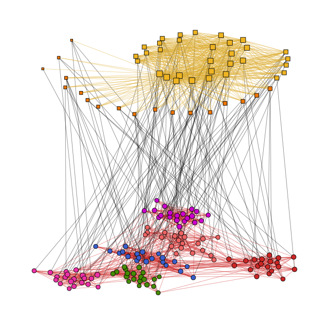

Figure 9: Multilevel network with separate layouts for each level.

</div>

## Fix only one level

``` r
xy <- layout_as_multilevel(
  multilvl_ex,
  type = "fix2",
  FUN2 = layout_with_stress,
  alpha = 25,
  beta = 45
)

ggraph(multilvl_ex, "manual", x = xy[, 1], y = xy[, 2]) +
  geom_edge_link0(
    aes(
      filter = (node1.lvl == 1 & node2.lvl == 1),
      edge_color = col
    ),
    alpha = 0.5,
    edge_linewidth = 0.3
  ) +
  geom_edge_link0(
    aes(filter = (node1.lvl != node2.lvl)),
    alpha = 0.3,
    edge_linewidth = 0.1,
    edge_color = "black"
  ) +
  geom_edge_link0(
    aes(
      filter = (node1.lvl == 2 & node2.lvl == 2),
      edge_color = col
    ),
    edge_linewidth = 0.3,
    alpha = 0.5
  ) +
  geom_node_point(aes(
    fill = as.factor(grp),
    shape = as.factor(lvl),
    size = nsize
  )) +
  scale_shape_manual(values = c(21, 22)) +
  scale_size_continuous(range = c(1.5, 4.5)) +
  scale_fill_manual(values = cols2) +
  scale_edge_color_manual(values = cols2, na.value = "grey12") +
  scale_edge_alpha_manual(values = c(0.1, 0.7)) +
  theme_graph() +
  coord_cartesian(clip = "off", expand = TRUE) +
  theme(legend.position = "none")
```

<div id="fig-multi-fix2-example">

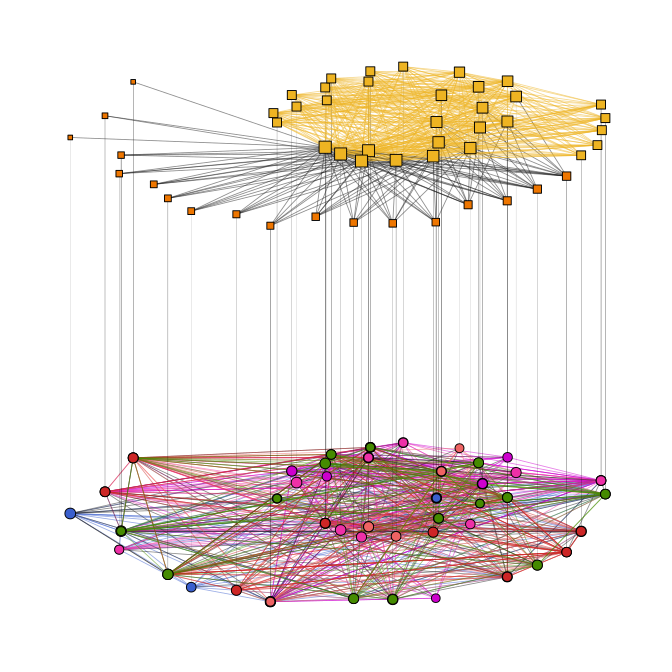

Figure 10: Multilevel network with level 2 fixed and level 1 optimized
for inter-level edges.

</div>

# Edge bundling

Edge bundling is a technique to reduce visual clutter in dense networks.
The idea is to group edges together into bundles, which can help to
reveal underlying structures and patterns that may be hidden in a
traditional edge representation. The ggraph package provides two
functions for edge bundling: geom_edge_bundle_force() and
geom_edge_bundle_path(). The first one uses a force-directed algorithm
to create bundles, while the second one creates bundles based on the
shortest path between nodes.

``` r
states <- map_data("state")
```

Force-directed edge bundling.

``` r
ggraph(us_flights, x = longitude, y = latitude) +
  geom_polygon(
    aes(long, lat, group = group),
    states,
    color = "white",
    linewidth = 0.2
  ) +
  coord_sf(crs = "NAD83", default_crs = sf::st_crs(4326)) +
  geom_edge_bundle_force(color = "white", width = 0.05) +
  geom_node_point(size = 0.1, color = "tomato") +
  theme_graph()
```

<div id="fig-force-bundle">

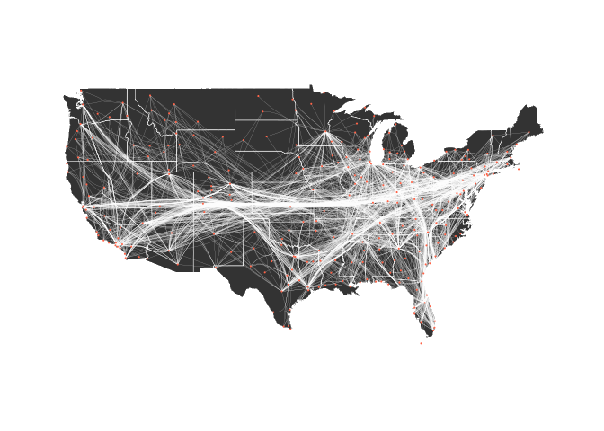

Figure 11: US flights network with force-directed edge bundling.

</div>

Path-based bundling

``` r
ggraph(us_flights, x = longitude, y = latitude) +
  geom_polygon(
    aes(long, lat, group = group),
    states,
    color = "white",
    linewidth = 0.2
  ) +
  coord_sf(crs = "NAD83", default_crs = sf::st_crs(4326)) +
  geom_edge_bundle_path(color = "white", width = 0.05) +
  geom_node_point(size = 0.1, color = "tomato") +
  theme_graph()
```

<div id="fig-path-bundle">

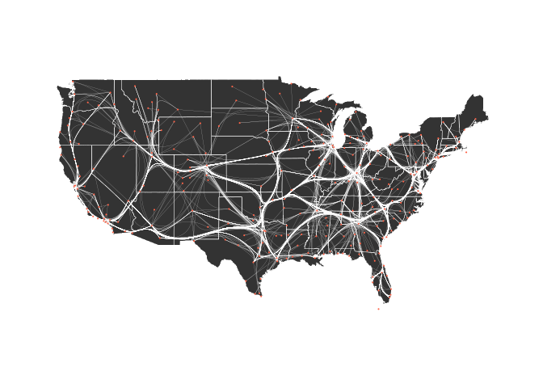

Figure 12: US flights network with path-based edge bundling.

</div>
