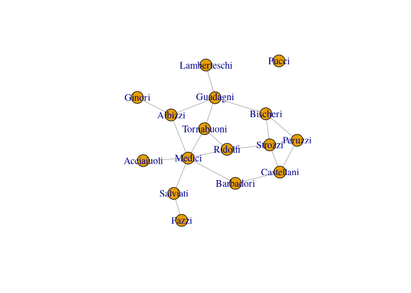
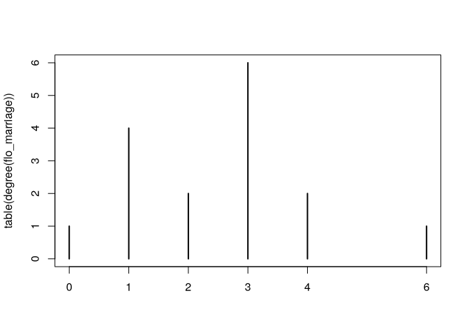
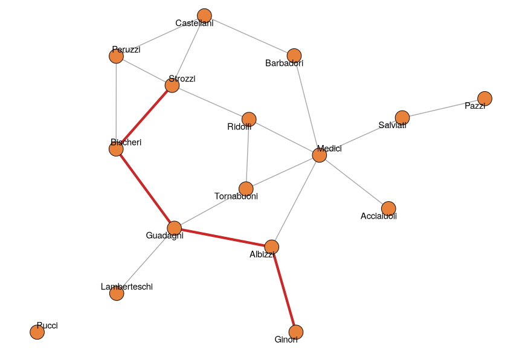
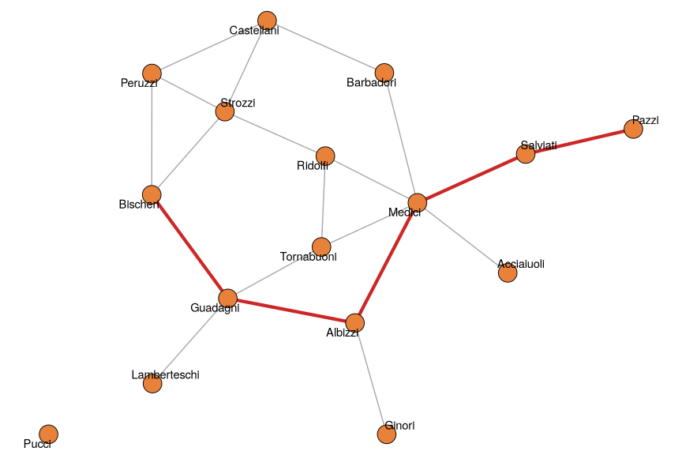
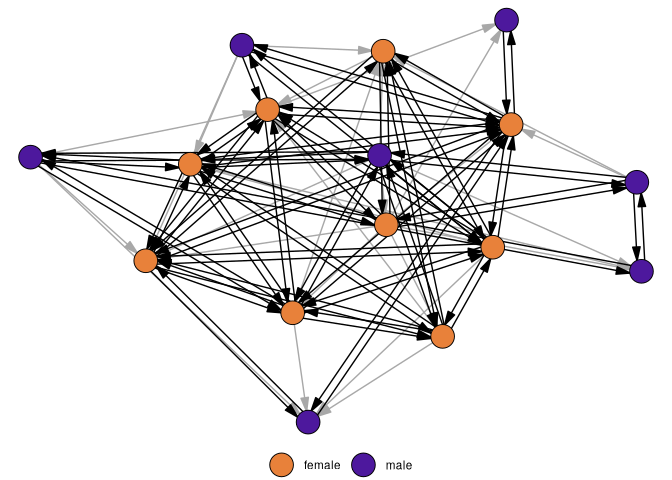
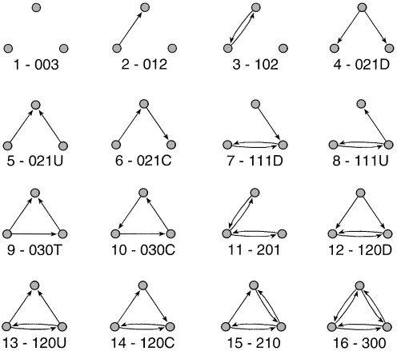
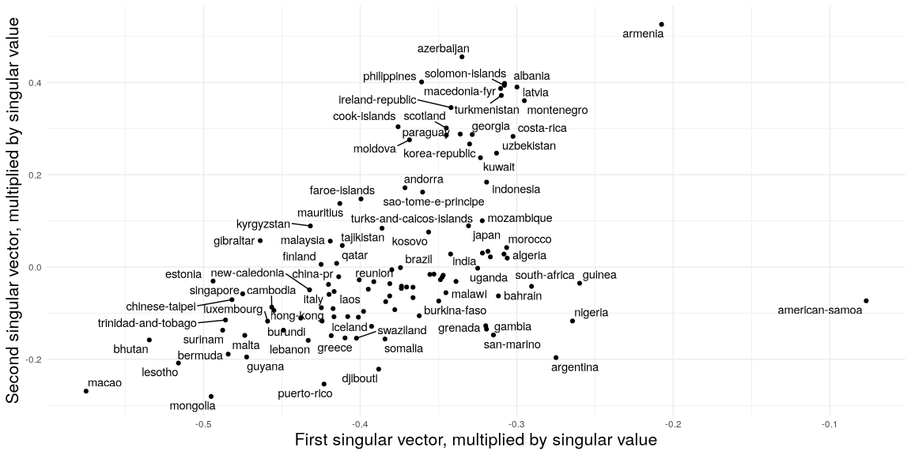
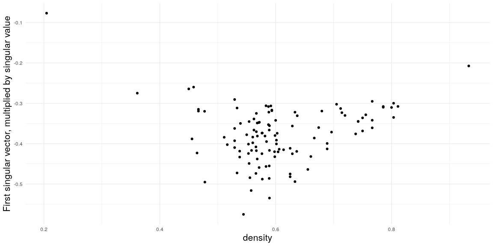
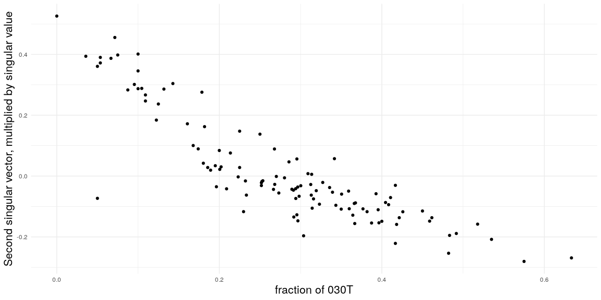

# Basic Network Statistics


[Source](https://schochastics.github.io/R4SNA/descriptive/descriptives-basic.html)

``` r
options(paged.print = FALSE)
```

``` r
libraries <- list(
  "igraph", "networkdata", 
  "ggraph", "netUtils"
)
invisible(lapply(libraries, library, character.only = TRUE))
```

# Example network

We use the marriage network of Florentine families compiled by Padgett
and Ansell (1993), available as flo_marriage in the networkdata package.
Nodes are the 16 leading families of 15th-century Florence, and an
undirected edge connects two families if they were joined by at least
one marriage. The network is a classic example in social network
analysis: small enough to be inspected at a glance, yet rich enough to
exhibit the full range of basic structural features, including an
isolated node (the Pucci family) that will be useful when we discuss
connected components.

``` r
data("flo_marriage")
flo_marriage
```

    IGRAPH bc7fb16 UN-- 16 20 -- 
    + attr: name (v/c), wealth (v/n), priors (v/n), ties (v/n)
    + edges from bc7fb16 (vertex names):
     [1] Acciaiuoli--Medici       Albizzi   --Ginori       Albizzi   --Guadagni    
     [4] Albizzi   --Medici       Barbadori --Castellani   Barbadori --Medici      
     [7] Bischeri  --Guadagni     Bischeri  --Peruzzi      Bischeri  --Strozzi     
    [10] Castellani--Peruzzi      Castellani--Strozzi      Guadagni  --Lamberteschi
    [13] Guadagni  --Tornabuoni   Medici    --Ridolfi      Medici    --Salviati    
    [16] Medici    --Tornabuoni   Pazzi     --Salviati     Peruzzi   --Strozzi     
    [19] Ridolfi   --Strozzi      Ridolfi   --Tornabuoni  

``` r
plot(flo_marriage)
```



The Pucci family has no marriage ties to others, and so is an isolated
node, while the Medicis are central.

# Network Size

``` r
vcount(flo_marriage); ecount(flo_marriage)
```

    [1] 16

    [1] 20

``` r
summary(flo_marriage)
```

    IGRAPH bc7fb16 UN-- 16 20 -- 
    + attr: name (v/c), wealth (v/n), priors (v/n), ties (v/n)

# Adjacency matrix and neighbors

``` r
as_adjacency_matrix(flo_marriage, sparse = F)[1:6, 1:6]
```

               Acciaiuoli Albizzi Barbadori Bischeri Castellani Ginori
    Acciaiuoli          0       0         0        0          0      0
    Albizzi             0       0         0        0          0      1
    Barbadori           0       0         0        0          1      0
    Bischeri            0       0         0        0          0      0
    Castellani          0       0         1        0          0      0
    Ginori              0       1         0        0          0      0

``` r
neighbors(flo_marriage, "Medici")
```

    + 6/16 vertices, named, from bc7fb16:
    [1] Acciaiuoli Albizzi    Barbadori  Ridolfi    Salviati   Tornabuoni

# Degree and degree distribution

``` r
degree(flo_marriage)
```

      Acciaiuoli      Albizzi    Barbadori     Bischeri   Castellani       Ginori 
               1            3            2            3            3            1 
        Guadagni Lamberteschi       Medici        Pazzi      Peruzzi        Pucci 
               4            1            6            1            3            0 
         Ridolfi     Salviati      Strozzi   Tornabuoni 
               3            2            4            3 

A useful summary is the average degree
$\bar{d} = \tfrac{1}{n} \sum_{v} d(v) = \tfrac{2m}{n}$, where $n$ and
$m$ denote the number of nodes and edges.

``` r
mean(degree(flo_marriage))
```

    [1] 2.5

The *degree distribution* tabulates how many nodes have each possible
degree. Many empirical networks are highly skewed towards low degrees.

``` r
table(degree(flo_marriage))
```


    0 1 2 3 4 6 
    1 4 2 6 2 1 

``` r
plot(table(degree(flo_marriage)))
```



# Density

The fraction of possible edges that are actually present. For an
undirected node, the maximum number is $\binom{n}{2}$, so the density is
$2m / (n(n-1))$ and lies between 0 and 1. Empirical networks usually are
at the low end, and become increasingly sparse as the number of nodes
grows.

``` r
c(
  empty = edge_density(make_empty_graph(10)),
  florentine = edge_density(flo_marriage),
  full = edge_density(make_full_graph(10))
)
```

         empty florentine       full 
     0.0000000  0.1666667  1.0000000 

# Shortest paths and distances

A *path* is a sequence of edges connecting two nodes without revisiting
any nodes. The *shortest path* is the one with the minimum number of
edges. Its length is the *distance* between a given pair.

``` r
shortest_paths(
  flo_marriage,
  from = "Ginori",
  to = "Strozzi",
  output = "vpath"
)$vpath
```

    [[1]]
    + 5/16 vertices, named, from bc7fb16:
    [1] Ginori   Albizzi  Guadagni Bischeri Strozzi 

``` r
g <- flo_marriage
E(g)$on_path <- FALSE
epath <- as.integer(shortest_paths(
  g,
  from = "Ginori",
  to = "Strozzi",
  output = "epath"
)$epath[[1]])
E(g)$on_path[epath] <- TRUE

ggraph(g, "stress") +
  geom_edge_link0(aes(color = on_path, width = on_path), show.legend = FALSE) +
  geom_node_point(shape = 21, size = 8, fill = "#E8813A") +
  geom_node_text(aes(label = name), repel = TRUE) +
  scale_edge_color_manual(values = c("grey66", "firebrick3")) +
  scale_edge_width_manual(values = c(0.5, 1.5)) +
  theme_void() +
  coord_equal(clip = "off")
```

<div id="fig-flo-shortest-path">



Figure 1: A shortest path of length 4 between the Ginori and the Strozzi
families, highlighted in red.

</div>

Show full pairwise distance matrix

``` r
distances(flo_marriage)[1:6, 1:6]
```

               Acciaiuoli Albizzi Barbadori Bischeri Castellani Ginori
    Acciaiuoli          0       2         2        4          3      3
    Albizzi             2       0         2        2          3      1
    Barbadori           2       2         0        3          1      3
    Bischeri            4       2         3        0          2      3
    Castellani          3       3         1        2          0      4
    Ginori              3       1         3        3          4      0

# Connected Components

If a network is not connected, ie. at least one path between every node,
it splits into *connected components*. Isolated nodes form components of
size one.

``` r
is_connected(flo_marriage); components(flo_marriage)
```

    [1] FALSE

    $membership
      Acciaiuoli      Albizzi    Barbadori     Bischeri   Castellani       Ginori 
               1            1            1            1            1            1 
        Guadagni Lamberteschi       Medici        Pazzi      Peruzzi        Pucci 
               1            1            1            1            1            2 
         Ridolfi     Salviati      Strozzi   Tornabuoni 
               1            1            1            1 

    $csize
    [1] 15  1

    $no
    [1] 2

The network has two components, one of size 15 and the other of size 1.
Distances between nodes of different components return `Inf`.

``` r
distances(flo_marriage, v = "Pucci")
```

          Acciaiuoli Albizzi Barbadori Bischeri Castellani Ginori Guadagni
    Pucci        Inf     Inf       Inf      Inf        Inf    Inf      Inf
          Lamberteschi Medici Pazzi Peruzzi Pucci Ridolfi Salviati Strozzi
    Pucci          Inf    Inf   Inf     Inf     0     Inf      Inf     Inf
          Tornabuoni
    Pucci        Inf

# Diameter and mean distance

The *diameter* is the longest shortes path, the `mean distance` is the
averate shortest-path length over all reachable pairs of nodes. Small
values indicate every node is a few steps from every other.

``` r
diameter(flo_marriage); mean_distance(flo_marriage)
```

    [1] 5

    [1] 2.485714

Reaching the Pazzi from the Bischeri requires traversing five marriage
ties.

``` r
g <- flo_marriage
E(g)$on_path <- FALSE
epath <- as.integer(shortest_paths(
  g,
  from = "Bischeri",
  to = "Pazzi",
  output = "epath"
)$epath[[1]])
E(g)$on_path[epath] <- TRUE

ggraph(g, "stress") +
  geom_edge_link0(aes(color = on_path, width = on_path), show.legend = FALSE) +
  geom_node_point(shape = 21, size = 8, fill = "#E8813A") +
  geom_node_text(aes(label = name), repel = TRUE) +
  scale_edge_color_manual(values = c("grey66", "firebrick3")) +
  scale_edge_width_manual(values = c(0.5, 1.5)) +
  theme_void() +
  coord_equal(clip = "off")
```

<div id="fig-flo-diameter">



Figure 2: A diameter path of length 5 between the Bischeri and the Pazzi
families, highlighted in red.

</div>

# Transitivity

If A is connected to B, and B to C, then A is likely to be connected to
C also. The *clustering coefficient* measures the tendency of a node’s
neighbors to be connected to each other. A high coefficient indicates
many such triadic closures. Transitivity reflects the tendency of
networks to form cohesive, locally dense structures where indirect
relationships become direct ties.

*Global transitivity* is the ratio of the number of closed triples to
the number of connected triples. *Local transitivity* of a node is the
fraction of pairs of its neighbors that are connected to each other.

``` r
transitivity(flo_marriage, type = "global")
```

    [1] 0.1914894

``` r
head(transitivity(flo_marriage,
                  type = "local",
                  isolates = "zero"))
```

    Acciaiuoli    Albizzi  Barbadori   Bischeri Castellani     Ginori 
     0.0000000  0.0000000  0.0000000  0.3333333  0.3333333  0.0000000 

In social networks we generally expect transitivity to be sizeable: if
two families are both allied with the Medici, there is a reasonable
chance that they are allied with each other as well (“the friend of my
friend is also my friend”). The Florentine marriage network has a global
transitivity of about 0.19, confirming this tendency, albeit at a modest
level.

# Assortativity

Measures the tendency of edges to form based on similar node attributes.
Nodes structured around similarity (homophily) or difference
(heterophily).

## Based on numerical attribute

*Degree assortativity* evaluates where nodes with similar degrees tend
to be connected.

``` r
assortativity(flo_marriage, degree(flo_marriage))
```

    [1] -0.3748379

Negative values indicate disassortative mixing, where highly connected
nodes tend to connect to low degree nodes, while a positive number
indicates nodes associate with nodes of similar degree.

# Based on a nominal attribute

Here, we use the attribute wealth which we dichotomize based on the
median into two groups:

    Low = below or equal to the median (lower wealth)
    High = above the median (higher wealth)

``` r
wealth <- V(flo_marriage)$wealth
med_wealth <- median(wealth, na.rm = T)
wealth_cat <- ifelse(wealth <= med_wealth, "low", "high")
assortativity_nominal(flo_marriage, as.factor(wealth_cat))
```

    [1] -0.3299233

The negative value indicates disassortative mixing or heterophily.
Families are more likely to form marriage ties with others from a
different wealth category.

# Reciprocity - directed networks

The proportion of directed edges for which the reverse edge is also
present. In friendship networks, ties are often reciprocated, while
heirarchical networks such as organizational structures have less
reciprocity and are inherently asymmetric.

``` r
reciprocity(rhesus)
```

    [1] 0.7567568

About 76% of the edges are reciprocated.

``` r
E(rhesus)$mutual <- which_mutual(rhesus)
ggraph(rhesus, "stress") +
  geom_edge_parallel(
    aes(filter = !mutual),
    edge_color = "grey66",
    edge_width = 0.5,
    arrow = arrow(
      angle = 15,
      length = unit(0.15, "inches"),
      ends = "last",
      type = "closed"
    ),
    n = 2,
    end_cap = circle(8, "pt")
  ) +
  geom_edge_parallel(
    aes(filter = mutual),
    edge_color = "black",
    edge_width = 0.5,
    arrow = arrow(
      angle = 15,
      length = unit(0.15, "inches"),
      ends = "last",
      type = "closed"
    ),
    n = 2,
    end_cap = circle(8, "pt")
  ) +
  geom_node_point(shape = 21, size = 8, aes(fill = gender)) +
  scale_fill_manual(values = c("#E8813A", "#4D189D"), name = "") +
  theme_void() +
  theme(legend.position = "bottom")
```

<div id="fig-rhesus-reciprocity">



Figure 3: Grooming relations among a group of rhesus monkeys.
Reciprocated edges are drawn in black, asymmetric edges in grey. Node
color encodes the gender of the monkey.

</div>

# Dyad and triad census

The *dyad census* categorizes all pairs of nodes based on their
mutual-connection status. Dyads can be *mutual*, *assymetric* or *null*.
It gives an overview of the prevalence of reciprocity and assymetry.

``` r
dyad_census(rhesus)
```

    $mut
    [1] 42

    $asym
    [1] 27

    $null
    [1] 51

The *triad census* counts the occurrence of each of the 16 possible
configurations among three nodes.

Triads are labeled using the MAN notation, often written as `xyzL`,
where `x` is the number of reciprocated (mutual) ties, `y` is the number
of asymmetric ties, and `z` is the number of null ties; the optional
letter `L` (`U`, `C`, `D`, or `T`) distinguishes triads that share the
same `xyz` counts but differ in structure. For undirected networks,
there are only four types.



``` r
triad_census(rhesus)
```

     [1]  49  72 115  16  12  11  50  50   2   0  54  13  12   7  58  39

Different triad types are useful because they reveal local structural
patterns that are not visible at the dyad level. For example, certain
triads capture reciprocity, hierarchy, or transitivity (e.g., “a friend
of a friend is also a friend”), which are key building blocks of larger
network organization.

## Triad census example

In this example, we are tackling the question of “how transitive is
football?” and assess structural differences among a set of football
leagues.

football_triad is a list which contains networks of 112 football leagues
as igraph objects. A directed link between team A and B indicates that A
won a match against B. Note that there can also be an edge from B to A,
since most leagues play a double round robin. For the sake of
simplicity, all draws were deleted so that there could also be null ties
between two teams if both games ended in a draw.

``` r
footy_census <- lapply(football_triad, triad_census)
footy_census <- matrix(unlist(footy_census),
                       ncol = 16, byrow = TRUE)
rownames(footy_census) <- sapply(football_triad, \(x) x$name)
colnames(footy_census) <- c(
  "003",
  "012",
  "102",
  "021D",
  "021U",
  "021C",
  "111D",
  "111U",
  "030T",
  "030C",
  "201",
  "120D",
  "120U",
  "120C",
  "210",
  "300"
)

# normalize to make proportions comparable across leagues
footy_census_norm <- footy_census / rowSums(footy_census)

idx <- which(
  rownames(footy_census) %in%
    c(
      "england",
      "spain",
      "germany",
      "italy",
      "france"
    )
)
footy_census[idx, ]
```

            003 012 102 021D 021U 021C 111D 111U 030T 030C 201 120D 120U 120C 210
    england   2  10   0   58   31   40   34   44  338   29  19  118  129  143 131
    france    1  23   5   30   33   44   48   40  332   41  16  132  108  160 114
    germany   0  21   6   27   19   49   38   46  165   16  23   77   79  117 120
    italy     1   4   2   35   43   30   30   22  419   38   5  164  116  118  99
    spain     0   8   4   27   42   45   32   35  364   43  11  126  105  148 130
            300
    england  14
    france   13
    germany  13
    italy    14
    spain    20

Notice how the transitive triad (030T) has the largest count in the top
leagues, hinting toward the childhood wisdom: “If A wins against B and B
wins against C, then A must win against C”.

``` r
footy_svd <- svd(footy_census_norm)
```

``` r
data.frame(
  u1 = footy_svd$d[1] * footy_svd$u[, 1],
  u2 = footy_svd$d[2] * footy_svd$u[, 2],
  league = rownames(footy_census)
) |>
  ggplot(aes(x = u1, y = u2)) +
  geom_point() +
  ggrepel::geom_text_repel(aes(label = league)) +
  theme_minimal() +
  theme(axis.title = element_text(size = 16)) +
  labs(
    x = "First singular vector, multiplied by singular value",
    y = "Second singular vector, multiplied by singular value"
  )
```

    Warning: ggrepel: 34 unlabeled data points (too many overlaps). Consider
    increasing max.overlaps

<div id="fig-footy-svd">



Figure 4: First two singular vectors of the normalized triad-census
profiles for 112 football leagues, scaled by the corresponding singular
values. Leagues close to each other have similar triad profiles.

</div>

For interpretation, compare to two simple network stats: density and
proportion of `030T` triads. Can use any node-, dyad-, or triad-level
statistic.

``` r
data.frame(
  y = footy_svd$d[1] * footy_svd$u[, 1],
  x = sapply(football_triad, edge_density)
) %>% 
  ggplot(aes(x, y)) +
  geom_point() +
  theme_minimal() +
  theme(axis.title = element_text(size = 16)) +
  labs(x = "density", y = "First singular vector, multiplied by singular value")
```

<div id="fig-footy-svd-density">



Figure 5: First singular vector (scaled by its singular value) plotted
against network density for each football league.

</div>

Density is not strongly related to the first singular vector in this
particular example, although it often is for other collections of
networks.

``` r
data.frame(
  y = footy_svd$d[2] * footy_svd$u[, 2],
  x = footy_census_norm[, 9]
) |>
  ggplot(aes(x, y)) +
  geom_point() +
  theme_minimal() +
  theme(axis.title = element_text(size = 16)) +
  labs(
    x = "fraction of 030T",
    y = "Second singular vector, multiplied by singular value"
  )
```

<div id="fig-footy-svd-030t">



Figure 6: Second singular vector (scaled by its singular value) plotted
against the proportion of transitive 030T triads for each football
league.

</div>

There is a much clearer relationship between the second singular vector
and the proportion of 030T triads, suggesting that the fraction of
transitive triads is a good indicator of structural differences among
the leagues.

## Census with attributes

`netUtils` allows working with node attributes.

The node attribute should be coded as integers from 1 to `max(attr)`.
The output of `dyad_census_attr()` is a `data.frame` in which each row
corresponds to a pair of attribute values, together with the count of
asymmetric, symmetric, and null dyads of that combination.

The output of `triad_census_attr()` is a named vector whose names have
the form Txxx-abc, where xxx is the standard triad census code and abc
are the attributes of the three nodes involved.

``` r
set.seed(1108)
g <- sample_gnp(20, p = 0.3, directed = T)
V(g)$type <- rep(1:2, each = 10)

dyad_census_attr(g, "type")
```

      from_attr to_attr asym_ab asym_ba sym null
    1         1       1       0       0   2   43
    2         1       2      15      29   6   50
    3         2       2       0       0   2   43

``` r
triad_census_attr(g, "type")
```

     T003-111  T003-112  T003-122  T003-222  T012-111  T012-121  T012-112  T012-122 
           10        46        67        27        44        63        38        34 
     T012-211  T012-221  T012-212  T012-222 T021D-111 T021D-211 T021D-112 T021D-212 
           57        82        45        41        11        18        15        30 
    T021D-122 T021D-222  T102-111  T102-112  T102-122  T102-211  T102-212  T102-222 
            4        11         3        17         2         4        17         5 
    T021C-111 T021C-211 T021C-121 T021C-221 T021C-112 T021C-212 T021C-122 T021C-222 
           14        10        36        20        19        11        22        17 
    T111U-111 T111U-121 T111U-112 T111U-122 T111U-211 T111U-221 T111U-212 T111U-222 
            5         7         3         8         3         4         5         6 
    T021U-111 T021U-112 T021U-122 T021U-211 T021U-212 T021U-222 T030T-111 T030T-121 
           11        24        20         5        17         8        13        22 
    T030T-112 T030T-122 T030T-211 T030T-221 T030T-212 T030T-222 T120U-111 T120U-112 
            5        14         6         7         2         0         2         4 
    T120U-122 T120U-211 T120U-212 T120U-222 T111D-111 T111D-121 T111D-112 T111D-122 
            2         0         3         1         2         5         8         3 
    T111D-211 T111D-221 T111D-212 T111D-222  T201-111  T201-112  T201-121  T201-122 
           10         5         7         1         1         1         0         2 
     T201-221  T201-222 T030C-111 T030C-112 T030C-122 T030C-222 T120C-111 T120C-121 
            1         0         2        13         6         0         1         5 
    T120C-211 T120C-221 T120C-112 T120C-122 T120C-212 T120C-222 T120D-111 T120D-112 
            2         3         2         1         1         2         1         1 
    T120D-211 T120D-212 T120D-122 T120D-222  T210-111  T210-121  T210-211  T210-221 
            1         3         0         1         0         0         0         0 
     T210-112  T210-122  T210-212  T210-222  T300-111  T300-112  T300-122  T300-222 
            0         2         0         0         0         0         0         0 
