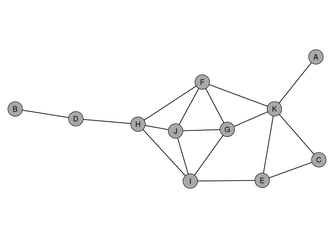
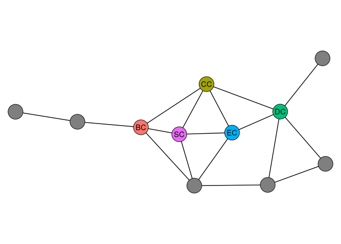
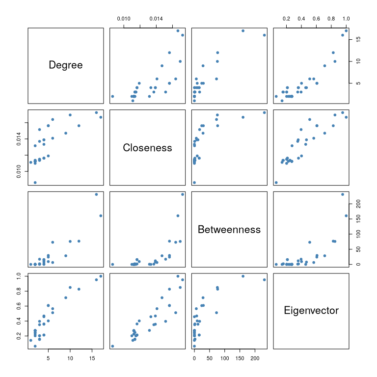
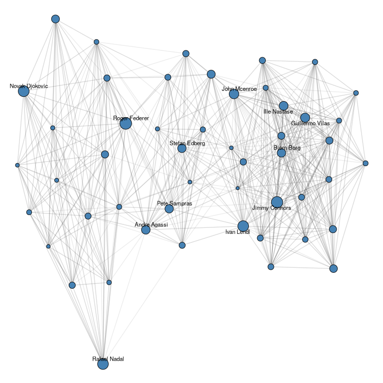
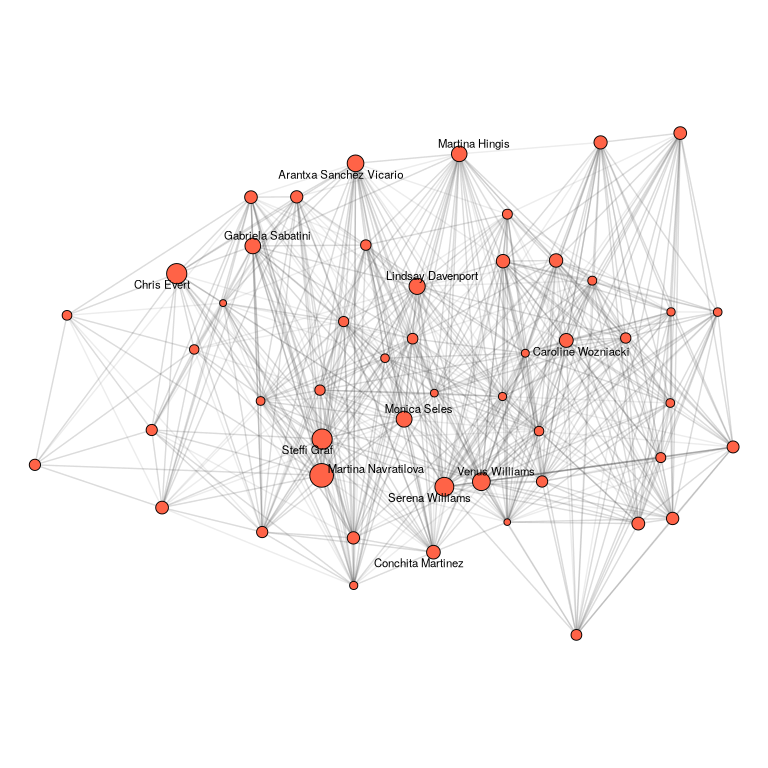
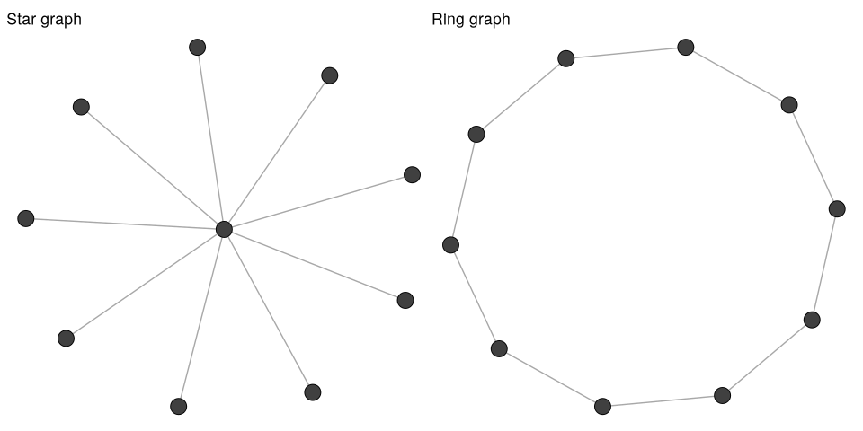
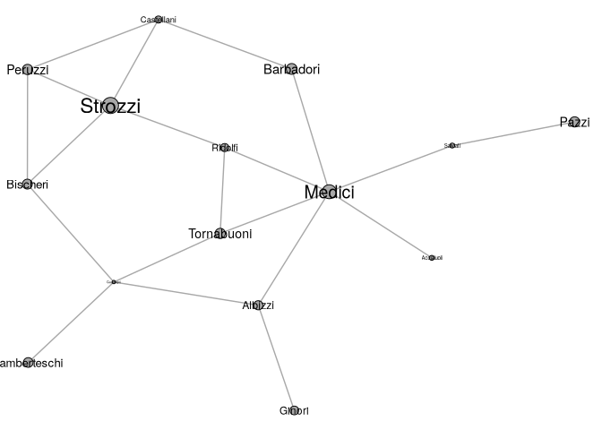
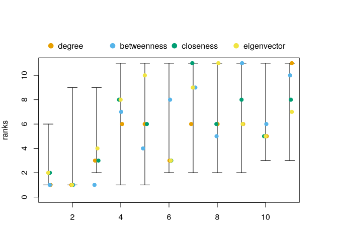

# Centrality


[Source](https://schochastics.github.io/R4SNA/descriptive/centrality-basic.html)

``` r
options(paged.print = FALSE)
```

``` r
libraries <- list(
  "igraph", "networkdata", "netrankr",
  "ggraph", "patchwork", "dplyr"
)
invisible(lapply(libraries, library, character.only = TRUE))
```

# Centrality Indices

- *Degree* - measures *activity*, how many direct connections does a
  node have? Many ties indicated active, popular or well-connected nodes
- *Closeness* - measures *efficiency*, how quickly can a node reach all
  others? Nodes close to everyone can spread information with minimal
  steps
- *Betweenness* - measure *brokerage*, how often does a node sit on the
  shortest path between others? Nodes with high betweenness mediate the
  flow between other parts of the network
- *Eigenvector centrality* - measures *prestige*, is a node connected to
  other well-connected nodes? Nodes of low degree may be central if they
  are tied to important nodes…centrality by association.

The indices aren’t interchangeable. Brokers need not be popular, and
presigeous nodes may not have high closeness to everyone.

- If you are interested in activity or popularity, degree (or strength
  for weighted networks) is the natural choice.
- If you care about efficiency of communication or independence,
  closeness captures how quickly a node can reach others.
- If brokerage or control is your focus, betweenness identifies nodes
  that bridge different parts of the network.
- If you are interested in influence through connections, eigenvector
  centrality or PageRank captures prestige by association.

``` r
ggraph(dbces11, "stress") +
  geom_edge_link0() +
  geom_node_point(shape = 21, size = 10, fill = "grey66") +
  geom_node_text(aes(label = name)) +
  theme_void() +
  coord_equal(clip = "off")
```

<div id="fig-dbces11-basic-plot">



Figure 1: The dbces11 example network used to illustrate centrality
indices.

</div>

## Degree Centrality

Nodes of high degree are active or popular socially. With the adjacency
matrix $A = (a_{vu})$:

$$C_D(v) = \sum_{u \neq v} a_{vu}.$$

``` r
degree(dbces11)
```

    A B C D E F G H I J K 
    1 1 2 2 3 4 4 4 4 4 5 

For weighted networks, *strength* sums the edge weights rather than
counting edges. As an illustration we use the miserables network, which
records co-occurrences of characters in Victor Hugo’s Les Misérables,
with edge weights counting how often two characters appear in the same
chapter.

``` r
strength(miserables, 
         weights = E(miserables)$weight) %>% 
  sort(decreasing = T) %>% head()
```

       Valjean     Marius   Enjolras Courfeyrac    Cosette Combeferre 
           158        104         91         84         68         68 

## Closeness Centrality

Based on shortest path distances between nodes. A central node can reach
others quickly. For the shortest path $d(v,u)$ from $v$ to $u$,

$$C_C(v) = \frac{1}{\sum_{u \neq v} d(v, u)},$$
so shorter total distances receive higher scores.

``` r
closeness(dbces11)
```

             A          B          C          D          E          F          G 
    0.03703704 0.02941176 0.04000000 0.04000000 0.05000000 0.05882353 0.05263158 
             H          I          J          K 
    0.05555556 0.05555556 0.05263158 0.05555556 

For disconnected networks, `closeness` returns `NaN` for isolates.
`harmonic_centrality` treats unreachable pairs as zero.

## Betweenness Centrality

Counts how often a node lies on the shortest path between pairs of other
nodes. A node with high betweenness is a bridge or broker, and removal
would increase distances or disconnect parts of the network.

Letting $\sigma_{st}$ be the number of shortest paths from $s$ to $t$
and $\sigma_{st} (v)$ the number of those passing through $v$,

$$C_B(v) = \sum_{s \neq v \neq t} \frac{\sigma_{st}(v)}{\sigma_{st}}.$$

``` r
betweenness(dbces11)
```

            A         B         C         D         E         F         G         H 
     0.000000  0.000000  0.000000  9.000000  3.833333  9.833333  2.666667 16.333333 
            I         J         K 
     7.333333  1.333333 14.666667 

## Eigenvector Centrality

Weighs each connection by the centrality of the neighbor. A node is
central if it is connected to other central zones, with the recursive
definition

$$C_E(v) = \frac{1}{\lambda} \sum_{u \in N(v)} C_E(u),$$

``` r
eigen_centrality(dbces11)$vector
```

            A         B         C         D         E         F         G         H 
    0.2259630 0.0645825 0.3786244 0.2415182 0.5709057 0.9846544 1.0000000 0.8386195 
            I         J         K 
    0.9113529 0.9986474 0.8450304 

## Subgraph Centrality

Quantifies the participation of each node in all subgraphs of the
network. Captures how embedded a node is in the local structure of the
network.

``` r
subgraph_centrality(dbces11)
```

           A        B        C        D        E        F        G        H 
    1.825100 1.595400 3.148571 2.423091 4.387127 7.807257 7.939410 6.672783 
           I        J        K 
    7.032672 8.242124 7.389559 

## Comparison

``` r
V(dbces11)$cent <- NA
V(dbces11)$cent[which.max(degree(dbces11))] <- "DC"
V(dbces11)$cent[which.max(betweenness(dbces11))] <- "BC"
V(dbces11)$cent[which.max(closeness(dbces11))] <- "CC"
V(dbces11)$cent[which.max(eigen_centrality(dbces11)$vector)] <- "EC"
V(dbces11)$cent[which.max(subgraph_centrality(dbces11))] <- "SC"

ggraph(dbces11, "stress") +
  geom_edge_link0() +
  geom_node_point(
    shape = 21,
    size = 10,
    aes(fill = cent),
    show.legend = FALSE
  ) +
  geom_node_text(aes(filter = !is.na(cent), label = cent)) +
  theme_void() +
  coord_equal(clip = "off")
```

<div id="fig-dbces11-centrality">



Figure 2: Most central node for different centrality indices in the
dbces11 graph. DC = degree, BC = betweenness, CC = closeness, EC =
eigenvector, SC = subgraph centrality.

</div>

## Correlation Between Indices

On some networks, all indices will largely agree; on others, they will
diverge considerably. We examine this using Zachary’s karate club
network, a classic social network of 34 members of a university karate
club observed over three years in the 1970s.

``` r
cent_df <- data.frame(
  degree = degree(karate),
  closeness = closeness(karate),
  betweenness = betweenness(karate),
  eigen = eigen_centrality(karate)$vector
)
round(cor(cent_df), 2)
```

                degree closeness betweenness eigen
    degree        1.00      0.77        0.91  0.92
    closeness     0.77      1.00        0.72  0.90
    betweenness   0.91      0.72        1.00  0.80
    eigen         0.92      0.90        0.80  1.00

``` r
pairs(
  cent_df,
  pch = 19,
  col = "steelblue",
  labels = c("Degree", "Closeness", "Betweenness", "Eigenvector")
)
```

<div id="fig-centrality-pairs">



Figure 3: Pairwise scatter plots of four centrality indices computed on
the karate club network.

</div>

# Directed Networks

To illustrate them, we use the ht_advice network, a classic study of
advice-seeking relations in a small high-tech company. A directed edge
from $i$ to $j$ indicates that employee $i$ sought advice from $j$.

## PageRank

Assigns each node a score that grows with the number and PageRank of its
incoming neighbors. A high PageRank indicates an individual who receives
endorsement or attention from other well-regarded individuals.

``` r
round(page_rank(ht_advice)$vector, 3)
```

     [1] 0.049 0.094 0.027 0.046 0.016 0.072 0.104 0.042 0.015 0.030 0.039 0.040
    [13] 0.014 0.044 0.016 0.028 0.042 0.072 0.014 0.033 0.164

## Hubs and Authorities

The HITS algorithm assigns a hub score and an authority score to each
node. A good hub points to many good authorities, and a good authority
is pointed to by many good hubs. Authorities are frequently consulted,
and hubs frequently consult many others.

``` r
hits <- hits_scores(ht_advice)
round(hits$hub, 3)
```

     [1] 0.370 0.176 0.841 0.709 0.835 0.065 0.492 0.490 0.773 0.672 0.206 0.122
    [13] 0.331 0.279 1.000 0.274 0.313 0.800 0.581 0.687 0.600

``` r
round(hits$authority, 3)
```

     [1] 0.782 1.000 0.356 0.496 0.330 0.644 0.684 0.711 0.290 0.615 0.769 0.498
    [13] 0.323 0.677 0.267 0.570 0.645 0.871 0.323 0.589 0.776

## Example - Ranking Tennis Players

Every edge produces a tie driected from the loser to the winner.
PageRank includes counts as well as weighting each win by the standing
of the defeated opponent.

The networkdata package provides season-level networks for the men’s
(atp) and women’s (wta) tours from 1968 to 2021, with each list element
representing one season. Edges point from loser to winner, and the edge
weight records how many times that match-up occurred on a given surface.
To rank players across the entire history of each tour, we collapse all
54 seasonal networks into a single weighted directed network: the weight
of an edge from player i to player j is the total number of matches i
lost to j over the period 1968-2021.

``` r
combine_seasons <- function(net_list) {
  edges <- do.call(
    rbind,
    lapply(net_list, function(g) {
      igraph::as_data_frame(g, what = "edges")[, c("from", "to", "weight")]
    })
  )
  edges <- aggregate(weight ~ from + to, data = edges, FUN = sum)
  graph_from_data_frame(edges, directed = TRUE)
}
atp_all <- combine_seasons(atp)
wta_all <- combine_seasons(wta)
atp_all; wta_all
```

    IGRAPH 50072ba DNW- 5965 118906 -- 
    + attr: name (v/c), weight (e/n)
    + edges from 50072ba (vertex names):
     [1] Jan Kukal         ->A Macdonald      Alberto Tous      ->Aaron Krickstein
     [3] Alejandro Ganzabal->Aaron Krickstein Alex Antonitsch   ->Aaron Krickstein
     [5] Alex Obrien       ->Aaron Krickstein Alexander Mronz   ->Aaron Krickstein
     [7] Alexander Reichel ->Aaron Krickstein Alexander Volkov  ->Aaron Krickstein
     [9] Amos Mansdorf     ->Aaron Krickstein Anders Jarryd     ->Aaron Krickstein
    [11] Andre Agassi      ->Aaron Krickstein Andrei Cherkasov  ->Aaron Krickstein
    [13] Andrei Chesnokov  ->Aaron Krickstein Andres Gomez      ->Aaron Krickstein
    [15] Andres Vysand     ->Aaron Krickstein Andrew Castle     ->Aaron Krickstein
    + ... omitted several edges

    IGRAPH 9bbc540 DNW- 5946 88958 -- 
    + attr: name (v/c), weight (e/n)
    + edges from 9bbc540 (vertex names):
     [1] Urszula Nebelska   ->Aaliya Ebrahim Alexandra Damaschin->Abbie Myers   
     [3] Alison Bai         ->Abbie Myers    Ayano Shimizu      ->Abbie Myers   
     [5] Claire Liu         ->Abbie Myers    Erina Hayashi      ->Abbie Myers   
     [7] Francesca Jones    ->Abbie Myers    Irina Maria Bara   ->Abbie Myers   
     [9] Ivana Popovic      ->Abbie Myers    Lizette Cabrera    ->Abbie Myers   
    [11] Miharu Imanishi    ->Abbie Myers    Misaki Matsuda     ->Abbie Myers   
    [13] Paula Badosa       ->Abbie Myers    Ya Hsuan Lee       ->Abbie Myers   
    [15] Yuxuan Zhang       ->Abbie Myers    Zoe Hives          ->Abbie Myers   
    + ... omitted several edges

Compute PageRank on each network and inspect the ten highest-scoring
players.

``` r
atp_pr <- page_rank(atp_all)$vector
wta_pr <- page_rank(wta_all)$vector
round(head(sort(atp_pr, decreasing = T), 10), 4)
```

      Roger Federer   Jimmy Connors  Novak Djokovic    Rafael Nadal      Ivan Lendl 
             0.0076          0.0072          0.0066          0.0065          0.0065 
       John Mcenroe Guillermo Vilas    Ilie Nastase    Andre Agassi   Stefan Edberg 
             0.0054          0.0049          0.0047          0.0046          0.0044 

``` r
round(head(sort(wta_pr, decreasing = T), 10), 4)
```

        Martina Navratilova             Chris Evert             Steffi Graf 
                     0.0117                  0.0084                  0.0084 
            Serena Williams          Venus Williams Arantxa Sanchez Vicario 
                     0.0073                  0.0064                  0.0057 
          Lindsay Davenport            Monica Seles       Gabriela Sabatini 
                     0.0054                  0.0053                  0.0051 
             Martina Hingis 
                     0.0050 

``` r
top_atp <- names(sort(atp_pr, decreasing = TRUE))[1:50]
atp_top <- subgraph(atp_all, top_atp)
V(atp_top)$pr <- atp_pr[V(atp_top)$name]
V(atp_top)$lab <- ifelse(rank(-V(atp_top)$pr) <= 12, V(atp_top)$name, "")

ggraph(atp_top, "stress") +
  geom_edge_link0(edge_alpha = 0.1, edge_color = "grey30") +
  geom_node_point(
    aes(size = pr),
    shape = 21,
    fill = "steelblue",
    show.legend = FALSE
  ) +
  geom_node_text(aes(label = lab), repel = TRUE, size = 3) +
  scale_size(range = c(2, 8)) +
  theme_void() +
  coord_equal(clip = "off")
```

<div id="fig-atp-all-time">



Figure 4: Subnetwork induced by the 50 highest-ranked ATP players by
PageRank across all seasons (1968-2021). Node size is proportional to
PageRank; the top twelve players are labelled.

</div>

``` r
top_wta <- names(sort(wta_pr, decreasing = TRUE))[1:50]
wta_top <- subgraph(wta_all, top_wta)
V(wta_top)$pr <- wta_pr[V(wta_top)$name]
V(wta_top)$lab <- ifelse(rank(-V(wta_top)$pr) <= 12, V(wta_top)$name, "")

ggraph(wta_top, "stress") +
  geom_edge_link0(edge_alpha = 0.1, edge_color = "grey30") +
  geom_node_point(
    aes(size = pr),
    shape = 21,
    fill = "tomato",
    show.legend = FALSE
  ) +
  geom_node_text(aes(label = lab), repel = TRUE, size = 3) +
  scale_size(range = c(2, 8)) +
  theme_void() +
  coord_equal(clip = "off")
```

<div id="fig-wta-all-time">



Figure 5: Subnetwork induced by the 50 highest-ranked WTA players by
PageRank across all seasons (1968-2021). Node size is proportional to
PageRank; the top twelve players are labelled.

</div>

# Normalization

To make comparisons across networks of different sizes.

``` r
degree(dbces11); degree(dbces11, normalized = T)
```

    A B C D E F G H I J K 
    1 1 2 2 3 4 4 4 4 4 5 

      A   B   C   D   E   F   G   H   I   J   K 
    0.1 0.1 0.2 0.2 0.3 0.4 0.4 0.4 0.4 0.4 0.5 

# Centralization

Centrality is node-level, centralization is network-level. Comparison to
a maximally centralized network (1) and an evenly distributed network
(0).

``` r
p1 <- ggraph(make_star(10, mode = "undirected"), "stress") +
  geom_edge_link0(edge_color = "grey66") +
  geom_node_point(shape = 21, size = 6, fill = "grey25") +
  theme_void() +
  ggtitle("Star graph")

p2 <- ggraph(make_ring(10), "stress") +
  geom_edge_link0(edge_color = "grey66") +
  geom_node_point(shape = 21, size = 6, fill = "grey25") +
  theme_void() +
  ggtitle("Ring graph")

p1 + p2
```

<div id="fig-centralization-contrast">



Figure 6: A star graph (left) has maximum centralization while a ring
graph (right) has minimum centralization.

</div>

``` r
centr_degree(make_star(10, mode = "undirected"))$centralization
```

    [1] 0.8

``` r
centr_degree(make_ring(10))$centralization
```

    [1] 0

``` r
c(
  degree = centr_degree(karate)$centralization,
  betweenness = centr_betw(karate)$centralization,
  closeness = centr_clo(karate)$centralization,
  eigen = centr_eigen(karate)$centralization
)
```

         degree betweenness   closeness       eigen 
      0.3761141   0.4055572   0.2981949   0.6458497 

# Other Centrality Measures

`sna` implements *flow betweenness* based on maximum flow rather than
shortes path, *information centrality* based on information-theoretic
measures, and *stress centrality*, counting all shortest paths through a
node, without normalization. `sna` operates on adjacency matrices.

``` r
A <- as_adjacency_matrix(dbces11, sparse = F)
sna::flowbet(A, gmode = "graph")
```

     [1]  0  0  6  9 14 14 11 22 15  8 31

``` r
round(sna::infocent(A, gmode = "graph"), 3)
```

     [1] 0.587 0.427 0.804 0.656 0.971 1.133 1.117 1.126 1.129 1.105 1.128

# Example - Florentine Families

Since Pucci is isolated, and closeness is not well defined for
disconnected networks, look at the connected sub-graph only.

``` r
flo_marriage_sub <- subgraph(
  flo_marriage,
  components(flo_marriage)$membership ==
    which.max(components(flo_marriage)$csize)
)
```

``` r
ggraph(flo_marriage_sub, "stress") +
  geom_edge_link0(edge_color = "grey66") +
  geom_node_point(
    shape = 21,
    aes(size = wealth),
    fill = "grey66",
    show.legend = FALSE
  ) +
  geom_node_text(aes(size = wealth, label = name), show.legend = FALSE) +
  theme_void()
```

<div id="fig-flo-marriage">



Figure 7: Marriage network among Florentine families. Node size is
proportional to the wealth of each family.

</div>

``` r
data.frame(
  name = V(flo_marriage_sub)$name,
  degree = rank(-degree(flo_marriage_sub)),
  betweenness = rank(-betweenness(flo_marriage_sub)),
  closeness = rank(-closeness(flo_marriage_sub)),
  eigen = rank(-eigen_centrality(flo_marriage_sub)$vector)
) |>
  knitr::kable(
    row.names = FALSE,
    col.names = c("Family", "Degree", "Betweenness", "Closeness", "Eigenvector")
  )
```

| Family       | Degree | Betweenness | Closeness | Eigenvector |
|:-------------|-------:|------------:|----------:|------------:|
| Acciaiuoli   |   13.5 |        13.5 |      11.5 |          12 |
| Albizzi      |    6.5 |         3.0 |       3.5 |           9 |
| Barbadori    |   10.5 |         8.0 |       6.5 |          10 |
| Bischeri     |    6.5 |         6.0 |       8.0 |           6 |
| Castellani   |    6.5 |        10.0 |       9.5 |           8 |
| Ginori       |   13.5 |        13.5 |      13.0 |          14 |
| Guadagni     |    2.5 |         2.0 |       5.0 |           5 |
| Lamberteschi |   13.5 |        13.5 |      14.0 |          13 |
| Medici       |    1.0 |         1.0 |       1.0 |           1 |
| Pazzi        |   13.5 |        13.5 |      15.0 |          15 |
| Peruzzi      |    6.5 |        11.0 |      11.5 |           7 |
| Ridolfi      |    6.5 |         5.0 |       2.0 |           3 |
| Salviati     |   10.5 |         4.0 |       9.5 |          11 |
| Strozzi      |    2.5 |         7.0 |       6.5 |           2 |
| Tornabuoni   |    6.5 |         9.0 |       3.5 |           4 |

The Medici rank first (or nearly first) on every index. Their high
degree means they had the most marriage ties, making them the most
active family in forming alliances. Their top betweenness ranking
reveals that they occupied a critical brokerage position: many of the
shortest paths between other families passed through them, giving the
Medici control over the flow of information and political favors. Their
high closeness means they could reach any other family through fewer
intermediaries than anyone else. And their eigenvector centrality shows
that they were not just well-connected, but connected to other
well-connected families.

The Strozzi, despite their wealth, were structurally peripheral. Their
marriage ties connected them to less central families, limiting their
ability to broker relationships or influence the network as a whole.
This case illustrates a key insight of network analysis: structural
position can matter more than individual attributes like wealth.

To characterize the network as a whole:

``` r
c(
  degree = centr_degree(flo_marriage_sub)$centralization,
  betweenness = centr_betw(flo_marriage_sub)$centralization,
  closeness = centr_clo(flo_marriage_sub)$centralization,
  eigen = centr_eigen(flo_marriage_sub)$centralization
)
```

         degree betweenness   closeness       eigen 
      0.2380952   0.4368132   0.3224523   0.5277086 

Eigenvector centralization is the largest, reflecting that prestige in
this network is concentrated in a tightly connected core around the
Medici. Betweenness centralization is also high and confirms that
brokerage was in the hands of a few families. Degree and closeness are
more evenly spread, which fits the intuition that several families were
reasonably active and well-positioned even if none were as dominant as
the Medici on a structural measure.

# Beyond a Single Index

## Neighborhood Inclusion

If every neighbor of node $u$ is also a neighbor of another node $v$,
the $u$ is in a structurally weaker position because whatever node $u$
can reach, $v$ can too, and more. This property holds for every
centrality index, if $u$ is neighborhood-dominated by $v$, no index will
rank $u$ above $v$.

The function `neighborhood_inclusion()` returns a matrix `P` where
`P[u, v] = 1` whenever $u$ is dominated by $v$. The helper
`comparable_pairs()` reports what fraction of node pairs the partial
order actually orders.

``` r
P <- neighborhood_inclusion(dbces11)
comparable_pairs(P)
```

    [1] 0.1636364

Only about 16% of pairs are comparable in dbces11. The other 84% are
structurally ambiguous, and that ambiguity is exactly the room in which
different indices can disagree. In a network where every pair is
comparable, all indices would produce the same ranking.

## Rank Intervals

For a partially ordered set of nodes, every centrality index is one
particular linear extension, a total ordering that respects the partial
order. `rank_intervals()` reports, for each node, the smallest and
largest rank it can take across all such extensions. Wide intervals mean
the structure leaves the node’s position open; narrow intervals mean the
structure pins it down.

``` r
(rk_int <- rank_intervals(P))
```

     node:A rank interval: [1, 6]
     node:B rank interval: [1, 9]
     node:C rank interval: [2, 9]
     node:D rank interval: [2, 11]
     node:E rank interval: [3, 11]
     node:F rank interval: [2, 11]
     node:G rank interval: [2, 11]
     node:H rank interval: [2, 11]
     node:I rank interval: [1, 11]
     node:J rank interval: [1, 11]
     node:K rank interval: [3, 11]

``` r
cent_scores <- data.frame(
  degree = degree(dbces11),
  betweenness = round(betweenness(dbces11), 4),
  closeness = round(closeness(dbces11), 4),
  eigenvector = round(eigen_centrality(dbces11)$vector, 4)
)
plot(rk_int, cent_scores = cent_scores)
```

<div id="fig-rank-intervals-dbces">



Figure 8: Rank intervals for dbces11 with the ranks produced by four
centrality indices overlaid. Points scattered widely within an interval
indicate indices disagree about that node’s position.

</div>

## Exact Rank Probabilities

Rather than picking one index, we can enumerate every linear extension
of the partial order and ask, for each node, how often it lands at each
rank. For small graphs, `exact_rank_prob()` does this exhaustively. On
larger networks, `exact_rank_prob()` becomes infeasible, but
`neighborhood_inclusion()` and `rank_intervals()` remain cheap and still
reveal which rankings the structure forces and which it leaves open.

``` r
res <- exact_rank_prob(P)
```

The probability of being the most central node (top rank) is the last
column of `res$rank.prob`.

``` r
round(res$rank.prob[, ncol(res$rank.prob)], 2)
```

       A    B    C    D    E    F    G    H    I    J    K 
    0.00 0.00 0.00 0.14 0.16 0.11 0.11 0.14 0.09 0.09 0.16 

Nodes E and K share the highest probability (0.16) of occupying the top
rank across all valid rankings, closely followed by D and H. The
expected rank, the weighted average of a node’s rank over all
extensions, gives a single summary.

``` r
round(res$expected.rank, 2)
```

       A    B    C    D    E    F    G    H    I    J    K 
    1.71 3.00 4.29 7.50 8.14 6.86 6.86 7.50 6.00 6.00 8.14 
