# Subgroups


[Source](https://schochastics.github.io/R4SNA/descriptive/clustering.html)

``` r
options(paged.print = FALSE)
```

``` r
libraries <- list(
  "igraph", "networkdata", "blockmodeling",
  "netUtils", "ggraph", "patchwork"
)
invisible(lapply(libraries, library, character.only = TRUE))
```

# Cliques

A *clique* is a set of nodes where every pair is directly connected,
forming a complete *subgraph*. A *maximal clique* cannot be extended by
adding more nodes while retaining the property. It is the most strict
definition of a cohesive subgroup, but is rarely encountered in real
networks

``` r
ggraph(clique_graph, "stress") +
  geom_edge_link0(edge_color = "grey66") +
  geom_node_point(shape = 21, size = 8, fill = "grey25") +
  theme_void()
```

<div id="fig-clique-graph-blank">

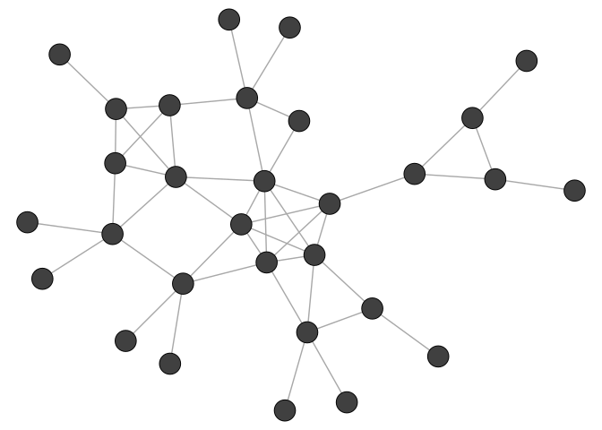

Figure 1: The example network used to illustrate cliques and k-core
decomposition.

</div>

`max_cliques()` is only feasible for smaller networks.

``` r
(cl <- max_cliques(clique_graph, min = 3))
```

    [[1]]
    + 3/30 vertices, from 0193e05:
    [1]  9 17 18

    [[2]]
    + 3/30 vertices, from 0193e05:
    [1] 7 4 5

    [[3]]
    + 3/30 vertices, from 0193e05:
    [1] 7 4 8

    [[4]]
    + 3/30 vertices, from 0193e05:
    [1] 10  2 11

    [[5]]
    + 3/30 vertices, from 0193e05:
    [1] 16 12 15

    [[6]]
    + 3/30 vertices, from 0193e05:
    [1] 6 1 5

    [[7]]
    + 4/30 vertices, from 0193e05:
    [1] 12 13 15 14

    [[8]]
    + 3/30 vertices, from 0193e05:
    [1] 12  2  1

    [[9]]
    + 5/30 vertices, from 0193e05:
    [1] 1 2 5 4 3

``` r
xy <- graphlayouts::layout_with_stress(clique_graph)

cl_df <- as.data.frame(do.call(
  "rbind",
  lapply(seq_along(cl), function(x) {
    cbind(xy[cl[[x]], ], x)
  })
))

ggraph(clique_graph, "stress") +
  geom_edge_link0(edge_color = "grey66") +
  geom_node_point(shape = 21, size = 8, fill = "grey25") +
  ggforce::geom_mark_hull(
    data = cl_df,
    aes(V1, V2, fill = as.factor(x), group = x),
    show.legend = FALSE
  ) +
  scale_fill_manual(
    values = c(
      "#E69F00",
      "#000000",
      "#56B4E9",
      "#009E73",
      "#F0E442",
      "#0072B2",
      "#D55E00",
      "#CC79A7",
      "#666666"
    )
  ) +
  theme_void()
```

<div id="fig-clique-graph">

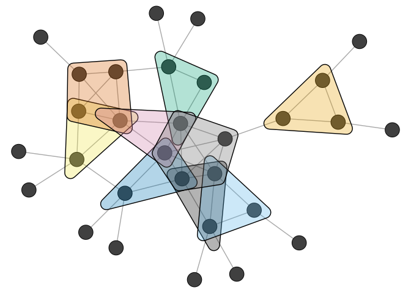

Figure 2: Maximal cliques of size 3 or more highlighted in the example
network.

</div>

*K-core decomposition* creates subgraphs in which each node has at least
k neighbors. It is a relaxed version of a clique.

``` r
(kcore <- coreness(clique_graph))
```

     [1] 4 4 4 4 4 3 2 2 2 2 2 3 3 3 3 3 2 2 1 1 1 1 1 1 1 1 1 1 1 1

``` r
cl_df <- as.data.frame(do.call(
  "rbind",
  lapply(sort(unique(kcore))[c(2, 3, 4)], function(x) {
    cbind(xy[kcore >= x, ], x)
  })
))

ggraph(clique_graph, "stress") +
  geom_edge_link0(edge_color = "grey66") +
  geom_node_point(shape = 21, size = 8, fill = "grey25") +
  ggforce::geom_mark_hull(
    data = cl_df,
    aes(V1, V2, fill = as.factor(x), group = x),
    show.legend = FALSE
  ) +
  scale_fill_manual(values = c("red", "blue", "green")) +
  theme_void()
```

<div id="fig-kcore">

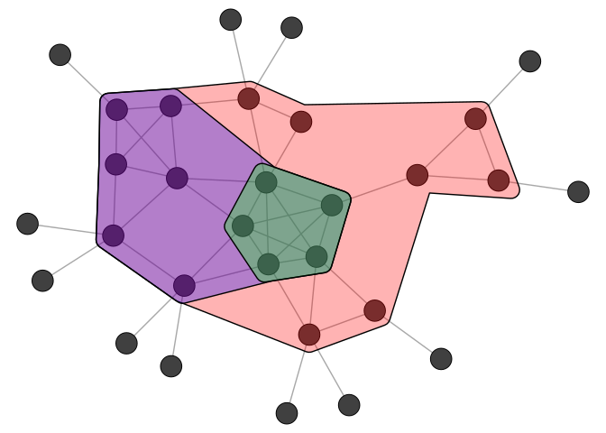

Figure 3: K-core decomposition of the example network. Nested hulls show
the 2-core, 3-core, and 4-core.

</div>

# Community Detection

A fuzzily defined concept, referring to groups of nodes which are more
densely connected to each other than to the rest of the network. Many
different algorithms exist. Most are based on “modularity maximization”.
Modularity compares the observed number of edges within groups to the
expectation for forming random edges while maintaining the degree of
each node.

Modularity:

$$Q = \frac{1}{2m} \sum_{ij} \left[ A_{ij} - \frac{k_i k_j}{2m} \right] \delta(c_i, c_j)$$

where $m$ is the total number of edges, $A_{i,j}$ is the adjacency
matrix entry (1 if nodes $i$ and $j$ are connected, 0 otherwise), $k_i$
is the degree of node $i$, and $\delta(c_i, c_j)$ equals 1 if nodes $i$
and $j$ are assigned to the same community and 0 otherwise. The term
$\frac{k_i k_j}{2m}$ is the expected number of edges between $i$ and $j$
under a null model that preserves degree. Modularity values typically
range from around -0.5 to 1, where values close to zero indicate no more
within-group edges than expected by chance, and higher values indicate
stronger community structure.

The workflow of a cluster analysis is always the same, independent from
the chosen method. We illustrate the workflow using the infamous karate
club network, already encountered in Chapter 3. This network was
collected by Wayne Zachary in the 1970s and it captures friendships
among 34 members of a university karate club. During the study, a
conflict between the club’s instructor and the administrator led to the
club splitting into two factions, making it a classic benchmark for
community detection.

``` r
ggraph(karate, "stress") +
  geom_edge_link0(edge_color = "grey66") +
  geom_node_point(shape = 21, size = 5, fill = "grey66") +
  theme_void() +
  coord_equal()
```

<div id="fig-karate-plot">

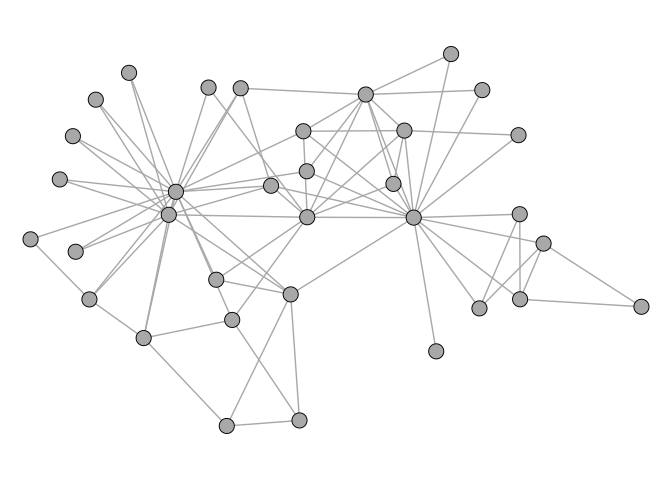

Figure 4: Zachary’s karate club network.

</div>

Using the Louvain method.

``` r
clu <- cluster_louvain(karate)

(mem <- membership(clu))
```

     [1] 1 1 1 1 2 2 2 1 3 3 2 1 1 1 3 3 2 1 3 1 3 1 3 4 4 4 3 4 4 3 3 4 3 3

``` r
(com <- communities(clu))
```

    $`1`
     [1]  1  2  3  4  8 12 13 14 18 20 22

    $`2`
    [1]  5  6  7 11 17

    $`3`
     [1]  9 10 15 16 19 21 23 27 30 31 33 34

    $`4`
    [1] 24 25 26 28 29 32

Comparing different methods

``` r
imc <- cluster_infomap(karate)
lec <- cluster_leading_eigen(karate)
loc <- cluster_louvain(karate)
sgc <- cluster_spinglass(karate)
wtc <- cluster_walktrap(karate)
scores <- c(
  infomap = modularity(karate, membership(imc)),
  eigen = modularity(karate, membership(lec)),
  louvain = modularity(karate, membership(loc)),
  spinglass = modularity(karate, membership(sgc)),
  walk = modularity(karate, membership(wtc))
)
scores
```

      infomap     eigen   louvain spinglass      walk 
    0.4020381 0.3934089 0.4151052 0.4197896 0.3532216 

For networks up to around 100 nodes, the optimal partition can be
calculated:

``` r
optc <- cluster_optimal(karate)
modularity(karate, membership(optc))
```

    [1] 0.4197896

``` r
V(karate)$clu <- membership(optc)
ggraph(karate, "stress") +
  geom_edge_link0(edge_color = "grey66") +
  geom_node_point(
    shape = 21,
    size = 5,
    aes(fill = as.factor(clu)),
    show.legend = FALSE
  ) +
  theme_void() +
  coord_equal()
```

<div id="fig-karate-clu">

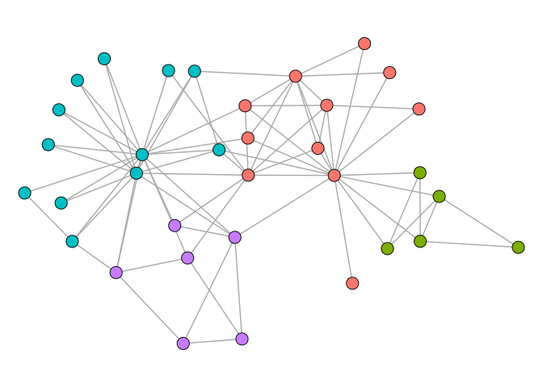

Figure 5: Karate club network colored by community membership (optimal
partition).

</div>

Note that when modularity is being maximized, smaller clusters can be
merged together to form bigger clusters. In a ring of 50 clusters of
size 5, the Louvain method merges multiple cliques resulting in an
unintuitive clustering.

``` r
n1 <- 5
n2 <- 50
A <- matrix(1, n1, n1)
lst <- vector("list", n2)
lst <- lapply(lst, function(x) A)
AA <- Matrix::bdiag(lst)
for (i in 1:(n2 - 1)) {
  AA[i * n1, i * n1 + 1] <- AA[i * n1 + 1, i * n1] <- 1
}
AA[1, n1 * n2] <- AA[n1 * n2, 1] <- 1
K50 <- graph_from_adjacency_matrix(AA, "undirected", diag = FALSE)


ggraph(K50, "stress") +
  geom_edge_link0(edge_linewidth = 0.6, edge_color = "grey66") +
  geom_node_point(shape = 21, fill = "grey66", size = 2, show.legend = FALSE) +
  theme_void() +
  coord_fixed()
```

<div id="fig-K50-blank">

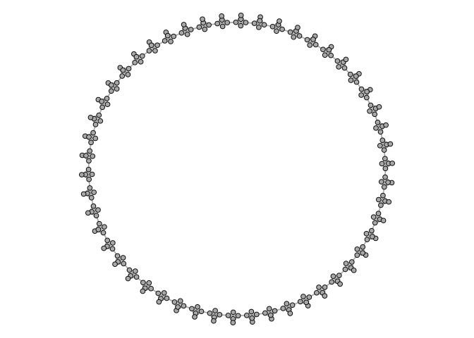

Figure 6: A ring of 50 cliques of size 5, used to illustrate the
resolution limit.

</div>

``` r
clu_louvain <- cluster_louvain(K50)
table(membership(clu_louvain))
```


     1  2  3  4  5  6  7  8  9 10 11 12 13 14 15 16 17 18 19 20 21 22 23 24 
    15 15 10 10 10 10 10 10 10 10 10 10 10 10 10 10 10 10 10 10 10 10 10 10 

In such cases, can use `cluster_leiden` instead. When used with the CPM
(Constant Potts Model) objective function, it avoids the resolution
limit entirely.

``` r
clu_leiden <- cluster_leiden(
  K50, objective_function = "CPM", resolution = 0.5
)
table(membership(clu_leiden))
```


     1  2  3  4  5  6  7  8  9 10 11 12 13 14 15 16 17 18 19 20 21 22 23 24 25 26 
     5  5  5  5  5  5  5  5  5  5  5  5  5  5  5  5  5  5  5  5  5  5  5  5  5  5 
    27 28 29 30 31 32 33 34 35 36 37 38 39 40 41 42 43 44 45 46 47 48 49 50 
     5  5  5  5  5  5  5  5  5  5  5  5  5  5  5  5  5  5  5  5  5  5  5  5 

Choosing the right resolution can be tricky. A common approach is to
calculate

``` r
(r <- quantile(degree(karate))[2] / (vcount(karate) - 1))
```

           25% 
    0.06060606 

``` r
leidenc <- cluster_leiden(
  karate,
  objective_function = "CPM",
  resolution = r
)
```

``` r
V(karate)$clu <- membership(leidenc)
ggraph(karate, "stress") +
  geom_edge_link0(edge_color = "grey66") +
  geom_node_point(
    shape = 21,
    size = 5,
    aes(fill = as.factor(clu)),
    show.legend = FALSE
  ) +
  theme_void() +
  coord_equal()
```

<div id="fig-karate-leiden">

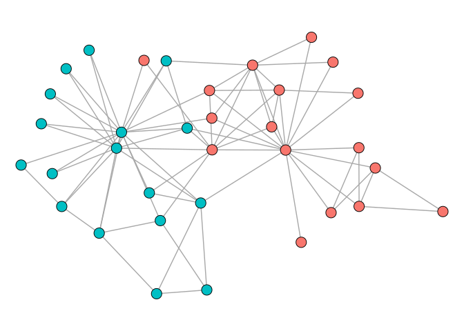

Figure 7: Karate club network colored by community membership (Leiden
algorithm with CPM objective function).

</div>

# Blockmodeling

Focuses on patterns of connections in addition to density. Two nodes
belong to the same block if they relate to other blocks in similar ways,
whether or not they are connected to each other. This makes
blockmodeling particularly useful for role analysis in sociology and
organizational context.

Blockmodeling is computationally intensive, and suited for small
networks.

We illustrate blockmodeling on a random network with 3 dense blocks of
size 20.

``` r
n1 <- 3
n2 <- 20

set.seed(1108)
g <- sample_islands(n1, n2, 0.75, 5)
g <- simplify(g)
V(g)$grp <- rep(LETTERS[1:n1], each = n2)
ggraph(g, "stress") +
  geom_edge_link0(edge_linewidth = 0.2, edge_color = "grey66") +
  geom_node_point(shape = 21, size = 5, fill = "grey66", show.legend = FALSE) +
  theme_void()
```

<div id="fig-blockmodel-network">

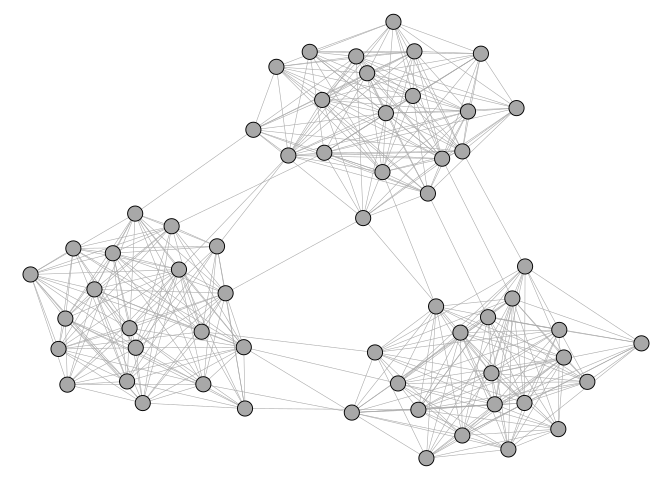

Figure 8: A random network with three dense blocks of 20 nodes each.

</div>

Must define expected block structure with an adjacency matrix specifying
expectations for each pair of blocks. “com” is complete with all
possible ties, “nul” means no ties expected. In the example below, we
place “com” on the diagonal and “nul” on the off-diagonal, which
corresponds to the familiar clustering scenario where nodes are densely
connected within groups and sparsely connected between them. The
function then tries multiple random starting partitions (rep) and
optimizes each one, returning the best assignment of nodes to blocks.

``` r
A <- as_adjacency_matrix(g)
(blk <- matrix(
  c("com", "nul", "nul", "nul", "com", "nul", "nul", "nul", "com"),
  nrow = 3
))
```

         [,1]  [,2]  [,3] 
    [1,] "com" "nul" "nul"
    [2,] "nul" "com" "nul"
    [3,] "nul" "nul" "com"

``` r
res <- optRandomParC(
  M = A, k = 3,
  approaches = "bin", #binary blockmodel
  blocks = blk, 
  rep = 5, # random starting partitions
  mingr = 20, maxgr = 20 #min and max block size
)
```


    Starting optimization of the partiton 1 of 5 partitions.
    Starting partition: 3 2 3 2 1 1 1 1 3 3 3 3 2 2 1 1 2 1 2 2 2 2 2 1 2 3 1 2 1 3 1 3 2 2 3 2 2 3 2 1 1 1 1 3 1 3 3 3 3 1 2 3 3 1 2 2 3 1 1 3 
    Final error: 364 
    Final partition:    3 3 3 3 3 3 3 3 3 3 3 3 3 3 3 3 3 3 3 3 2 2 2 2 2 2 2 2 2 2 2 2 2 2 2 2 2 2 2 2 1 1 1 1 1 1 1 1 1 1 1 1 1 1 1 1 1 1 1 1 


    Starting optimization of the partiton 2 of 5 partitions.
    Starting partition: 2 3 1 2 1 3 1 1 3 3 1 3 3 3 2 1 3 2 1 1 2 1 3 1 2 1 3 2 3 2 3 3 2 2 3 1 3 2 3 1 2 2 3 1 1 3 3 2 1 1 2 2 1 2 2 2 1 1 2 3 
    Final error: 364 
    Final partition:    1 1 1 1 1 1 1 1 1 1 1 1 1 1 1 1 1 1 1 1 3 3 3 3 3 3 3 3 3 3 3 3 3 3 3 3 3 3 3 3 2 2 2 2 2 2 2 2 2 2 2 2 2 2 2 2 2 2 2 2 


    Starting optimization of the partiton 3 of 5 partitions.
    Starting partition: 3 1 2 3 2 3 3 3 3 2 1 3 2 3 3 3 1 2 2 3 1 3 3 1 3 2 1 1 1 1 3 1 1 1 3 2 2 2 3 2 3 1 3 3 1 1 2 2 2 2 2 2 1 2 1 1 2 1 2 1 
    Final error: 364 
    Final partition:    3 3 3 3 3 3 3 3 3 3 3 3 3 3 3 3 3 3 3 3 1 1 1 1 1 1 1 1 1 1 1 1 1 1 1 1 1 1 1 1 2 2 2 2 2 2 2 2 2 2 2 2 2 2 2 2 2 2 2 2 


    Starting optimization of the partiton 4 of 5 partitions.
    Starting partition: 1 2 1 1 2 1 2 1 3 1 3 2 3 3 2 3 1 3 1 2 3 1 3 2 1 3 1 1 1 1 2 2 3 2 3 1 1 1 1 3 3 2 2 2 1 3 2 2 2 2 1 2 3 3 3 3 2 3 2 3 
    Final error: 364 
    Final partition:    3 3 3 3 3 3 3 3 3 3 3 3 3 3 3 3 3 3 3 3 1 1 1 1 1 1 1 1 1 1 1 1 1 1 1 1 1 1 1 1 2 2 2 2 2 2 2 2 2 2 2 2 2 2 2 2 2 2 2 2 


    Starting optimization of the partiton 5 of 5 partitions.
    Starting partition: 2 3 2 3 2 1 3 3 2 3 1 1 3 1 1 1 3 2 3 1 2 3 1 3 1 1 3 3 3 1 1 2 2 2 3 1 2 2 2 2 2 3 2 2 3 3 2 1 2 3 3 1 3 1 1 1 2 1 2 1 
    Final error: 364 
    Final partition:    1 1 1 1 1 1 1 1 1 1 1 1 1 1 1 1 1 1 1 1 3 3 3 3 3 3 3 3 3 3 3 3 3 3 3 3 3 3 3 3 2 2 2 2 2 2 2 2 2 2 2 2 2 2 2 2 2 2 2 2 


    Optimization of all partitions completed
    All 5 solutions have err 364 

``` r
clu(res)
```

     [1] 3 3 3 3 3 3 3 3 3 3 3 3 3 3 3 3 3 3 3 3 2 2 2 2 2 2 2 2 2 2 2 2 2 2 2 2 2 2
    [39] 2 2 1 1 1 1 1 1 1 1 1 1 1 1 1 1 1 1 1 1 1 1

``` r
V(g)$clu <- clu(res)
ggraph(g, "stress") +
  geom_edge_link0(edge_linewidth = 0.2, edge_color = "grey66") +
  geom_node_point(
    shape = 21,
    size = 5,
    aes(fill = as.factor(clu)),
    show.legend = FALSE
  ) +
  theme_void()
```

<div id="fig-blockmodel-result">

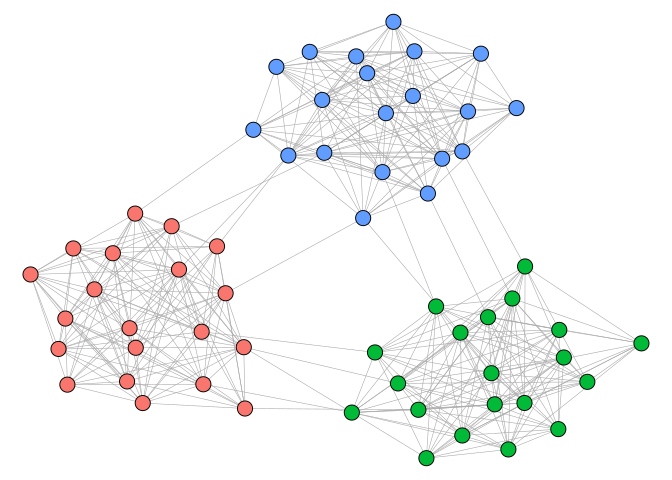

Figure 9: Blockmodeling result for the random network.

</div>

# Core-Perifery

Unlike community detection, core-perifery posits that a network is
organized into a densely connected core and a sparsely-connected
periphery. Core nodes are highly connected to each other and periphery
nodes, periphery nodes tend to be connected to core nodes but not each
other.

``` r
set.seed(1108)
g_clu <- sample_islands(3, 8, 0.8, 2)
V(g_clu)$clu <- rep(1:3, each = 8)
g_clu <- permute(g_clu, order(V(g_clu)$clu))
V(g_clu)$clu <- rep(1:3, each = 8)
E(g_clu)$type <- apply(
  matrix(V(g_clu)$clu[as_edgelist(g_clu, names = FALSE)], ncol = 2),
  1,
  function(x) if (x[1] == x[2]) paste("community", x[1]) else "between"
)

p1 <- ggraph(g_clu, "matrix") +
  geom_edge_point(mirror = TRUE, aes(edge_color = type)) +
  coord_fixed() +
  scale_y_reverse() +
  theme_graph() +
  theme(legend.position = "bottom", legend.title = element_blank()) +
  labs(title = "Community structure")

set.seed(1108)
g_cp <- netUtils::split_graph(n = 24, p = 0.3, core = 0.3)
V(g_cp)$type <- c("periphery", "core")[V(g_cp)$core + 1]
E(g_cp)$type <- apply(
  matrix(V(g_cp)$core[as_edgelist(g_cp, names = FALSE)], ncol = 2),
  1,
  function(x) if (all(x == 1)) "core - core" else "core - periphery"
)

p2 <- ggraph(g_cp, "matrix") +
  geom_edge_point(mirror = TRUE, aes(edge_color = type)) +
  coord_fixed() +
  scale_y_reverse() +
  theme_graph() +
  theme(legend.position = "bottom", legend.title = element_blank()) +
  labs(title = "Core-periphery structure")

p1 + p2
```

<div id="fig-compare-clu-cp">

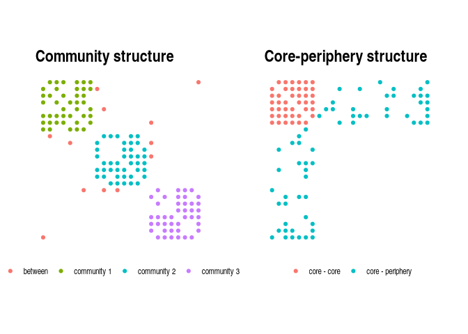

Figure 10: Comparison of community structure and core-periphery
structure by patterns in the adjacency matrix. Left: community structure
with dense blocks along the diagonal. Right: core-periphery structure
with a dense block in the top-left corner and sparse connections
elsewhere.

</div>

Core-periphery structures can appear in many different contexts. In
international trade networks, a small number of wealthy, industrialised
countries form a densely interconnected core, while developing nations
at the periphery trade primarily with core countries but rarely with
each other. In scientific collaboration networks, a core of highly
productive researchers co-author with many others and with each other,
while peripheral researchers have fewer and more localised
collaborations.

The idea of the model is that nodes either belong to the core, or the
periphery. The membership of nodes is derived by optimizing the
correlation between the observed adjacency matrix and an idealized
adjacency matrix.

``` r
cp <- core_periphery(core_graph)
V(core_graph)$type <- c("periphery", "core")[cp$vec + 1]
p1 <- ggraph(core_graph, "stress") +
  geom_edge_link0(edge_color = "grey66", edge_linewidth = 0.1) +
  geom_node_point(shape = 21, size = 3, aes(fill = type)) +
  theme_graph() +
  theme(legend.position = "bottom", legend.title = element_blank())

E(core_graph)$col <- apply(
  matrix(as.logical(cp$vec[as_edgelist(core_graph, names = FALSE)]), ncol = 2),
  1,
  all
)
E(core_graph)$type <- c("core - periphery", "core - core")[
  E(core_graph)$col + 1
]
p2 <- ggraph(core_graph, "matrix") +
  geom_edge_point(mirror = TRUE, aes(edge_color = type), edge_size = 0.2) +
  coord_fixed() +
  scale_y_reverse() +
  guides(edge_color = guide_legend(override.aes = list(edge_size = 3))) +
  theme_graph() +
  theme(legend.position = "bottom", legend.title = element_blank())

p1 + p2
```

<div id="fig-core-graph">

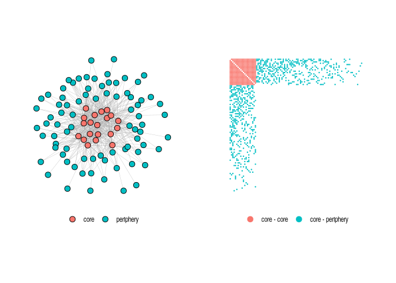

Figure 11: A graph with a perfect core-periphery structure. Left:
network layout with core and periphery nodes. Right: adjacency matrix
showing the block pattern.

</div>

``` r
(cp <- core_periphery(core_graph))
```

    $vec
      [1] 1 1 1 1 1 1 1 1 1 1 1 1 1 1 1 1 1 1 1 1 0 0 0 0 0 0 0 0 0 0 0 0 0 0 0 0 0
     [38] 0 0 0 0 0 0 0 0 0 0 0 0 0 0 0 0 0 0 0 0 0 0 0 0 0 0 0 0 0 0 0 0 0 0 0 0 0
     [75] 0 0 0 0 0 0 0 0 0 0 0 0 0 0 0 0 0 0 0 0 0 0 0 0 0 0

    $corr
    [1] 1

`vec` is one if core, zero if peripheral. `corr` is the correlation to
the ideal adjacency matrix derived from `vec` membership, which in this
case is perfect.

Different optimization techniques can be used. To illustrate this on a
real-world network, we use the US domestic flights network from the
`networkdata` package. This network connects 276 airports based on
scheduled flights and is a natural candidate for core-periphery
analysis: major hub airports (Atlanta, Denver, Dallas-Fort Worth, etc.)
serve as a densely interconnected core, while smaller regional airports
on the periphery connect primarily to these hubs.

``` r
cp_dc <- core_periphery(us_flights, method = "rk1_dc")
cp_dc$corr; sum(cp_dc$vec)
```

    [1] 0.8092107

    [1] 45

45 core airports identified, with a correlation of 0.81, strongly
suggesting a core-periphery structure in the airline system. The `GA`
method is usually better, but much slower. In this case, rank-one
approximations are almost as good.

``` r
cp_ec <- core_periphery(us_flights, method = "rk1_ec")
cp_ga <- core_periphery(us_flights, method = "GA", iter = 2500)
c(rk1_dc = cp_dc$corr, rk1_ec = cp_ec$corr, GA = cp_ga$corr)
```

       rk1_dc    rk1_ec        GA 
    0.8092107 0.8097646 0.8102048 
