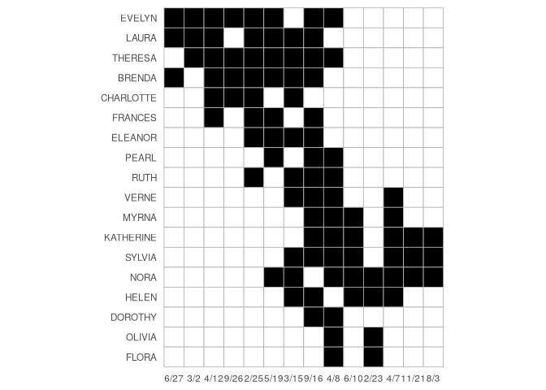
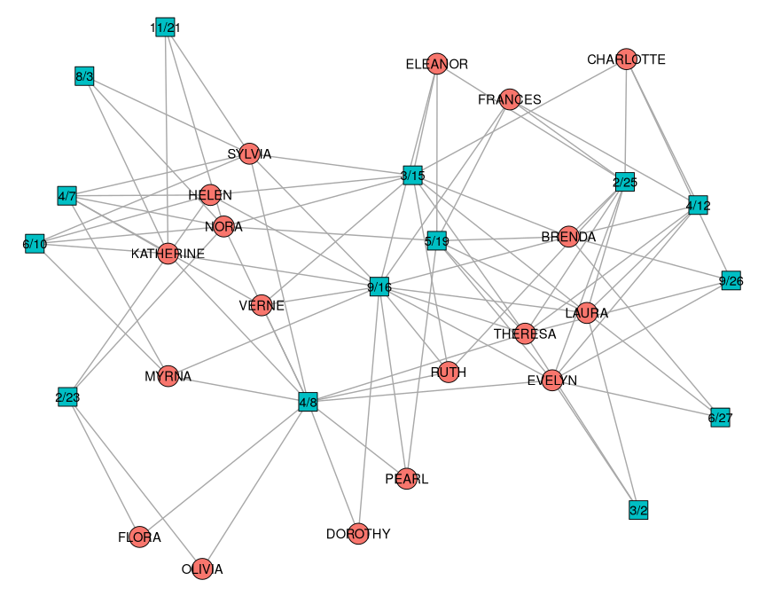
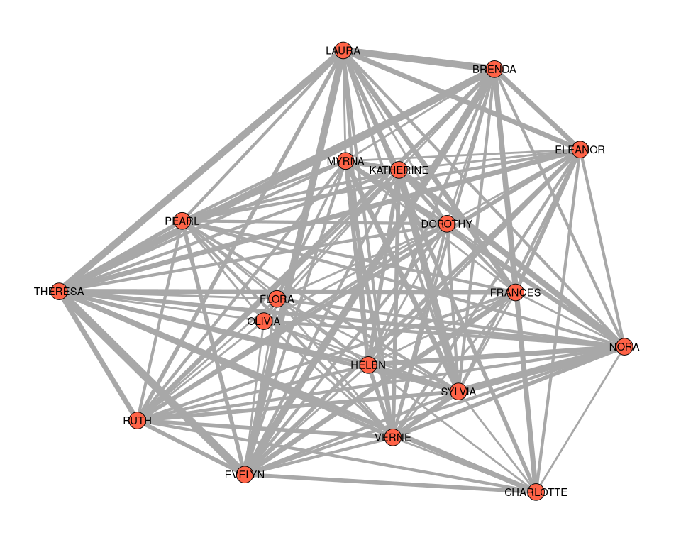
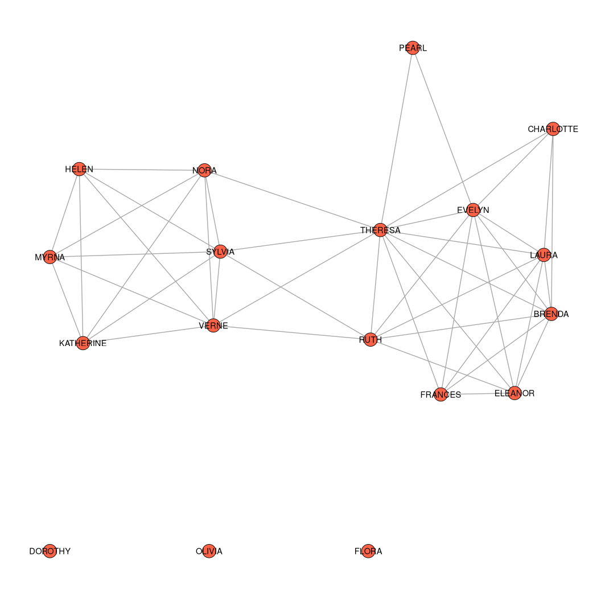
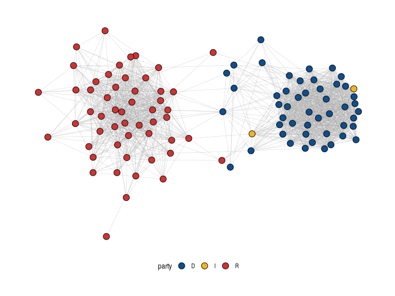

# Two-Mode Networks


[Source](https://schochastics.github.io/R4SNA/descriptive/two-mode-networks.html)

``` r
options(paged.print = FALSE)
```

``` r
libraries <- list(
  "igraph", "networkdata", "tnet",
  "backbone", "ggraph", "tidyverse"
)
invisible(lapply(libraries, library, character.only = TRUE))
```

Two-mode network data represent situations like

- Affiliation networks (membership in institutions/clubs)
- Voting/sponsorship networks (politicians and bills)
- Citation networks (authors and papers)
- Co-authorship networks (also authors and papers)

The can be analyzed directly or projected onto a one-mode network, the
latter approach being more popular.

# Data Structure

Stored as an *incidence matrix* or *biadjacency matrix*, with rows for
one type of node and columns for the other type. Entries indicated ties
existing across the two sets. Two-mode networks are especially useful
for analyzing how connections emerge indirectly, for example, when two
individuals are linked because they attend the same event or belong to
the same organization.

`igraph` recognizes a two-mode network if it contains a logical
attribute named `type`. One mode is `FALSE` and the other is `TRUE`.

To illustrate methods tailored for two-mode networks, we will use the
well-known Southern Women dataset (Davis et al. 2009). This classic
dataset records the attendance patterns of 18 women at 14 social events
in the American South, and has become a foundational example in network
analysis.

``` r
southern_women
```

    IGRAPH 1074643 UN-B 32 89 -- 
    + attr: type (v/l), name (v/c)
    + edges from 1074643 (vertex names):
     [1] EVELYN   --6/27 EVELYN   --3/2  EVELYN   --4/12 EVELYN   --9/26
     [5] EVELYN   --2/25 EVELYN   --5/19 EVELYN   --9/16 EVELYN   --4/8 
     [9] LAURA    --6/27 LAURA    --3/2  LAURA    --4/12 LAURA    --2/25
    [13] LAURA    --5/19 LAURA    --3/15 LAURA    --9/16 THERESA  --3/2 
    [17] THERESA  --4/12 THERESA  --9/26 THERESA  --2/25 THERESA  --5/19
    [21] THERESA  --3/15 THERESA  --9/16 THERESA  --4/8  BRENDA   --6/27
    [25] BRENDA   --4/12 BRENDA   --9/26 BRENDA   --2/25 BRENDA   --5/19
    [29] BRENDA   --3/15 BRENDA   --9/16 CHARLOTTE--4/12 CHARLOTTE--9/26
    + ... omitted several edges

``` r
(A <- as_biadjacency_matrix(southern_women))
```

              6/27 3/2 4/12 9/26 2/25 5/19 3/15 9/16 4/8 6/10 2/23 4/7 11/21 8/3
    EVELYN       1   1    1    1    1    1    0    1   1    0    0   0     0   0
    LAURA        1   1    1    0    1    1    1    1   0    0    0   0     0   0
    THERESA      0   1    1    1    1    1    1    1   1    0    0   0     0   0
    BRENDA       1   0    1    1    1    1    1    1   0    0    0   0     0   0
    CHARLOTTE    0   0    1    1    1    0    1    0   0    0    0   0     0   0
    FRANCES      0   0    1    0    1    1    0    1   0    0    0   0     0   0
    ELEANOR      0   0    0    0    1    1    1    1   0    0    0   0     0   0
    PEARL        0   0    0    0    0    1    0    1   1    0    0   0     0   0
    RUTH         0   0    0    0    1    0    1    1   1    0    0   0     0   0
    VERNE        0   0    0    0    0    0    1    1   1    0    0   1     0   0
    MYRNA        0   0    0    0    0    0    0    1   1    1    0   1     0   0
    KATHERINE    0   0    0    0    0    0    0    1   1    1    0   1     1   1
    SYLVIA       0   0    0    0    0    0    1    1   1    1    0   1     1   1
    NORA         0   0    0    0    0    1    1    0   1    1    1   1     1   1
    HELEN        0   0    0    0    0    0    1    1   0    1    1   1     0   0
    DOROTHY      0   0    0    0    0    0    0    1   1    0    0   0     0   0
    OLIVIA       0   0    0    0    0    0    0    0   1    0    1   0     0   0
    FLORA        0   0    0    0    0    0    0    0   1    0    1   0     0   0

``` r
# Convert to tidy format
df <- as.data.frame(A) %>% 
  rownames_to_column("woman") %>% 
  pivot_longer(-woman, names_to = "event", values_to = "attend") %>% 
  mutate(
    attend = as.integer(attend > 0),
    # Reverse row order so first woman appears at top
    woman = factor(woman, levels = rev(unique(woman))),
    event = factor(event, levels = unique(event))
  )

# Plot incidence matrix (black = tie, white = no tie)
ggplot(df, aes(x = event, y = woman, fill = factor(attend))) +
  geom_tile(color = "grey70", linewidth = 0.3) +
  scale_fill_manual(values = c("0" = "white", "1" = "black"), guide = "none") +
  coord_fixed() +
  labs(
    x = NULL,
    y = NULL
  ) +
  theme_minimal() +
  theme(panel.grid = element_blank())
```

<div id="fig-incmat">



Figure 1: Incidence matrix representation of the Southern Women two-mode
network. Rows correspond to the 18 women and columns to the 14 social
events; black cells indicate attendance at an event, and white cells
indicate non-attendance.

</div>

``` r
ggraph(southern_women, "stress") +
  geom_edge_link0(edge_color = "grey66") +
  geom_node_point(
    aes(fill = type, shape = type),
    size = 8,
    show.legend = FALSE
  ) +
  geom_node_text(aes(label = name)) +
  scale_shape_manual(values = c(21, 22)) +
  theme_void()
```

<div id="fig-southern-women-plot">



Figure 2

</div>

To see how many vertices belong to each mode:

``` r
table(V(southern_women)$type)
```


    FALSE  TRUE 
       18    14 

# Direct Approach

Since closed triplets of nodes do not exist, the definition of
transitivity must be adapted.

``` r
transitivity(southern_women); transitivity(southern_women, type = "local")
```

    [1] 0

       EVELYN     LAURA   THERESA    BRENDA CHARLOTTE   FRANCES   ELEANOR     PEARL 
            0         0         0         0         0         0         0         0 
         RUTH     VERNE     MYRNA KATHERINE    SYLVIA      NORA     HELEN   DOROTHY 
            0         0         0         0         0         0         0         0 
       OLIVIA     FLORA      6/27       3/2      4/12      9/26      2/25      5/19 
            0         0         0         0         0         0         0         0 
         3/15      9/16       4/8      6/10      2/23       4/7     11/21       8/3 
            0         0         0         0         0         0         0         0 

`tnet` defines a two-mode clustering coefficient based on cycles of
length six, eg. woman $\rightarrow$ event $\rightarrow$ woman
$\rightarrow$ event $\rightarrow$ woman $\rightarrow$ event
$\rightarrow$ back to the first woman.

``` r
el_women <- as_edgelist(southern_women, names = F)
```

Global clustering (first mode)

``` r
clustering_tm(el_women)
```

    [1] 0.7718968

Local clustering (first mode).

``` r
clustering_local_tm(el_women)
```

       node        lc
    1     1 0.7666667
    2     2 0.8421751
    3     3 0.7523437
    4     4 0.8387909
    5     5 1.0000000
    6     6 0.8690476
    7     7 0.7959184
    8     8 0.6462585
    9     9 0.6702509
    10   10 0.6740891
    11   11 0.7138810
    12   12 0.7695560
    13   13 0.7461929
    14   14 0.8379501
    15   15 0.8159204
    16   16 0.5407407
    17   17 0.5806452
    18   18 0.5806452

Local clustering (second mode).

``` r
clustering_local_tm(el_women[, 2:1])
```

       node        lc
    1     1       NaN
    2     2       NaN
    3     3       NaN
    4     4       NaN
    5     5       NaN
    6     6       NaN
    7     7       NaN
    8     8       NaN
    9     9       NaN
    10   10       NaN
    11   11       NaN
    12   12       NaN
    13   13       NaN
    14   14       NaN
    15   15       NaN
    16   16       NaN
    17   17       NaN
    18   18       NaN
    19   19 1.0000000
    20   20 0.9487179
    21   21 0.9532967
    22   22 0.9644970
    23   23 0.9628253
    24   24 0.8135593
    25   25 0.7171825
    26   26 0.7791580
    27   27 0.7353630
    28   28 0.8544601
    29   29 0.9555556
    30   30 0.8844765
    31   31 0.8709677
    32   32 0.8709677

`NaN` values indicated the node does not participate in any valid
six-cycle. This approach is computationally intensive.

# Projection Approach

Nodes from one mode are connected if they share ties to the same nodes
in the other mode. They can be weighted or binary.

## Weighted Projection

Projection onto the first mode is $AA^T$, projecting onto the second
mode is $A^TA$. The result is a weighted adjacency matrix, with entries
indicating the number of shared affiliations.

``` r
(B <- A %*% t(A))
```

              EVELYN LAURA THERESA BRENDA CHARLOTTE FRANCES ELEANOR PEARL RUTH
    EVELYN         8     6       7      6         3       4       3     3    3
    LAURA          6     7       6      6         3       4       4     2    3
    THERESA        7     6       8      6         4       4       4     3    4
    BRENDA         6     6       6      7         4       4       4     2    3
    CHARLOTTE      3     3       4      4         4       2       2     0    2
    FRANCES        4     4       4      4         2       4       3     2    2
    ELEANOR        3     4       4      4         2       3       4     2    3
    PEARL          3     2       3      2         0       2       2     3    2
    RUTH           3     3       4      3         2       2       3     2    4
    VERNE          2     2       3      2         1       1       2     2    3
    MYRNA          2     1       2      1         0       1       1     2    2
    KATHERINE      2     1       2      1         0       1       1     2    2
    SYLVIA         2     2       3      2         1       1       2     2    3
    NORA           2     2       3      2         1       1       2     2    2
    HELEN          1     2       2      2         1       1       2     1    2
    DOROTHY        2     1       2      1         0       1       1     2    2
    OLIVIA         1     0       1      0         0       0       0     1    1
    FLORA          1     0       1      0         0       0       0     1    1
              VERNE MYRNA KATHERINE SYLVIA NORA HELEN DOROTHY OLIVIA FLORA
    EVELYN        2     2         2      2    2     1       2      1     1
    LAURA         2     1         1      2    2     2       1      0     0
    THERESA       3     2         2      3    3     2       2      1     1
    BRENDA        2     1         1      2    2     2       1      0     0
    CHARLOTTE     1     0         0      1    1     1       0      0     0
    FRANCES       1     1         1      1    1     1       1      0     0
    ELEANOR       2     1         1      2    2     2       1      0     0
    PEARL         2     2         2      2    2     1       2      1     1
    RUTH          3     2         2      3    2     2       2      1     1
    VERNE         4     3         3      4    3     3       2      1     1
    MYRNA         3     4         4      4    3     3       2      1     1
    KATHERINE     3     4         6      6    5     3       2      1     1
    SYLVIA        4     4         6      7    6     4       2      1     1
    NORA          3     3         5      6    8     4       1      2     2
    HELEN         3     3         3      4    4     5       1      1     1
    DOROTHY       2     2         2      2    1     1       2      1     1
    OLIVIA        1     1         1      1    2     1       1      2     2
    FLORA         1     1         1      1    2     1       1      2     2

Alternatively, with `igraph`

``` r
(projs <- bipartite_projection(southern_women))
```

    $proj1
    IGRAPH 202e934 UNW- 18 139 -- 
    + attr: name (v/c), weight (e/n)
    + edges from 202e934 (vertex names):
     [1] EVELYN --LAURA     EVELYN --BRENDA    EVELYN --THERESA   EVELYN --CHARLOTTE
     [5] EVELYN --FRANCES   EVELYN --ELEANOR   EVELYN --RUTH      EVELYN --PEARL    
     [9] EVELYN --NORA      EVELYN --VERNE     EVELYN --MYRNA     EVELYN --KATHERINE
    [13] EVELYN --SYLVIA    EVELYN --HELEN     EVELYN --DOROTHY   EVELYN --OLIVIA   
    [17] EVELYN --FLORA     LAURA  --BRENDA    LAURA  --THERESA   LAURA  --CHARLOTTE
    [21] LAURA  --FRANCES   LAURA  --ELEANOR   LAURA  --RUTH      LAURA  --PEARL    
    [25] LAURA  --NORA      LAURA  --VERNE     LAURA  --SYLVIA    LAURA  --HELEN    
    [29] LAURA  --MYRNA     LAURA  --KATHERINE LAURA  --DOROTHY   THERESA--BRENDA   
    + ... omitted several edges

    $proj2
    IGRAPH 3e36c80 UNW- 14 66 -- 
    + attr: name (v/c), weight (e/n)
    + edges from 3e36c80 (vertex names):
     [1] 6/27--3/2   6/27--4/12  6/27--9/26  6/27--2/25  6/27--5/19  6/27--9/16 
     [7] 6/27--4/8   6/27--3/15  3/2 --4/12  3/2 --9/26  3/2 --2/25  3/2 --5/19 
    [13] 3/2 --9/16  3/2 --4/8   3/2 --3/15  4/12--9/26  4/12--2/25  4/12--5/19 
    [19] 4/12--9/16  4/12--4/8   4/12--3/15  9/26--2/25  9/26--5/19  9/26--9/16 
    [25] 9/26--4/8   9/26--3/15  2/25--5/19  2/25--9/16  2/25--4/8   2/25--3/15 
    [31] 5/19--9/16  5/19--4/8   5/19--3/15  5/19--6/10  5/19--2/23  5/19--4/7  
    [37] 5/19--11/21 5/19--8/3   3/15--9/16  3/15--4/8   3/15--4/7   3/15--6/10 
    [43] 3/15--11/21 3/15--8/3   3/15--2/23  9/16--4/8   9/16--4/7   9/16--6/10 
    + ... omitted several edges

``` r
proj <- graph_from_adjacency_matrix(
  B,
  weighted = TRUE,
  diag = FALSE,
  mode = "undirected"
)

ggraph(proj, "stress") +
  geom_edge_link0(
    aes(edge_linewidth = weight),
    edge_color = "grey66",
    show.legend = FALSE
  ) +
  geom_node_point(shape = 21, fill = "tomato", size = 8, show.legend = FALSE) +
  geom_node_text(aes(label = name)) +
  scale_edge_width(range = c(1, 4)) +
  theme_graph() +
  coord_cartesian(clip = "off")
```

<div id="fig-plot_weighted_proj">



Figure 3: Weighted projection of the Southern Women network onto the
women.

</div>

This is commonly binarized for analysis.

## Simple Binary Projections

A simple way is to define a global threshold for turning weights into
binary. This can be the mean edge weight, sometimes adjusted upwards by
1-2 standard deviations. In many projected networks, the distribution of
edge weights is highly skewed, with most pairs sharing only one or two
affiliations.

The appropriate threshold depends on the research question: lower
thresholds preserve more information but may produce very dense graphs,
while higher thresholds emphasize strong ties but risk discarding
meaningful structure.

``` r
women_proj <- projs$proj1
threshold <- mean(E(projs$proj1)$weight)
women_bin <- delete_edges(
  women_proj, which(E(women_proj)$weight <= threshold)
)
(women_bin <- delete_edge_attr(women_bin, "weight"))
```

    IGRAPH b9f149a UN-- 18 46 -- 
    + attr: name (v/c)
    + edges from b9f149a (vertex names):
     [1] EVELYN --LAURA     EVELYN --BRENDA    EVELYN --THERESA   EVELYN --CHARLOTTE
     [5] EVELYN --FRANCES   EVELYN --ELEANOR   EVELYN --RUTH      EVELYN --PEARL    
     [9] LAURA  --BRENDA    LAURA  --THERESA   LAURA  --CHARLOTTE LAURA  --FRANCES  
    [13] LAURA  --ELEANOR   LAURA  --RUTH      THERESA--BRENDA    THERESA--CHARLOTTE
    [17] THERESA--FRANCES   THERESA--ELEANOR   THERESA--RUTH      THERESA--PEARL    
    [21] THERESA--NORA      THERESA--VERNE     THERESA--SYLVIA    BRENDA --CHARLOTTE
    [25] BRENDA --FRANCES   BRENDA --ELEANOR   BRENDA --RUTH      FRANCES--ELEANOR  
    [29] ELEANOR--RUTH      RUTH   --VERNE     RUTH   --SYLVIA    VERNE  --SYLVIA   
    + ... omitted several edges

Connections now only show stronger-than-average shared-event ties.

``` r
ggraph(women_bin, "stress", bbox = 5) +
  geom_edge_link0(edge_color = "grey66") +
  geom_node_point(shape = 21, fill = "tomato", size = 8) +
  geom_node_text(aes(label = name)) +
  theme_graph() +
  coord_cartesian(clip = "off")
```

<div id="fig-southern-women-bin-plot">



Figure 4: Binary projection of the Southern Women network onto the women
using a global threshold based on the mean edge weight.

</div>

## Model-based Binary Projections

Statistical models which determine if an edge weight differs enough from
the expected value of an underlying null model to keep the edge in the
binary projection.

The idea is:

1.  Create the weighted projection of interest, eg. `B <- A%*%t(A)`
2.  Generate random two-mode networks according to a given model
3.  Compare if the values `B[i,j]` differ significantly from the
    distribution of values in the random projections.

The difference is in the construction of the random networks:

- *Fixed Degree Sequence Model* `fdsm`: Create random two-mode networks
  with the same row and column sums as `A`.
- *Fixed Column Model* `fixedcol`: Create random two-mode networks with
  the same column sums as `A`.
- *Fixed Row Model* `fixedrow`: Create random two-mode networks with the
  same row sums as A.
- *Fixed Fill Model* `fixedfill`: Create random two-mode networks with
  the same number of ones as A.
- *Stochastic Degree Sequence Model* `sdsm`: Create random two-mode
  networks with approximately the same row and column sums as A.

In general you can follow these rough questions:

1.  Use the model that fits your empirical setting or a known link
    formation process. If that link formation process dictates that row
    sums are fixed but column sums not, then choose fixedrow.
2.  Use fdsm if your network is small enough. Sampling from the FDSM is
    quite expensive.
3.  Use the sdsm for large networks.

To illustrate model fitting in a substantive setting, we use a bill
cosponsorship network from the U.S. Senate in 2015 (available in the
networkdata package). The data form a two-mode network in which one set
of nodes represents senators and the other represents bills; a tie
between a senator and a bill indicates sponsorship or cosponsorship. We
are interested in examining the binary one-mode projection onto
senators, i.e., a network in which two senators are connected if they
sponsored at least one bill together.

``` r
cosponsor
```

    IGRAPH 6eddec8 UN-B 3984 26392 -- 
    + attr: name (v/c), type (v/l), party (v/c)
    + edges from 6eddec8 (vertex names):
     [1] 115s1   --Enzi, Michael B.    115s10  --Cardin, Benjamin L.
     [3] 115s10  --Wicker, Roger F.    115s100 --Alexander, Lamar   
     [5] 115s1000--Franken, Al         115s1000--Murray, Patty      
     [7] 115s1000--Brown, Sherrod      115s1000--Warren, Elizabeth  
     [9] 115s1000--Markey, Edward J.   115s1001--Crapo, Mike        
    [11] 115s1001--Blumenthal, Richard 115s1001--Murphy, Christopher
    [13] 115s1001--Cassidy, Bill       115s1001--Alexander, Lamar   
    [15] 115s1001--Bennet, Michael F.  115s1002--Moran, Jerry       
    + ... omitted several edges

Because the network is large, use SDSM. The projection is onto the nodes
with `type = FALSE`. For `type = TRUE`, the `type` attribute must be
inverted.

``` r
(senators <- backbone_from_projection(
  cosponsor,
  model = "sdsm",
  alpha = 0.05,
  signed = FALSE
))
```

    IGRAPH ab13f67 UN-- 110 1591 -- sdsm backbone
    + attr: name (g/c), call (g/x), narrative (g/c), name (v/c), party
    | (v/c), oldweight (e/n)
    + edges from ab13f67 (vertex names):
     [1] Enzi, Michael B.--Moran, Jerry     Enzi, Michael B.--Scott, Tim      
     [3] Enzi, Michael B.--Daines, Steve    Enzi, Michael B.--Perdue, David   
     [5] Enzi, Michael B.--Blunt, Roy       Enzi, Michael B.--Inhofe, James M.
     [7] Enzi, Michael B.--Barrasso, John   Enzi, Michael B.--Fischer, Deb    
     [9] Enzi, Michael B.--Ernst, Joni      Enzi, Michael B.--Rounds, Mike    
    [11] Enzi, Michael B.--Kennedy, John    Enzi, Michael B.--Flake, Jeff     
    [13] Enzi, Michael B.--Hoeven, John     Enzi, Michael B.--Risch, James E. 
    + ... omitted several edges

If `signed = FALSE`, ties are retained only if the co-sponsorship
strength is greater tahn expected from a null model at the significance
level `alpha`. If `signed = TRUE`, negative results for less than
expected strength of co-sponsorship, with positive numbers showing
greater than expected.

``` r
V(senators)$party <- V(cosponsor)$party[match(
  V(senators)$name,
  V(cosponsor)$name
)]
senators <- largest_component(senators)
party_cols <-
  c(D = "#104E8B", R = "#CD3333", I = "#EEB422")
ggraph(senators, "stress") +
  geom_edge_link0(edge_linewidth = 0.1, edge_color = "grey66") +
  geom_node_point(shape = 21, aes(fill = party), size = 4) +
  scale_fill_manual(values = party_cols) +
  theme_graph() +
  theme(legend.position = "bottom")
```

<div id="fig-cosponsor-plot">



Figure 5: Backbone projection of the U.S. Senate cosponsorship network,
with nodes colored by party affiliation. Edges represent statistically
significant co-sponsorship ties based on the SDSM null model.

</div>

This reveals strong polarization, with a small number of edges spanning
the gap, and a few senators positioned as “brokers”.
