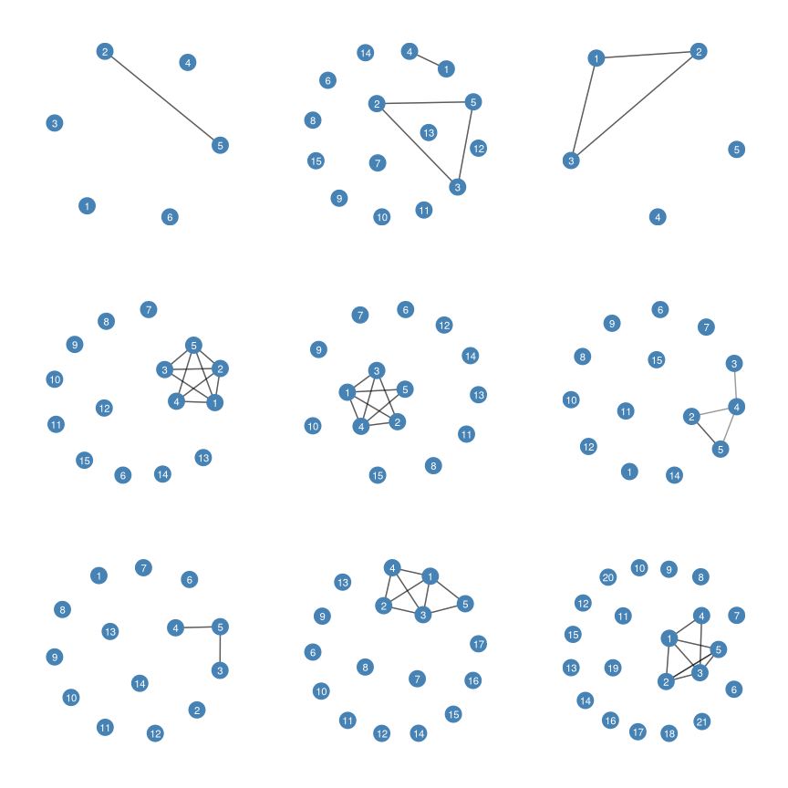
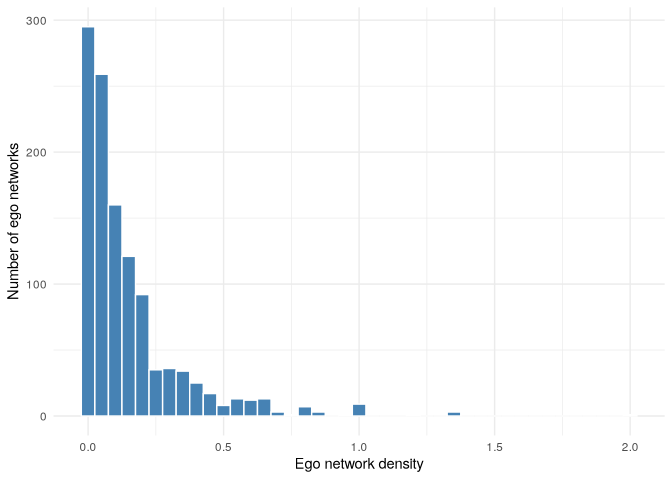
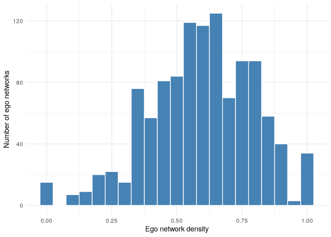
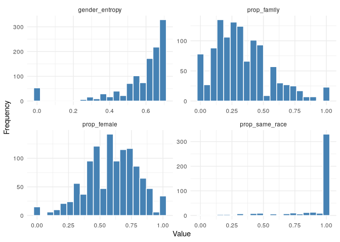
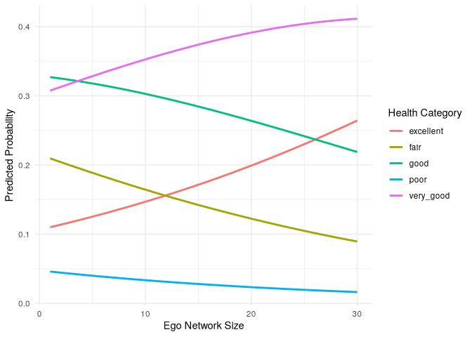
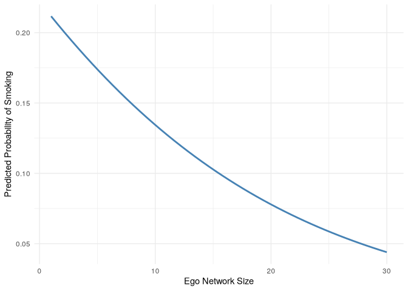
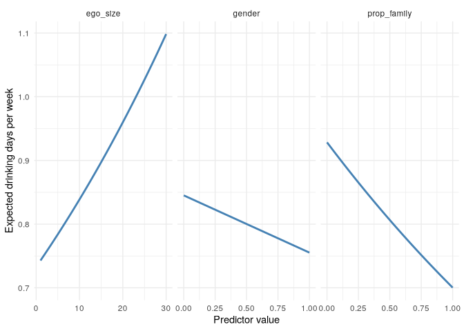

# Ego Networks


[Source](https://schochastics.github.io/R4SNA/descriptive/ego-networks.html)

``` r
options(paged.print = FALSE)
```

``` r
libraries <- list(
  "igraph", "networkdata", "egor",
  "patchwork", "ggraph", "tidyverse",
  "knitr"
)
invisible(lapply(libraries, library, character.only = TRUE))
```

# Data Structure

Ego network analysis focuses on a single individual (ego), people
directly connected to them (alters), and the relation ship among the
alters.

Data consists of multiple distinct networks, each centered on a
different ego and typically composed of different actors.

The `egor` object stores three levels:

- *ego-level data* - attributes of respondents
- *alter-level data* - attributes of individuals named by respondents
- *alter-alter ties* - relationships among alters

# Create the UCNets Ego Network Dataset

In this chapter, we draw on ego network data from the UC Berkeley Social
Networks Study (UCNets) (Fischer 2020), a longitudinal study of personal
networks in the San Francisco Bay Area conducted between 2015 and 2018.
Specifically, we use data from the first wave and select only a subset
of variables relevant for the examples presented in Chapter 7. Several
of these variables are recoded to create analytically useful ego-,
alter-, and alter–alter-level measures.

To construct the ego-centered network dataset used in Chapter 7, we
combine information from two wave-1 files: one containing
respondent-level information and one containing alter- and
alter–alter-level information. These are then organized into the three
components required by the egor package: an ego table, an alter table,
and an alter–alter tie table.

## Load Wave 1 Data

``` r
alt_obj <- load("data/ICPSR_36975/DS0001/36975-0001-Data.rda")
altw1 <- get(alt_obj)

ego_obj <- load("data/ICPSR_36975/DS0005/36975-0005-Data.rda")
egow1 <- get(ego_obj)

# Alter-alter pair variables in the alter file
pair_vars <- c(
  "N1_N2", "N1_N3", "N1_N4", "N1_N5",
  "N2_N3", "N2_N4", "N2_N5",
  "N3_N4", "N3_N5",
  "N4_N5"
)
```

## Ego-level data

``` r
egos <- egow1 %>% 
  select(
    PRIM_KEY, GENDER, YEAR_PRELOAD, AGE_EX, A2A, A13A, A19A, B3B,
    G1, H3, H4A, H5A, H6A, J1A, J1B, K1, RACECATS1, K9A, K15, K22A
  ) %>%
  mutate(
    .egoID = as.character(PRIM_KEY),

    # 0 = male, 1 = female
    gender = ifelse(as.numeric(GENDER) == 2, 1, 0),

    year_birth = YEAR_PRELOAD,

    # exact age in years
    age = as.numeric(AGE_EX),

    # 1 = married, 0 = otherwise
    married = ifelse(as.numeric(A2A) == 1, 1, 0),

    # 1 = yes, 0 = no
    pets = ifelse(as.numeric(A13A) == 1, 1, 0),

    # 1 = own, 0 = rent/other
    home_owner = ifelse(as.numeric(A19A) == 1, 1, 0),

    # 1 = active in informal groups, 0 = not active
    informal_groups = ifelse(as.numeric(B3B) == 1, 1, 0),

    # ordered self-rated health
    health = ordered(
      as.numeric(G1),
      levels = c(1, 2, 3, 4, 5),
      labels = c("excellent", "very_good", "good", "fair", "poor")
    ),

    # 1 = advised to lose weight, 0 = otherwise
    lose_weight_advice = ifelse(as.numeric(H3) == 1, 1, 0),

    # 1 = smoker, 0 = non-smoker
    smoker = ifelse(as.numeric(H4A) == 1, 1, 0),

    # days per week drinking alcohol
    drinking_days = as.numeric(H5A),

    # 1 = used marijuana, 0 = otherwise
    marijuana_use = ifelse(as.numeric(H6A) == 1, 1, 0),

    # extraversion = reverse-coded reserved + sociable
    extraversion = rowMeans(
      cbind(
        6 - as.numeric(J1A),
        as.numeric(J1B)
      ),
      na.rm = TRUE
    ),

    # ordered education
    education = ordered(
      as.numeric(K1),
      levels = 1:10,
      labels = c(
        "less_than_9th",
        "9th_to_12th_no_grad",
        "high_school",
        "ged",
        "some_college",
        "associate",
        "bachelor",
        "master",
        "professional_degree",
        "other"
      )
    ),

    # race
    race = factor(
      as.numeric(RACECATS1),
      levels = c(1, 2, 3, 4, 6, 7, 9),
      labels = c(
        "white",
        "black",
        "american_indian",
        "asian",
        "unknown",
        "pacific_islander",
        "mixed"
      )
    ),

    # country of birth collapsed to continent
    birth_continent = factor(
      as.numeric(K9A),
      levels = c(1, 2, 4, 6, 11, 3, 7, 8, 9, 10, 12, 14, 5, 13, 15),
      labels = c(
        "north_america", "north_america", "north_america",
        "north_america", "north_america",
        "asia", "asia", "asia", "asia", "asia", "asia", "asia",
        "europe", "europe",
        "other"
      )
    ),

    # religion
    religion = factor(
      as.numeric(K15),
      levels = c(1, 2, 3, 4, 5, 6, 7),
      labels = c(
        "protestant",
        "catholic",
        "jewish",
        "muslim",
        "buddhist",
        "other_religion",
        "no_religion"
      )
    ),

    # ordered income
    income = ordered(
      as.numeric(K22A),
      levels = 1:13,
      labels = c(
        "under_15k",
        "15k_25k",
        "25k_35k",
        "35k_45k",
        "45k_60k",
        "60k_75k",
        "75k_100k",
        "100k_125k",
        "125k_150k",
        "150k_200k",
        "200k_300k",
        "300k_500k",
        "500k_plus"
      )
    ), 
    .keep = "none"
  ) %>% 
  distinct()
```

## Alter-level data

``` r
alters <- altw1 |>
  filter(!is.na(PRIM_KEY), !is.na(NAME_NMBR2)) |>
  transmute(
    .egoID = as.character(PRIM_KEY),
    .altID = as.integer(NAME_NMBR2),

    # match ego coding: 0 = male, 1 = female
    gender = ifelse(as.numeric(N_GENDER) == 2, 1, 0),

    # family indicator
    family = ifelse(
      C1A_1 == "(1) yes" |
      C1A_3 == "(1) yes" |
      C1A_4 == "(1) yes" |
      C1A_5 == "(1) yes" |
      C1A_6 == "(1) yes",
      1, 0
    ),

    # race homophily indicator
    same_race = ifelse(C2G_NSAMERACE == "(1) yes", 1, 0),

    # alter roughly same age as ego (+/- 6 years)
    same_age = case_when(
      as.numeric(C1C_NSAMEAGE) == 1 ~ 1,
      as.numeric(C1C_NSAMEAGE) == 0 ~ 0,
      TRUE ~ NA_real_
    )
  ) |>
  distinct()
```

## Alter-alter ties

``` r
aaties <- altw1 |>
  select(PRIM_KEY, all_of(pair_vars)) |>
  distinct() |>
  pivot_longer(
    cols = all_of(pair_vars),
    names_to = "pair",
    values_to = "relation"
  ) |>
  filter(!is.na(relation)) |>
  mutate(
    relation = as.character(relation),

    # tie if alters know each other very well or know a little
    weight = ifelse(grepl("^\\((1|2)\\)", relation), 1, 0),

    .egoID = as.character(PRIM_KEY),
    .srcID = as.integer(sub("^N([1-5])_N([1-5])$", "\\1", pair)),
    .tgtID = as.integer(sub("^N([1-5])_N([1-5])$", "\\2", pair))
  ) |>
  filter(weight == 1) |>
  select(.egoID, .srcID, .tgtID, weight)

valid_alters <- alters |>
  select(.egoID, .altID)

aaties <- aaties |>
  inner_join(valid_alters, by = c(".egoID", ".srcID" = ".altID")) |>
  inner_join(valid_alters, by = c(".egoID", ".tgtID" = ".altID"))
```

## Build ego object

``` r
ego_net_w1 <- egor(
  egos   = egos,
  alters = alters,
  aaties = aaties,
  ID.vars = list(
    ego    = ".egoID",
    alter  = ".altID",
    source = ".srcID",
    target = ".tgtID"
  )
)
```

``` r
head(ego_net_w1$ego)
```

    # A tibble: 6 × 19
      .egoID gender year_birth   age married  pets home_owner informal_groups health
      <chr>   <dbl>      <dbl> <dbl>   <dbl> <dbl>      <dbl>           <dbl> <ord> 
    1 30000…      1       1961  53.8       0     0          0               1 fair  
    2 30000…      0       1964  51.3       0     0          0               1 good  
    3 30000…      1       1951  63.7       0     1          0               0 good  
    4 30000…      1       1959  55.9       1     1          1               1 very_…
    5 30000…      1       1952  63.1       1     0          1               0 excel…
    6 30000…      1       1949  66.3       0     0          0               0 fair  
    # ℹ 10 more variables: lose_weight_advice <dbl>, smoker <dbl>,
    #   drinking_days <dbl>, marijuana_use <dbl>, extraversion <dbl>,
    #   education <ord>, race <fct>, birth_continent <fct>, religion <fct>,
    #   income <ord>

``` r
head(ego_net_w1$alter)
```

    # A tibble: 6 × 6
      .altID .egoID        gender family same_race same_age
      <chr>  <chr>          <dbl>  <dbl>     <dbl>    <dbl>
    1 1      3000000000036      1      1         1        1
    2 2      3000000000036      0      0         1        1
    3 3      3000000000036      1      0         1       NA
    4 4      3000000000036      1      0         1       NA
    5 5      3000000000036      0      0         1        1
    6 6      3000000000036      1      0         1       NA

``` r
head(ego_net_w1$aatie)
```

    # A tibble: 6 × 4
      .egoID        .srcID .tgtID weight
      <chr>         <chr>  <chr>   <dbl>
    1 3000000000036 2      5           1
    2 3000000000036 2      5           1
    3 3000000000156 2      3           1
    4 3000000000156 3      5           1
    5 3000000000156 2      3           1
    6 3000000000156 2      5           1

Before proceeding with the analysis, we remove respondents for whom the
variable numgiven is missing in the ego-level data. This variable
records how many alters each respondent named and is required for
several of the descriptive measures used later in the chapter. Because
numgiven records how many alters a respondent named, a missing value at
the ego level implies that no alter information is recorded for that
respondent. Consequently, it is sufficient to remove missing values only
from the ego table, since the alter and alter–alter tie tables contain
entries only for egos who actually reported network members.

``` r
dim(ego_net_w1$ego); dim(ego_net_w1$alter); dim(ego_net_w1$aatie)
```

    [1] 1159   19

    [1] 12209     6

    [1] 6696    4

The ego table now contains 1159 respondents. Across these respondents, a
total of 12209 alters were named, each linked to a specific ego via
.egoID and uniquely identified within each ego network by .altID. The
alter–alter tie table contains 6696 rows, with each row representing a
relationship between two alters within the same ego network. These ties
are identified by the .egoID of the corresponding ego and the .srcID and
.tgtID variables that indicate the two alters involved.

# Plotting Ego Nets

Convert to `igraph` object and view first 3 ego networks. Each list item
contains one ego’s personal network. Alter-level attributes are
automatically transferred as vertex attributes, and alter-alter tie
information as edge attributes.

``` r
g <- as_igraph(ego_net_w1)
g[1:3]
```

    $`3000000000036`
    IGRAPH bdbc083 UNW- 6 2 -- 
    + attr: .egoID (g/c), name (v/c), gender (v/n), family (v/n), same_race
    | (v/n), same_age (v/n), weight (e/n)
    + edges from bdbc083 (vertex names):
    [1] 2--5 2--5

    $`3000000000156`
    IGRAPH 47e09f6 UNW- 15 8 -- 
    + attr: .egoID (g/c), name (v/c), gender (v/n), family (v/n), same_race
    | (v/n), same_age (v/n), weight (e/n)
    + edges from 47e09f6 (vertex names):
    [1] 2--3 3--5 2--3 2--5 1--4 2--5 3--5 1--4

    $`3000000000271`
    IGRAPH 5931042 UNW- 5 6 -- 
    + attr: .egoID (g/c), name (v/c), gender (v/n), family (v/n), same_race
    | (v/n), same_age (v/n), weight (e/n)
    + edges from 5931042 (vertex names):
    [1] 1--2 1--3 1--2 2--3 1--3 2--3

``` r
plots <- lapply(g[1:9], function(g) {
  # rebuild a clean graph using only structure + names
  el <- as_edgelist(g, names = TRUE)
  vn <- V(g)$name

  if (length(el) == 0 || nrow(el) == 0) {
    g_clean <- make_empty_graph(n = length(vn), directed = FALSE)
    V(g_clean)$name <- vn
  } else {
    g_clean <- graph_from_edgelist(el, directed = FALSE)

    # add back isolated vertices, if any
    missing_v <- setdiff(vn, V(g_clean)$name)
    if (length(missing_v) > 0) {
      g_clean <- add_vertices(g_clean, nv = length(missing_v), name = missing_v)
    }
  }

  ggraph(g_clean, layout = "kk") +
    geom_edge_link(alpha = 0.4) +
    geom_node_point(size = 6, color = "steelblue") +
    geom_node_text(aes(label = name), size = 3, color = "white") +
    theme_graph()
})

wrap_plots(plots, ncol = 3)
```

<div id="fig-egos">



Figure 1: The first nine ego networks derived from the egor object based
on the example dataset. Each panel represents the alter–alter structure
of a single ego’s personal network, where nodes correspond to alters and
edges represent ties among them. The ego node itself is not shown, as it
is by definition connected to all alters. Differences across panels
illustrate variation in density, clustering, and overall structural
configuration across ego networks.

</div>

# Descriptive Statistics

*Density* captures the proportion of actual ties to all possible ties.
It reflects the cohesion within a personal network. High values indicate
tightly knit groups. Such cohesive structures can facilitate trust, norm
enforcement, and social support, as information circulates quickly and
reputational mechanisms are strong.

OTOH, dense networks tend to generate redundant information because
alters are connected to many of the same people and share overlapping
perspectives. Individuals benefit when they bridge gaps, so-called
structural holes, between otherwise disconnected groups. In low-density
networks, ego may occupy a brokerage position linking clusters that are
not directly connected to each other, thereby gaining access to diverse,
non-redundant information and potential strategic advantages (such as
faster promotion within organizations). Density therefore captures an
important theoretical trade-off between cohesion and brokerage in ego
network structure.

``` r
dens <- ego_density(ego_net_w1)
head(dens)
```

    # A tibble: 6 × 2
      .egoID        density
      <chr>           <dbl>
    1 3000000000036  0.133 
    2 3000000000156  0.0762
    3 3000000000271  0.6   
    4 3000000000317  0.171 
    5 3000000000346  0.152 
    6 3000000000349  0.0549

Note ego networks with 0 or 1 alters will have density of `NaN`.

``` r
sum(is.nan(dens$density))
```

    [1] 10

``` r
ggplot(dens, aes(x = density)) +
  geom_histogram(binwidth = 0.05, fill = "steelblue", color = "white") +
  labs(
    x = "Ego network density",
    y = "Number of ego networks"
  ) +
  theme_minimal()
```

<div id="fig-ego-dens">



Figure 2: Distribution of densities across ego networks. Values closer
to 1 indicate networks in which most alters are connected to one
another, while values closer to 0 indicate networks with many structural
holes.

</div>

## Network composition based on alter attributes

The *composition of alters* focuses on who is present in the ego’s
personal network by aggregating alter attributes within each ego
network.

`comp_ply` applies a function to an alter attribute within each ego
network, returning one value per ego.

### Proportion of Family Members

This captures the extent to which a respondent’s personal network is
centered around kin relationships rather than non-kin ties such as
friends, coworkers, or acquaintances. Networks with a high proportion of
family members may indicate stronger reliance on kin-based support
systems, whereas networks with fewer family members may reflect more
diverse social connections outside the household or extended family.

``` r
prop_family <- comp_ply(ego_net_w1, "family", mean)
head(prop_family)
```

    # A tibble: 6 × 2
      .egoID        result
      <chr>          <dbl>
    1 3000000000036 0.167 
    2 3000000000156 0.0667
    3 3000000000271 0     
    4 3000000000317 0.467 
    5 3000000000346 0.533 
    6 3000000000349 0.714 

### Gender composition

Values close to 0 indicate networks composed mostly of men, values close
to 1 indicate networks composed mostly of women, and values around 0.5
suggest a more gender-balanced network.

``` r
prop_female <- comp_ply(ego_net_w1, "gender", mean)
head(prop_female)
```

    # A tibble: 6 × 2
      .egoID        result
      <chr>          <dbl>
    1 3000000000036  0.667
    2 3000000000156  0.2  
    3 3000000000271  1    
    4 3000000000317  0.6  
    5 3000000000346  0.467
    6 3000000000349  0.5  

``` r
ggplot(prop_female, aes(x = result))  +
  geom_histogram(binwidth = 0.05, fill = "steelblue", color = "white") +
  labs(
    x = "Ego network density",
    y = "Number of ego networks"
  ) +
  theme_minimal()
```

    Warning: Removed 19 rows containing non-finite outside the scale range
    (`stat_bin()`).



### Racial Homiphily

``` r
prop_same_race <- comp_ply(ego_net_w1, "same_race", mean)
head(prop_same_race)
```

    # A tibble: 6 × 2
      .egoID        result
      <chr>          <dbl>
    1 3000000000036  1    
    2 3000000000156  0.133
    3 3000000000271 NA    
    4 3000000000317  1    
    5 3000000000346  1    
    6 3000000000349 NA    

``` r
comp_summary <- data.frame(
  egoID = prop_family$.egoID,
  prop_family = prop_family$result,
  prop_female = prop_female$result,
  prop_same_race = prop_same_race$result
)

row.names(comp_summary) <- NULL

kable(
  head(comp_summary, 10),
  digits = 2,
  caption = "Summary of compositional measures for ego networks."
)
```

| egoID         | prop_family | prop_female | prop_same_race |
|:--------------|------------:|------------:|---------------:|
| 3000000000036 |        0.17 |        0.67 |           1.00 |
| 3000000000156 |        0.07 |        0.20 |           0.13 |
| 3000000000271 |        0.00 |        1.00 |             NA |
| 3000000000317 |        0.47 |        0.60 |           1.00 |
| 3000000000346 |        0.53 |        0.47 |           1.00 |
| 3000000000349 |        0.71 |        0.50 |             NA |
| 3000000000490 |        0.29 |          NA |             NA |
| 3000000000552 |        0.18 |        0.59 |             NA |
| 3000000000560 |        0.14 |        0.57 |             NA |
| 3000000000601 |        0.43 |        0.71 |             NA |

Summary of compositional measures for ego networks.

## Diversity of alters within ego networks

Instead of the presence of certain alter characterstics, diversity
captures how heterogenous the alters are with respect to a given
attribute. Shannon entropy

$$H = - \sum_i p_i \log(p_i)$$

where $p_i$ represents the proportion of alters belonging to category
$i$. Entropy increases when alters are more evenly distributed across
categories and decreases when most alters belong to the same category.
Networks with entropy close to zero therefore contain alters who are
largely similar to one another, while higher values indicate more
heterogeneous networks.

``` r
gender_entropy <- alts_diversity_entropy(
  ego_net_w1,
  alt.attr = "gender",
  base = exp(1)
)
head(gender_entropy)
```

    # A tibble: 6 × 2
      .egoID        entropy
      <chr>           <dbl>
    1 3000000000036   0.637
    2 3000000000156   0.500
    3 3000000000271   0    
    4 3000000000317   0.673
    5 3000000000346   0.691
    6 3000000000349   0.693

Networks composed of mostly the same gender have lower values.

We can combine the diversity measure with the compositional measures
above to better understand how ego networks vary across respondents.

``` r
comp_summary$gender_entropy <- gender_entropy$entropy

comp_long <- comp_summary %>% 
  pivot_longer(
    cols = -egoID,
    names_to = "measure",
    values_to = "value"
  )

comp_long %>% 
  ggplot(aes(x = value)) +
  geom_histogram(bins = 20, fill = "steelblue", color = "white") +
  facet_wrap(~measure, ncol = 2, scales = "free") +
  labs(
    x = "Value",
    y = "Frequency"
  ) +
  theme_minimal()  
```

    Warning: Removed 747 rows containing non-finite outside the scale range
    (`stat_bin()`).



The proportion of family members varies widely across respondents,
indicating substantial heterogeneity in the extent to which personal
networks are centered around kin. The gender composition measure is
broadly distributed around intermediate values, suggesting that many
respondents’ networks contain a mixture of male and female alters rather
than being strongly gender-segregated. The gender diversity measure is
concentrated toward higher values, indicating that many ego networks
contain a relatively balanced mix of male and female alters. Finally,
the distribution of racial homophily is highly skewed toward 1,
suggesting that most respondents name alters who share their racial
background.

# Predicting individual outcomes using ego network measures

Since ego network data are typically collected through individual
surveys, the resulting observations can be treated as independent,
allowing for traditional regression models.

## Predicting self-reported health - Ordinal Regression

> Are respondents with larger, more diverse, or more kin-centered
> personal networks more likely to report better health?

### Outcome Variable

The outcome is the ego-level variable `health`. The variable is an
ordered factor with five categories.

The model will use an ordinal regression model.

### Predictors

Ego-level `age`, `gender` and `education` and ego-network measures
`ego_size`, `prop_family` and `gender_entropy`. `prop_same_race` has too
many missing observations.

Together, this model combines network size, network composition,
homophily, and diversity, along with standard demographic controls.

### Preparing Analysis Data

``` r
net_size <- ego_net_w1$alter %>% 
  count(.egoID, name = "ego_size")

prop_family_df <- comp_ply(ego_net_w1, "family", mean) %>% 
  rename(prop_family = result)
prop_same_race_df <- comp_ply(ego_net_w1, "same_race", mean) %>% 
  rename(prop_same_race = result)
gender_entropy_df <- alts_diversity_entropy(
  ego_net_w1, alt.attr = "gender", base = exp(1)
) %>% 
  rename(gender_entropy = entropy)

analysis_dat <- egos %>% 
  left_join(net_size, by = ".egoID") %>% 
  left_join(prop_family_df, by = ".egoID") %>% 
  left_join(prop_same_race_df, by = ".egoID") %>% 
  left_join(gender_entropy_df, by = ".egoID")
head(analysis_dat)  
```

             .egoID gender year_birth      age married pets home_owner
    1 3000000000036      1       1961 53.83333       0    0          0
    2 3000000000156      0       1964 51.33333       0    0          0
    3 3000000000271      1       1951 63.66667       0    1          0
    4 3000000000317      1       1959 55.91667       1    1          1
    5 3000000000346      1       1952 63.08333       1    0          1
    6 3000000000349      1       1949 66.33333       0    0          0
      informal_groups    health lose_weight_advice smoker drinking_days
    1               1      fair                  0      1             9
    2               1      good                  0      1             9
    3               0      good                  0      0             6
    4               1 very_good                  0      0             8
    5               0 excellent                  0      0             1
    6               0      fair                  0      0             1
      marijuana_use extraversion           education             race
    1             0          4.0        some_college            white
    2             1          2.0        some_college pacific_islander
    3             0          4.0        some_college            white
    4             0          2.0              master            white
    5             0          1.0 professional_degree            white
    6             0          3.5 professional_degree            asian
      birth_continent    religion    income ego_size prop_family prop_same_race
    1   north_america  protestant   35k_45k        6  0.16666667      1.0000000
    2   north_america no_religion under_15k       15  0.06666667      0.1333333
    3   north_america no_religion   25k_35k        5  0.00000000             NA
    4   north_america no_religion under_15k       15  0.46666667      1.0000000
    5   north_america    catholic under_15k       15  0.53333333      1.0000000
    6   north_america    buddhist   60k_75k       14  0.71428571             NA
      gender_entropy
    1      0.6365142
    2      0.5004024
    3      0.0000000
    4      0.6730117
    5      0.6909233
    6      0.6931472

``` r
analysis_dat$health_ord <- ordered(
  analysis_dat$health,
  levels = c("poor", "fair", "good", "very_good", "excellent")
)

table(analysis_dat$health_ord, useNA = "ifany")
```


         poor      fair      good very_good excellent      <NA> 
           29       137       287       448       256         2 

### Estimating the model

``` r
library(MASS)
```


    Attaching package: 'MASS'

    The following object is masked from 'package:patchwork':

        area

    The following object is masked from 'package:dplyr':

        select

``` r
analysis_dat$education <- factor(analysis_dat$education)

health_model <- polr(
  health_ord ~ ego_size + prop_family + gender_entropy +
    age + gender + education,
  data = analysis_dat, Hess = TRUE, na.action = na.omit
)

summary(health_model)
```

    Call:
    polr(formula = health_ord ~ ego_size + prop_family + gender_entropy + 
        age + gender + education, data = analysis_dat, na.action = na.omit, 
        Hess = TRUE)

    Coefficients:
                       Value Std. Error t value
    ego_size        0.036763   0.013619  2.6993
    prop_family    -0.141296   0.259089 -0.5454
    gender_entropy -0.156403   0.369930 -0.4228
    age            -0.004227   0.003141 -1.3457
    gender         -0.066838   0.116978 -0.5714
    education.L     1.099295   0.417016  2.6361
    education.Q     0.277373   0.392132  0.7073
    education.C    -0.642736   0.401649 -1.6002
    education^4    -0.399798   0.319163 -1.2526
    education^5    -0.194744   0.256395 -0.7595
    education^6    -0.209106   0.334843 -0.6245
    education^7     0.327806   0.298822  1.0970
    education^8    -0.619628   0.206942 -2.9942

    Intercepts:
                        Value   Std. Error t value
    poor|fair           -3.5890  0.3666    -9.7888
    fair|good           -1.6261  0.3222    -5.0475
    good|very_good      -0.2238  0.3180    -0.7037
    very_good|excellent  1.5334  0.3215     4.7698

    Residual Deviance: 3124.629 
    AIC: 3158.629 
    (14 observations deleted due to missingness)

### Interpretation

In ordinal logistic regression estimated with polr(), statistical
significance can be assessed by examining the ratio of the coefficient
to its standard error (the value). As a rule of thumb, absolute values
larger than about 1.96 correspond to significance at the 5% level under
the normal approximation. Applying this criterion, the effect of network
size is statistically significant, suggesting that respondents with
larger personal networks are more likely to report better health
categories. Education is also positively correlated and statistically
significant. None of the other measures are.

### Predicted Probabilities

Although the coefficients from an ordinal logistic regression indicate
how predictors shift respondents along the underlying latent scale of
the outcome, they can be difficult to interpret substantively. A more
intuitive way to understand the model is to examine predicted
probabilities for each category of the outcome variable.

For example, we can examine how the predicted probability of reporting
different health levels changes as ego network size increases, while
holding the other variables constant.

``` r
pred_probs <- predict(health_model, type = "probs")
head(pred_probs)
```

            poor       fair      good very_good excellent
    1 0.03121252 0.15537749 0.2959123 0.3613524 0.1561453
    2 0.02025457 0.10805282 0.2460178 0.4018487 0.2238261
    3 0.02988656 0.15000244 0.2914431 0.3665312 0.1621367
    4 0.01573578 0.08646079 0.2141202 0.4120718 0.2716114
    5 0.01022860 0.05830848 0.1616812 0.4039483 0.3658334
    6 0.01103190 0.06254727 0.1704593 0.4076679 0.3482936

To visualize the relationship between network size and health, we can
generate predicted probabilities across a range of ego network sizes
while holding the other predictors at typical values.

``` r
size_seq <- seq(
  min(analysis_dat$ego_size, na.rm = T),
  max(analysis_dat$ego_size, na.rm = T),
  length.out = 50
)

pred_dat <- tibble(
  ego_size = size_seq,
  prop_family = mean(analysis_dat$prop_family, na.rm = T),
  gender_entropy = mean(analysis_dat$gender_entropy, na.rm = T),
  age = mean(analysis_dat$age, na.rm = T),
  gender = 0,
  education = levels(analysis_dat$education)[1]
)

pred_dat <- cbind(
  pred_dat,
  predict(health_model, newdata = pred_dat, type = "probs")
)

pred_long <- pred_dat %>% 
  pivot_longer(
    cols = c(poor, fair, good, very_good, excellent),
    names_to = "health_category",
    values_to = "probability"
  )

pred_long %>% 
  ggplot(aes(x = ego_size, y = probability, color = health_category)) +
  geom_line(linewidth = 1) +
  labs(
    x = "Ego Network Size",
    y = "Predicted Probability",
    color = "Health Category"
  ) +
  theme_minimal()  
```



Overall, the results show a clear pattern: as the number of alters in a
respondent’s personal network increases, the probability of reporting
better health categories increases, while the probability of reporting
poorer health categories declines. This pattern indicates that larger
ego networks are associated with a greater likelihood of reporting
better health outcomes.

Substantively, this finding aligns with the idea that individuals
embedded in larger personal networks may benefit from greater social
support, access to information, and other resources that can contribute
to improved health and well-being.

## Predicting Smoking Behavior - Logistic Regression

We now illustrate a second application by examining whether features of
respondents’ ego networks are associated with a binary health behavior
outcome: cigarette smoking.

Smoking behavior is a natural outcome to consider in a network context.
Social networks often shape health behaviors through mechanisms such as
social norms, peer influence, and access to support. Individuals
embedded in larger or more diverse networks may experience different
pressures or resources that affect their likelihood of smoking. For
example, networks with strong family presence may discourage smoking,
while more diverse networks may expose individuals to different
behavioral norms.

> Are respondents with larger, more diverse, or more kin-centered
> personal networks more or less likely to smoke cigarettes?

### Outcome variable

`smoker`, coded as 1 = smoker. The model will be a logistical regression
model.

### Predictors

As before

### Estimating the Model

``` r
smoke_model <- glm(
  smoker ~ ego_size + prop_family + gender_entropy +
    age + gender + education,
  data = analysis_dat,
  family = binomial, na.action = na.omit
)
summary(smoke_model)
```


    Call:
    glm(formula = smoker ~ ego_size + prop_family + gender_entropy + 
        age + gender + education, family = binomial, data = analysis_dat, 
        na.action = na.omit)

    Coefficients:
                    Estimate Std. Error z value Pr(>|z|)  
    (Intercept)    -0.834686   0.684750  -1.219   0.2229  
    ego_size       -0.060849   0.035252  -1.726   0.0843 .
    prop_family    -0.988552   0.608703  -1.624   0.1044  
    gender_entropy  0.174328   0.809086   0.215   0.8294  
    age            -0.011351   0.007343  -1.546   0.1221  
    gender         -0.505703   0.269515  -1.876   0.0606 .
    education.L    -2.169284   0.874946  -2.479   0.0132 *
    education.Q    -0.327076   0.830557  -0.394   0.6937  
    education.C     1.560839   0.781781   1.997   0.0459 *
    education^4     0.034602   0.660243   0.052   0.9582  
    education^5    -0.256551   0.550060  -0.466   0.6409  
    education^6     0.015995   0.563957   0.028   0.9774  
    education^7    -0.669260   0.471493  -1.419   0.1558  
    education^8     0.520699   0.352631   1.477   0.1398  
    ---
    Signif. codes:  0 '***' 0.001 '**' 0.01 '*' 0.05 '.' 0.1 ' ' 1

    (Dispersion parameter for binomial family taken to be 1)

        Null deviance: 510.60  on 1146  degrees of freedom
    Residual deviance: 462.89  on 1133  degrees of freedom
      (12 observations deleted due to missingness)
    AIC: 490.89

    Number of Fisher Scoring iterations: 6

### Interpretation

Among the network predictors, ego network size (ego_size) shows a
negative association with smoking. The coefficient is −0.061,
corresponding to an odds ratio of approximately 0.94. This suggests that
each additional alter in a respondent’s ego network is associated with
roughly a 6% decrease in the odds of smoking, although the effect is
only marginally significant.

Among the demographic controls, gender shows a marginally significant
association with smoking. The negative coefficient indicates that
respondents coded as female have lower odds of smoking than males.

Finally, the results indicate that education is associated with smoking
behavior, as reflected in the statistically significant polynomial
contrasts for the education variable. These contrasts capture systematic
variation in smoking across levels of educational attainment.
Substantively, this pattern is consistent with well-established findings
that smoking prevalence tends to be lower among individuals with higher
levels of education.

For ease of interpretation, it is often useful to transform the
coefficients into odds ratios, which indicate the multiplicative change
in the odds of smoking associated with a one-unit increase in the
predictor. Odds ratios greater than 1 indicate that the predictor is
associated with higher odds of smoking, while values below 1 indicate
lower odds of smoking.

``` r
exp(coef(smoke_model))
```

       (Intercept)       ego_size    prop_family gender_entropy            age 
         0.4340106      0.9409650      0.3721150      1.1904458      0.9887130 
            gender    education.L    education.Q    education.C    education^4 
         0.6030812      0.1142593      0.7210287      4.7628151      1.0352075 
       education^5    education^6    education^7    education^8 
         0.7737154      1.0161236      0.5120876      1.6832035 

### Predicted Probabilities

How the probability of smoking changes as ego network size increases,
while holding the other predictors constant.

``` r
size_seq <- seq(
  min(analysis_dat$ego_size, na.rm = TRUE),
  max(analysis_dat$ego_size, na.rm = TRUE),
  length.out = 50
)

pred_dat <- data.frame(
  ego_size = size_seq,
  prop_family = mean(analysis_dat$prop_family, na.rm = TRUE),
  gender_entropy = mean(analysis_dat$gender_entropy, na.rm = TRUE),
  age = mean(analysis_dat$age, na.rm = TRUE),
  gender = 0,
  education = levels(analysis_dat$education)[1]
)

pred_dat$prob_smoke <- predict(
  smoke_model,
  newdata = pred_dat,
  type = "response"
)

ggplot(pred_dat, aes(x = ego_size, y = prob_smoke)) +
  geom_line(linewidth = 1, color = "steelblue") +
  labs(
    x = "Ego Network Size",
    y = "Predicted Probability of Smoking"
  ) +
  theme_minimal()
```



## Predicting drinking frequency - Poisson Regression

> Are respondents with larger, more diverse, or more kin-centered
> personal networks more likely to drink alcohol more frequently?

### Outcome variable

`drinking_days` coded as

- 0 = less than once a week
- 8 = less than one drink per week
- 9 = does not drink at all
- 1-7 = days per week

8 and 9 will be recoded as 0. Because they are counts, a Poisson
regression model is used.

``` r
analysis_dat <-  analysis_dat %>% 
  mutate(
    drinking_days_rec = if_else(drinking_days %in% c(8,9), 0, drinking_days))

table(analysis_dat$drinking_days_rec, useNA = "ifany")
```


       0    1    2    3    4    5    6    7 <NA> 
     340  301  110  128  113   62   69   35    1 

### Predictors

As before

### Estimating the Model

``` r
drink_model <- glm(
  drinking_days_rec ~
    ego_size + prop_family + gender_entropy + age + gender + education,
  data = analysis_dat,
  family = poisson,
  na.action = na.omit
)

summary(drink_model)
```


    Call:
    glm(formula = drinking_days_rec ~ ego_size + prop_family + gender_entropy + 
        age + gender + education, family = poisson, data = analysis_dat, 
        na.action = na.omit)

    Coefficients:
                     Estimate Std. Error z value Pr(>|z|)    
    (Intercept)     0.4810541  0.1310035   3.672 0.000241 ***
    ego_size        0.0134878  0.0050336   2.680 0.007372 ** 
    prop_family    -0.2819585  0.1035761  -2.722 0.006484 ** 
    gender_entropy  0.0437564  0.1477433   0.296 0.767104    
    age             0.0007412  0.0012170   0.609 0.542500    
    gender         -0.1123705  0.0447703  -2.510 0.012075 *  
    education.L     0.3736343  0.2430547   1.537 0.124234    
    education.Q    -0.6962611  0.2406259  -2.894 0.003809 ** 
    education.C     0.0506934  0.2237053   0.227 0.820729    
    education^4    -0.4743386  0.1673270  -2.835 0.004585 ** 
    education^5     0.0700040  0.1203433   0.582 0.560767    
    education^6    -0.1346388  0.1432642  -0.940 0.347324    
    education^7    -0.0578159  0.1264793  -0.457 0.647587    
    education^8    -0.0404278  0.0866799  -0.466 0.640927    
    ---
    Signif. codes:  0 '***' 0.001 '**' 0.01 '*' 0.05 '.' 0.1 ' ' 1

    (Dispersion parameter for poisson family taken to be 1)

        Null deviance: 2553.3  on 1145  degrees of freedom
    Residual deviance: 2492.2  on 1132  degrees of freedom
      (13 observations deleted due to missingness)
    AIC: 4747.7

    Number of Fisher Scoring iterations: 6

### Interpretation of Model Output

`ego_size` shows a positive, statistically significant association with
drinking frequency.

``` r
exp(0.0135)
```

    [1] 1.013592

Each additional alter is associated with a roughly 1.4% increase in
number of drinking days per week.

`prop_family` shows negative, statistically significant association with
drinking frequency

``` r
exp(-0.282)
```

    [1] 0.7542737

Each additional family member is associated with a nearly 25% decrease
in number of days.

Gender and age are also statistically significant.

``` r
exp(coef(drink_model))
```

       (Intercept)       ego_size    prop_family gender_entropy            age 
         1.6177788      1.0135791      0.7543050      1.0447279      1.0007415 
            gender    education.L    education.Q    education.C    education^4 
         0.8937130      1.4530057      0.4984455      1.0520003      0.6222965 
       education^5    education^6    education^7    education^8 
         1.0725124      0.8740316      0.9438237      0.9603785 

### Predicted Counts

To visualize the effects of the substantively important predictors, we
generate predicted counts while varying one predictor at a time and
holding the remaining variables constant at typical values. Here, we
focus on the three predictors that showed the clearest associations with
drinking frequency in the model: `ego_size`, `prop_family`, and
`gender`.

``` r
size_seq <- seq(
  min(analysis_dat$ego_size, na.rm = T),
  max(analysis_dat$ego_size, na.rm = T),
  length.out = 50
)

family_seq <- seq(0, 1, length.out = 50)

pred_size <- tibble(
  ego_size = size_seq,
  prop_family = mean(analysis_dat$prop_family, na.rm = T),
  gender_entropy = mean(analysis_dat$gender_entropy, na.rm = T),
  age = mean(analysis_dat$age, na.rm = T),
  gender = 0,
  education = levels(analysis_dat$education)[1]
)

pred_size <- pred_size %>% 
  mutate(
    pred = predict(drink_model, newdata = pred_size, type = "response"),
    variable = "ego_size",
    x = ego_size
  )

pred_family <- tibble(
  ego_size = mean(analysis_dat$ego_size, na.rm = TRUE),
  prop_family = family_seq,
  gender_entropy = mean(analysis_dat$gender_entropy, na.rm = TRUE),
  age = mean(analysis_dat$age, na.rm = TRUE),
  gender = 0,
  education = levels(analysis_dat$education)[1]
)

pred_family <- pred_family %>%
  mutate(
    pred = predict(drink_model, newdata = pred_family, type = "response"),
    variable = "prop_family",
    x = prop_family
  )

pred_gender <- tibble(
  ego_size = mean(analysis_dat$ego_size, na.rm = TRUE),
  prop_family = mean(analysis_dat$prop_family, na.rm = TRUE),
  gender_entropy = mean(analysis_dat$gender_entropy, na.rm = TRUE),
  age = mean(analysis_dat$age, na.rm = TRUE),
  gender = c(0, 1),
  education = levels(analysis_dat$education)[1]
)

pred_gender <- pred_gender %>%
  mutate(
    pred = predict(drink_model,
      newdata = pred_gender,
      type = "response"
    ),
    variable = "gender",
    x = gender
  )

pred_all <- bind_rows(pred_size, pred_family, pred_gender)
```

``` r
ggplot(pred_all, aes(x = x, y = pred)) +
  geom_line(linewidth = 1, color = "steelblue") +
  facet_wrap(~variable, scales = "free_x") +
  labs(
    x = "Predictor value",
    y = "Expected drinking days per week"
  ) +
  theme_minimal()
```



Taken together, the predicted counts reinforce the main results of the
Poisson model. Larger ego networks are associated with somewhat more
frequent drinking, whereas networks with a higher proportion of family
members are associated with less frequent drinking. At the same time,
women are predicted to drink less frequently than men. As in the
previous examples, these predictions are model-based associations rather
than causal effects. In particular, whether alters themselves drink
alcohol would likely matter for understanding social influence more
directly, but the present dataset does not include alter-level
information on drinking behavior.
