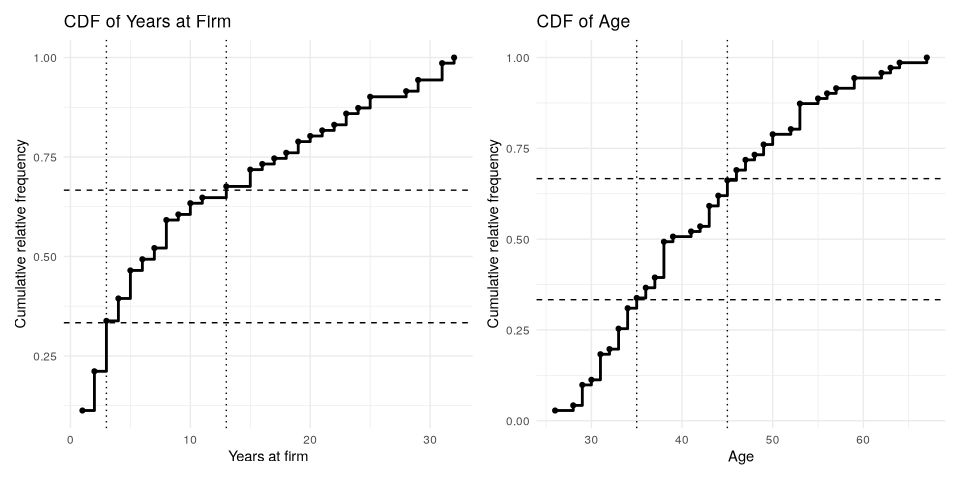
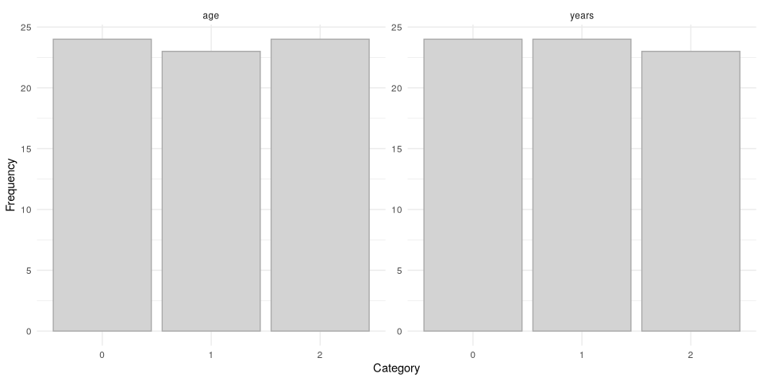
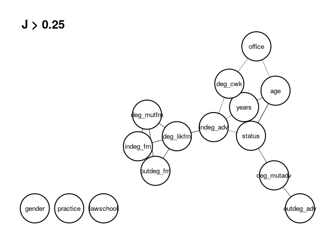
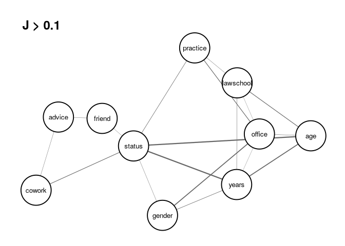
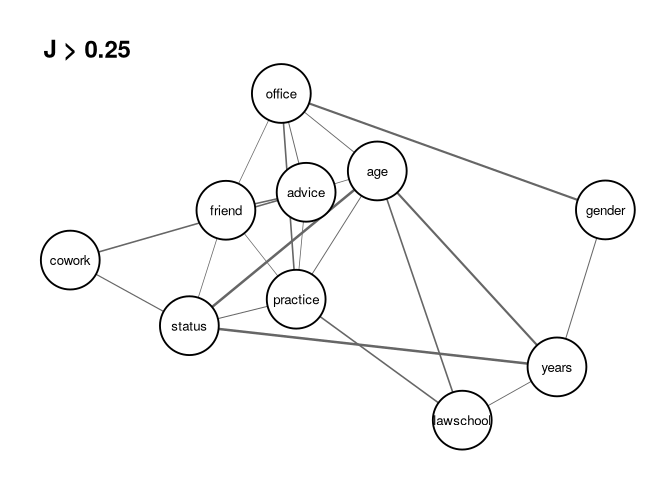
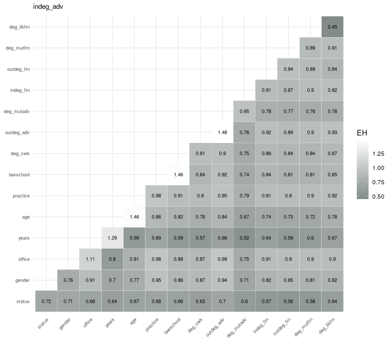
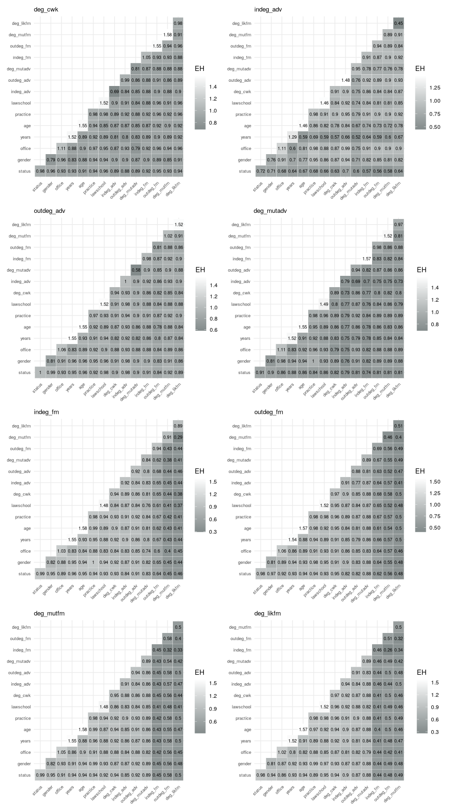
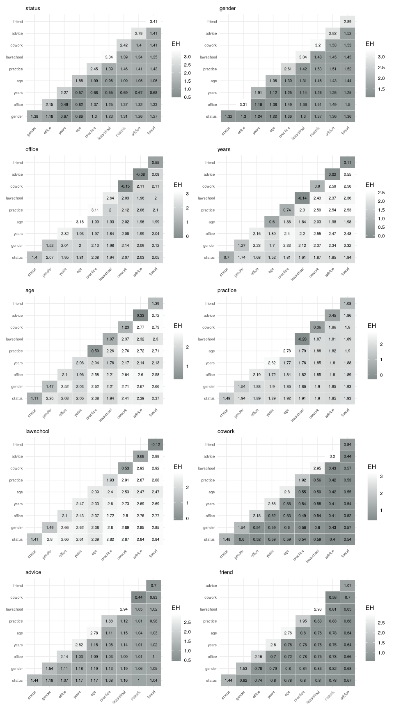
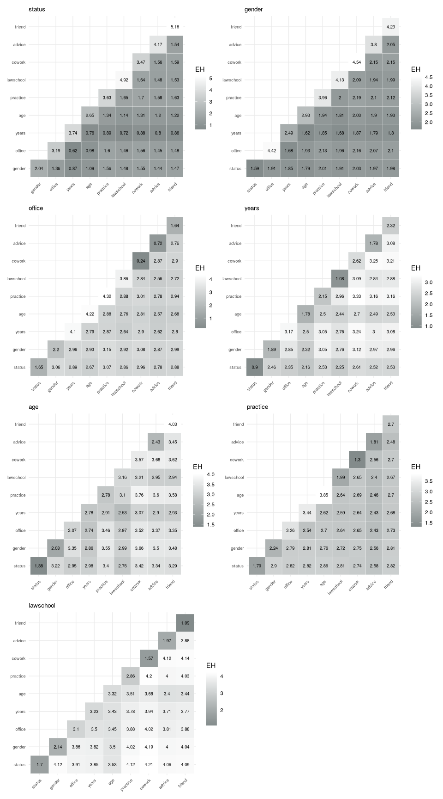
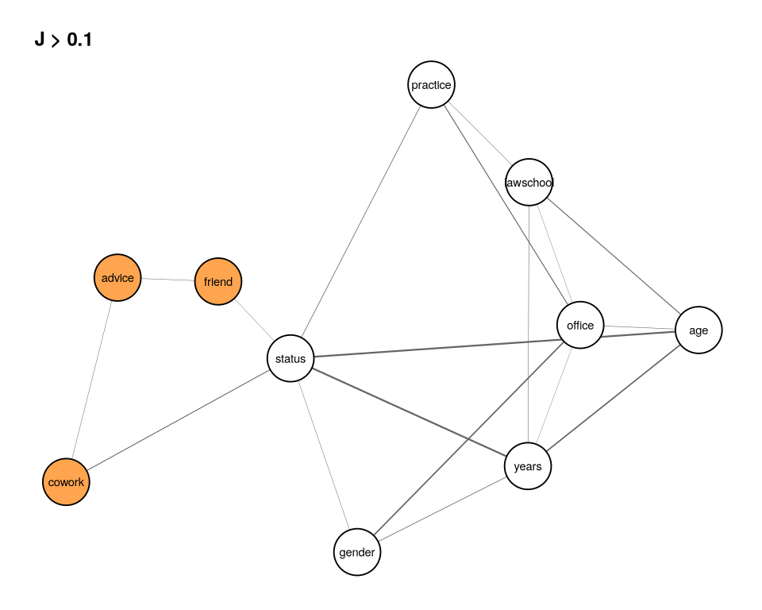

# Entropy Analysis


[Source](https://schochastics.github.io/R4SNA/descriptive/netropy.html)

``` r
options(paged.print = FALSE)
```

``` r
libraries <- list(
  "igraph", "netropy", "tidyverse", "patchwork", 
  "zeallot", "ggraph"
)
invisible(lapply(libraries, library, character.only = TRUE))
```

Multivariate entropy analysis provides a flexible, model-free framework
for studying the dependence structure among multiple variables
describing entities and their interactions. In network settings, this
requires pre-processing steps.

# Network Data Representation

To apply these methods, variables must be represented on finite discrete
range spaces and aligned to a common domain of observation. In network
settings, this typically involves preprocessing steps such as
discretization and the careful definition of observational units (e.g.,
nodes, dyads, or higher-order structures).

Since entropy analysis requires all variables to be defined on a common
domain, these differences must be resolved through appropriate
transformations. Vertex variables can be transformed to the edge domain,
or vice versa. Edge attributes can be constructed directly from vertex
attributes.

These transformations involve trade-offs. Extending vertex variables to
the edge domain increases the number of observations but also enlarges
the joint outcome space. Aggregating edge variables to the vertex domain
simplifies the data structure but may reduce variability and finer
relational detail. Nevertheless, these transformations are essential
because they make it possible to bring variables from different domains
into a common analytical framework. The same principles extend naturally
to higher-order structures such as triads.

Once variables have been aligned to a common domain and appropriately
discretized, the data are ready for multivariate entropy analysis.
Entropy can be used for dimensionality reduction by identifying
redundant variables and selecting informative subsets. Mutual
information, derived from joint entropy, quantifies the strength and
form of dependence between variables, including higher-order
interactions. Expected conditional entropies can be used to assess
predictive power by measuring how much uncertainty about one variable is
reduced given knowledge of others. Together, these measures provide a
comprehensive approach to understanding association, dependence, and
information flow in network data. In the following sections, we
illustrate this framework through an application.

# Example - Corporate Law Firm

The network consists of 71 lawyers connected through three types of
informal interactions: co-working (undirected), advice-seeking
(directed), and friendship (directed). In addition, each lawyer is
described by several attributes, including status (associate or
partner), gender, office location (Boston, Hartford, or Providence),
years at the firm, age, and area of practice (corporate or litigation).

Extract the adjacency matrices and the node attributes.

``` r
adj_advice <- lawdata[[1]]
adj_friend <- lawdata[[2]]
adj_cowork <- lawdata[[3]]
df_att <- lawdata[[4]]
```

Create new dyad variables for mutual friendship and mutual advice.

``` r
adj_mutadv <- adj_advice * t(adj_advice)
adj_mutfrn <- adj_friend * t(adj_friend)
```

Create likely friendships, which is an undirected network and does not
require reciprocal reporting of friendships,by creating the directed
graph object and then extracting the adjacency matrix from the graph
assuming it is undirected instead.

``` r
g_frn <- graph_from_adjacency_matrix(adj_friend, mode = "directed")
g_likfrn <- as_undirected(g_frn)
adj_likfrn <- as_adjacency_matrix(g_likfrn, sparse = FALSE)
```

## Data Editing

### Vertex Variables

``` r
head(df_att, 5)
```

      senior status gender office years age practice lawschool
    1      1      1      1      1    31  64        1         1
    2      2      1      1      1    32  62        0         1
    3      3      1      1      2    13  67        1         1
    4      4      1      1      1    31  59        0         3
    5      5      1      1      2    31  59        1         2

All variables are categorical except `years` and `age`, which must be
transformed to ordinal variables. The empirical cumulative distribution
functions can be used to identify cutpoints that produce approximately
equally sized groups.

We begin by constructing frequency tables for `years` and `age`, and
then compute the corresponding relative and cumulative relative
frequencies.

``` r
tab_years <- table(df_att$years)
frq_years <- tibble(
  years = as.numeric(names(tab_years)),
  freq = as.integer(tab_years)
) %>%
  mutate(
    rel.freq = freq / sum(freq),
    cum.rel.freq = cumsum(rel.freq)
  )

tab_age <- table(df_att$age)
frq_age <- tibble(
  age = as.numeric(names(tab_age)),
  freq = as.integer(tab_age)
) %>%
  mutate(
    rel.freq = freq / sum(freq),
    cum.rel.freq = cumsum(rel.freq)
  )
```

``` r
pyears <- ggplot(frq_years, aes(x = years, y = cum.rel.freq)) +
  geom_step(linewidth = 1) +
  geom_point() +
  geom_hline(yintercept = c(1 / 3, 2 / 3), linetype = "dashed") +
  geom_vline(xintercept = c(3, 13), linetype = "dotted") +
  labs(
    title = "CDF of Years at Firm",
    x = "Years at firm",
    y = "Cumulative relative frequency"
  ) +
  theme_minimal()

page <- ggplot(frq_age, aes(x = age, y = cum.rel.freq)) +
  geom_step(linewidth = 1) +
  geom_point() +
  geom_hline(yintercept = c(1 / 3, 2 / 3), linetype = "dashed") +
  geom_vline(xintercept = c(35, 45), linetype = "dotted") +
  labs(
    title = "CDF of Age",
    x = "Age",
    y = "Cumulative relative frequency"
  ) +
  theme_minimal()

pyears + page
```

<div id="fig-cdfs">



Figure 1: Empirical cumulative distribution functions (CDFs) for
`years at firm` and `age`. The dashed horizontal lines indicate the
target quantiles (approximately one-third and two-thirds), while the
dotted vertical lines show the selected cutpoints used to define three
approximately equally sized categories for each variable.

</div>

We use these plots to choose cutpoints that divide the data into three
approximately equally sized groups. For years, the selected cutpoints
are 3 and 13, while for age, the selected cutpoints are 35 and 45.

``` r
att_var <- tibble(
  status = df_att$status,
  gender = df_att$gender,
  office = df_att$office - 1,
  years = if_else(df_att$years <= 3, 0, if_else(df_att$years <= 13, 1, 2)),
  age = if_else(df_att$age <= 35, 0, if_else(df_att$age <= 45, 1, 2)),
  practice = df_att$practice,
  lawschool = df_att$lawschool - 1
)
summary(att_var)
```

         status          gender           office           years             age   
     Min.   :0.000   Min.   :0.0000   Min.   :0.0000   Min.   :0.0000   Min.   :0  
     1st Qu.:0.000   1st Qu.:0.5000   1st Qu.:0.0000   1st Qu.:0.0000   1st Qu.:0  
     Median :1.000   Median :1.0000   Median :0.0000   Median :1.0000   Median :1  
     Mean   :0.507   Mean   :0.7465   Mean   :0.3803   Mean   :0.9859   Mean   :1  
     3rd Qu.:1.000   3rd Qu.:1.0000   3rd Qu.:1.0000   3rd Qu.:2.0000   3rd Qu.:2  
     Max.   :1.000   Max.   :1.0000   Max.   :2.0000   Max.   :2.0000   Max.   :2  
        practice        lawschool    
     Min.   :0.0000   Min.   :0.000  
     1st Qu.:0.0000   1st Qu.:1.000  
     Median :1.0000   Median :1.000  
     Mean   :0.5775   Mean   :1.183  
     3rd Qu.:1.0000   3rd Qu.:2.000  
     Max.   :1.0000   Max.   :2.000  

All variables except years and age are already categorical with finite
range spaces and are therefore retained in their original form, apart
from simple recoding to start at where needed. The variables years and
age are recoded into three ordinal categories.

Finally, we examine the resulting categorized distributions for years
and age to confirm that the selected cutpoints produce reasonably
balanced groups.

``` r
years_cat <- as.data.frame(table(att_var$years))
names(years_cat) <- c("category", "freq")
years_cat$variable <- "years"

age_cat <- as.data.frame(table(att_var$age))
names(age_cat) <- c("category", "freq")
age_cat$variable <- "age"

att_long <- rbind(years_cat, age_cat)

ggplot(att_long, aes(x = factor(category), y = freq)) +
  geom_col(fill = "lightgrey", color = "darkgrey") +
  facet_wrap(~variable, scales = "free_y") +
  labs(
    x = "Category",
    y = "Frequency"
  ) +
  theme_minimal()
```

<div id="fig-cats">



Figure 2: Frequency distributions of the discretized variables `age` and
`years`, showing approximately balanced categories after CDF-based
grouping.

</div>

Next, we transform the observed dyad variables into node-level
variables. This is achieved by aggregating edge information into
node-based measures. In particular, we use degree-based summaries:
in-degree and out-degree for the directed advice and friendship
networks, and degree (number of ties) for the undirected co-work
network, as well as for the mutual advice, mutual friendship, and likely
friendship networks.

``` r
g_cwk <- graph_from_adjacency_matrix(
  adj_cowork, mode = "undirected"
)
g_adv <- graph_from_adjacency_matrix(
  adj_advice, mode = "directed"
)
g_mutadv <- graph_from_adjacency_matrix(
  adj_mutadv, mode = "undirected"
)
g_mutfrn <- graph_from_adjacency_matrix(
  adj_mutfrn, mode = "undirected"
)
```

``` r
deg_cwk <- degree(g_cwk)
indeg_adv <- degree(g_adv, mode = "in")
outdeg_adv <- degree(g_adv, mode = "out")
deg_mutadv <- degree(g_mutadv)
indeg_frn <- degree(g_frn, mode = "in")
outdeg_frn <- degree(g_frn, mode = "out")
deg_mutfrn <- degree(g_mutfrn)
deg_likfrn <- degree(g_likfrn)
```

``` r
deg_var <- data.frame(
  deg_cwk = ifelse(deg_cwk <= 9, 0, 1),
  indeg_adv = ifelse(indeg_adv <= 10, 0, 1),
  outdeg_adv = ifelse(outdeg_adv <= 11, 0, 1),
  deg_mutadv = ifelse(deg_mutadv <= 3, 0, 1),
  indeg_frn = ifelse(indeg_frn <= 7, 0, 1),
  outdeg_frn = ifelse(outdeg_frn <= 7, 0, 1),
  deg_mutfrn = ifelse(deg_mutfrn <= 4, 0, 1),
  deg_likfrn = ifelse(deg_likfrn <= 11, 0, 1)
)
```

Merging deg_var and att_var yields the final data frame vertex_var,
which contains all 15 observed and derived vertex variables used in the
subsequent entropy analysis.

``` r
vertex_var <- cbind(att_var, deg_var)
```

``` r
head(vertex_var)
```

      status gender office years age practice lawschool deg_cwk indeg_adv
    1      1      1      0     2   2        1         0       0         1
    2      1      1      0     2   2        0         0       1         1
    3      1      1      1     1   2        1         0       0         0
    4      1      1      0     2   2        0         2       1         1
    5      1      1      1     2   2        1         1       1         1
    6      1      1      1     2   2        1         0       1         1
      outdeg_adv deg_mutadv indeg_frn outdeg_frn deg_mutfrn deg_likfrn
    1          0          0         0          0          0          0
    2          0          1         1          0          0          0
    3          0          1         0          0          0          0
    4          1          1         1          1          1          1
    5          0          0         0          0          0          0
    6          0          0         0          0          0          0

### Dyad variables

Constructed from pairs of vertex variables, resulting in
$\binom{71}{2} = 2485$ observations. `status` yields four possible
outcomes: $(0,1),(0,1),(1,0),(1,1)$ and `office` gives nine:
$(0,1),(0,1),(0,2),(1,0),(1,1),(1,2),(2,0),(2,1),(2,2)$.

``` r
c(
  dyad_status, dyad_gender, dyad_office, dyad_years,
  dyad_age, dyad_practice, dyad_lawschool
) %<-%
  map(
    list(
      att_var$status, att_var$gender, att_var$office,
      att_var$years, att_var$age, att_var$practice, att_var$lawschool
    ),
    \(x) get_dyad_var(x, type = "att")
  )
```

Dyadic outcomes are recoded to numeric values, eg. `status` takes values
0-3 and `office` takes values 0-8.

To construct variables based on ties, provide the adjacency matrix.

``` r
c(dyad_cwk, dyad_adv, dyad_mutadv, 
  dyad_frn, dyad_mutfrn, dyad_likfrn) %<-%
  map(list(adj_cowork, adj_advice, adj_mutadv,
           adj_friend, adj_mutfrn, adj_likfrn),
      \(x) get_dyad_var(x, type = "tie"))
```

    two outcomes based on an indicator variable for the undirected relation is created

    four outcomes based on pairs of indicators for the directed relation is created

    two outcomes based on an indicator variable for the undirected relation is created

    four outcomes based on pairs of indicators for the directed relation is created

    two outcomes based on an indicator variable for the undirected relation is created
    two outcomes based on an indicator variable for the undirected relation is created

Combine all variables.

``` r
dyad_var <- data.frame(
  status = dyad_status$var,
  gender = dyad_gender$var,
  office = dyad_office$var,
  years = dyad_years$var,
  age = dyad_age$var,
  practice = dyad_practice$var,
  lawschool = dyad_lawschool$var,
  cowork = dyad_cwk$var,
  advice = dyad_adv$var,
  mutadv = dyad_mutadv$var,
  friend = dyad_frn$var,
  mutfrn = dyad_mutfrn$var,
  likfrn = dyad_likfrn$var
)
head(dyad_var, 10)
```

       status gender office years age practice lawschool cowork advice mutadv
    1       3      3      0     8   8        1         0      0      3      1
    2       3      3      3     5   8        3         0      0      0      0
    3       3      3      3     5   8        2         0      0      1      0
    4       3      3      0     8   8        1         6      0      1      0
    5       3      3      0     8   8        0         6      0      1      0
    6       3      3      1     7   8        1         6      0      1      0
    7       3      3      3     8   8        3         3      0      1      0
    8       3      3      3     8   8        2         3      0      0      0
    9       3      3      4     7   8        3         3      0      0      0
    10      3      3      3     8   8        2         5      0      0      0
       friend mutfrn likfrn
    1       2      0      1
    2       0      0      0
    3       0      0      0
    4       2      0      1
    5       1      0      1
    6       1      0      1
    7       0      0      0
    8       0      0      0
    9       0      0      0
    10      0      0      0

### Triad variables

Repead the process. The combinations of three nodes gives
$\binom{71}{3} = 57155$ observations.

``` r
c(triad_status, triad_gender, triad_office, triad_years,
  triad_age, triad_practice, triad_lawschool) %<-%
  map(list(att_var$status, att_var$gender, att_var$office, att_var$years,
           att_var$age, att_var$practice, att_var$lawschool),
      \(x) get_triad_var(x, type = "att"))
```

``` r
c(triad_cwk, triad_adv, triad_mutadv, 
  triad_frn, triad_mutfrn, triad_likfrn) %<-%
  map(list(adj_cowork, adj_advice, adj_mutadv,
           adj_friend, adj_mutfrn, adj_likfrn),
      \(x) get_triad_var(x, type = "tie"))
```

    8 outcomes based on triples of indicators for the undirected relation are created

    64 outcomes based on a sequence of 6 indicators for the directed relation are created

    8 outcomes based on triples of indicators for the undirected relation are created

    64 outcomes based on a sequence of 6 indicators for the directed relation are created

    8 outcomes based on triples of indicators for the undirected relation are created
    8 outcomes based on triples of indicators for the undirected relation are created

``` r
triad_var <- data.frame(
  status = triad_status$var,
  gender = triad_gender$var,
  office = triad_office$var,
  years = triad_years$var,
  age = triad_age$var,
  practice = triad_practice$var,
  lawschool = triad_lawschool$var,
  cowork = triad_cwk$var,
  advice = triad_adv$var,
  mutadv = triad_mutadv$var,
  friend = triad_frn$var,
  mutfrn = triad_mutfrn$var,
  likfrn = triad_likfrn$var
)
head(triad_var, 10)
```

       status gender office years age practice lawschool cowork advice mutadv
    1       7      7      9    17  26        5         0      0     35      1
    2       7      7      0    26  26        1        18      0     43      1
    3       7      7      9    26  26        5         9      0     11      1
    4       7      7      9    26  26        5         0      0     19      1
    5       7      7      9    26  26        1        18      4     35      1
    6       7      7      0    26  26        5        18      0     11      1
    7       7      7      0    26  26        1         0      0      3      1
    8       7      7      0    26  26        1        18      0     35      1
    9       7      7      0    26  26        5         0      0     11      1
    10      7      7      0    26  26        1         9      0     35      1
       friend mutfrn likfrn
    1       1      0      1
    2      37      0      7
    3       1      0      1
    4       1      0      1
    5       1      0      1
    6       5      0      3
    7       1      0      1
    8      33      0      5
    9       1      0      1
    10     41      0      7

## Univariate and Bivariate Entropies

Univariate entropy measures the uncertainty of a discrete variable $X$
with $r$ outcomes. Entropy of 0 means no uncertainty, ie. it is
constant. The maximum is $\log_2 r$ corresponding to a uniform
distribution over all outcomes. It is defined:

$$H(X) = \sum_x p(x) \log_2 \frac{1}{p(x)}.$$

Bivariate entropy assesses redundancy, functional relationships and
stochastic independence. It is given

$$H(X,Y) = \sum_x \sum_y p(x,y) \log_2 \frac{1}{p(x,y)}.$$

The bounds are

$$H(X) \leq H(X,Y) \leq H(X) + H(Y).$$

- The lower bound is attained if and only if there is a functional
  relationship $Y = f(X)$.
- The upper bound is attained if and only if $X$ and $Y$ are
  stochastically independent, $X \perp Y$.
- If $H(X,Y) = H(X)$ or $H(X,Y) = H(Y)$, one of the variables is
  redundant and does not provide additional information.

The function entropy_bivar() computes the bivariate entropies for all
pairs of variables in a data frame. The results are returned as an upper
triangular matrix, where each cell contains the joint entropy of the
corresponding row and column variables. The diagonal entries represent
the univariate entropies of each variable.

### Vertex variables

``` r
h2_vertex <- entropy_bivar(vertex_var)
h2_vertex[1:8,1:8]
```

              status gender office years   age practice lawschool deg_cwk
    status         1  1.695  2.084 2.007 2.276    1.981     2.459   1.975
    gender        NA  0.817  1.927 2.226 2.383    1.799     2.323   1.791
    office        NA     NA  1.125 2.693 2.668    2.088     2.607   2.113
    years         NA     NA     NA 1.585 2.750    2.555     3.012   2.523
    age           NA     NA     NA    NA 1.585    2.558     2.876   2.547
    practice      NA     NA     NA    NA    NA    0.983     2.513   1.975
    lawschool     NA     NA     NA    NA    NA       NA     1.533   2.524
    deg_cwk       NA     NA     NA    NA    NA       NA        NA   1.000

Redundancy can be identified by comparing the diagonal, univariate
entropies with the other values in the same row. If they are equal, it
indicates one variable is redundant. Here none are. Can check
`redundancy`. `dec` controls rounding of bivariate entropies.

``` r
(red_vertex <- redundancy(vertex_var, dec = 3))
```

    no redundant variables

    NULL

``` r
(red_vertex2 <- redundancy(df_att, dec = 2))
```

              senior status gender office years age practice lawschool
    senior         0      1      1      1     1   1        1         1
    status         0      0      0      0     0   0        0         0
    gender         0      0      0      0     0   0        0         0
    office         0      0      0      0     0   0        0         0
    years          0      0      0      0     0   0        0         0
    age            0      0      0      0     0   0        0         0
    practice       0      0      0      0     0   0        0         0
    lawschool      0      0      0      0     0   0        0         0

Senior consisted entirely of unique values and is flagged as redundant.
To identify redundant variables:

``` r
colnames(red_vertex2)[rowSums(red_vertex2) >= 1]
```

    [1] "senior"

### Dyad variables

``` r
(h2_dyad <- entropy_bivar(dyad_var))
```

              status gender office years   age practice lawschool cowork advice
    status     1.493  2.868  3.640 3.370 3.912    3.453     4.363  2.092  2.687
    gender        NA  1.547  3.758 3.939 4.274    3.506     4.439  2.158  2.785
    office        NA     NA  2.239 4.828 4.901    4.154     5.058  2.792  3.388
    years         NA     NA     NA 2.671 4.857    4.582     5.422  3.268  3.868
    age           NA     NA     NA    NA 2.801    4.743     5.347  3.411  4.028
    practice      NA     NA     NA    NA    NA    1.962     4.880  2.530  3.127
    lawschool     NA     NA     NA    NA    NA       NA     2.953  3.567  4.186
    cowork        NA     NA     NA    NA    NA       NA        NA  0.615  1.687
    advice        NA     NA     NA    NA    NA       NA        NA     NA  1.248
    mutadv        NA     NA     NA    NA    NA       NA        NA     NA     NA
    friend        NA     NA     NA    NA    NA       NA        NA     NA     NA
    mutfrn        NA     NA     NA    NA    NA       NA        NA     NA     NA
    likfrn        NA     NA     NA    NA    NA       NA        NA     NA     NA
              mutadv friend mutfrn likfrn
    status     1.825  2.324  1.838  2.080
    gender     1.911  2.415  1.913  2.176
    office     2.577  3.044  2.571  2.805
    years      3.010  3.483  3.002  3.248
    age        3.159  3.637  3.150  3.397
    practice   2.312  2.831  2.328  2.590
    lawschool  3.316  3.812  3.309  3.576
    cowork     0.920  1.456  0.961  1.211
    advice     1.248  1.953  1.518  1.730
    mutadv     0.367  1.152  0.664  0.918
    friend        NA  0.881  0.881  0.881
    mutfrn        NA     NA  0.369  0.795
    likfrn        NA     NA     NA  0.636

NB. this does not work on tibbles.

Redundancies can be seen for `friend` and `advice` The variables
`mutadv`, `mutfrn` and `likfrn` should be dropped.

``` r
dyad_var <- dyad_var[-c(10, 12:13)]
```

### Triad variables

``` r
(h2_triad <- entropy_bivar(triad_var))
```

              status gender office years   age practice lawschool cowork advice
    status     1.794  3.837  4.986 4.443 5.265    4.731     6.040  3.584  5.324
    gender        NA  2.245  5.539 5.424 5.964    5.177     6.479  4.063  5.859
    office        NA     NA  3.341 6.710 6.959    6.200     7.441  4.981  6.661
    years         NA     NA     NA 3.539 6.668    6.377     7.566  5.316  7.045
    age           NA     NA     NA    NA 3.885    6.787     7.657  5.693  7.458
    practice      NA     NA     NA    NA    NA    2.940     7.203  4.623  6.318
    lawschool     NA     NA     NA    NA    NA       NA     4.340  6.163  7.912
    cowork        NA     NA     NA    NA    NA       NA        NA  1.835  4.930
    advice        NA     NA     NA    NA    NA       NA        NA     NA  3.653
    mutadv        NA     NA     NA    NA    NA       NA        NA     NA     NA
    friend        NA     NA     NA    NA    NA       NA        NA     NA     NA
    mutfrn        NA     NA     NA    NA    NA       NA        NA     NA     NA
    likfrn        NA     NA     NA    NA    NA       NA        NA     NA     NA
              mutadv friend mutfrn likfrn
    status     2.781  4.241  2.812  3.524
    gender     3.298  4.751  3.302  4.054
    office     4.306  5.636  4.288  4.941
    years      4.534  5.911  4.515  5.233
    age        4.925  6.305  4.903  5.619
    practice   3.944  5.434  3.992  4.737
    lawschool  5.385  6.801  5.369  6.128
    cowork     2.702  4.238  2.821  3.529
    advice     3.653  5.650  4.432  5.037
    mutadv     1.063  3.339  1.925  2.658
    friend        NA  2.553  2.553  2.553
    mutfrn        NA     NA  1.066  2.299
    likfrn        NA     NA     NA  1.827

The same redundancy are evident, and are removed.

``` r
triad_var <- triad_var[-c(10, 12:13)]
```

## Joint Entropies and Association Graphs

Measures the total uncertainty associated with a pair of variables.
Provides a basis for assessing their dependence.

$$J(X,Y) = H(X) + H(Y) - H(X,Y)$$

It equals 0 if and only if $X$ and $Y$ are stochastically independent,
$X \perp Y$.

For three variables, trivariate entropy is bound by

$$H(X,Y) \leq H(X,Y,Z) \leq H(X,Z) + H(Y,Z) - H(Z)$$

and deviation from the upper bound

$$EJ(X,Y \mid Z) = H(X,Z) + H(Y,Z) - H(Z) - H(X,Y,Z)$$

which is 0 if and only if $X \perp Y \mid Z$.

Joint entropy values can be used to explore dependence structure through
association graphs, with variables as nodes and edges connecting pairs
whose entropy exceeds a chosen threshold. Lowering the threshold gives
more edges.

Cliques indicate groups of mutually dependent variables. Conditional
independence can by investigated by examining how the graph structure
changes when conditioning variables are removed.

The function `joint_entropy()` computes joint entropy values for all
pairs of variables in a data frame. The output is returned as a list
containing: (i) an upper triangular matrix of joint entropy values, with
univariate entropies on the diagonal, and (ii) a data frame summarizing
the frequency distribution of unique joint entropy values. An optional
argument controls the precision (number of decimal places) used in
constructing this frequency distribution; the default is 3.

### Vertex Variables

``` r
j_vertex <- joint_entropy(vertex_var, 3)
str(j_vertex)
```

    List of 2
     $ matrix: num [1:15, 1:15] 1 NA NA NA NA NA NA NA NA NA ...
      ..- attr(*, "dimnames")=List of 2
      .. ..$ : chr [1:15] "status" "gender" "office" "years" ...
      .. ..$ : chr [1:15] "status" "gender" "office" "years" ...
     $ freq  :'data.frame': 62 obs. of  3 variables:
      ..$ j        : Factor w/ 62 levels "0.001","0.002",..: 62 61 60 59 58 57 56 55 54 53 ...
      ..$  #(J = j): int [1:62] 1 1 1 1 1 1 1 1 1 1 ...
      ..$ #(J >= j): int [1:62] 1 2 3 4 5 6 7 8 9 10 ...

``` r
j_vertex$matrix
```

               status gender office years   age practice lawschool deg_cwk
    status          1  0.122  0.041 0.578 0.309    0.002     0.074   0.025
    gender         NA  0.817  0.015 0.176 0.019    0.001     0.027   0.026
    office         NA     NA  1.125 0.017 0.042    0.020     0.051   0.012
    years          NA     NA     NA 1.585 0.420    0.013     0.106   0.062
    age            NA     NA     NA    NA 1.585    0.010     0.242   0.038
    practice       NA     NA     NA    NA    NA    0.983     0.003   0.008
    lawschool      NA     NA     NA    NA    NA       NA     1.533   0.009
    deg_cwk        NA     NA     NA    NA    NA       NA        NA   1.000
    indeg_adv      NA     NA     NA    NA    NA       NA        NA      NA
    outdeg_adv     NA     NA     NA    NA    NA       NA        NA      NA
    deg_mutadv     NA     NA     NA    NA    NA       NA        NA      NA
    indeg_frn      NA     NA     NA    NA    NA       NA        NA      NA
    outdeg_frn     NA     NA     NA    NA    NA       NA        NA      NA
    deg_mutfrn     NA     NA     NA    NA    NA       NA        NA      NA
    deg_likfrn     NA     NA     NA    NA    NA       NA        NA      NA
               indeg_adv outdeg_adv deg_mutadv indeg_frn outdeg_frn deg_mutfrn
    status         0.284      0.004      0.092     0.008      0.025      0.012
    gender         0.053      0.011      0.003     0.001      0.011      0.001
    office         0.012      0.065      0.012     0.096      0.061      0.070
    years          0.299      0.036      0.062     0.034      0.044      0.034
    age            0.128      0.039      0.032     0.001      0.011      0.001
    practice       0.001      0.012      0.001     0.002      0.008      0.002
    lawschool      0.074      0.012      0.043     0.050      0.013      0.053
    deg_cwk        0.092      0.064      0.107     0.064      0.033      0.053
    indeg_adv      1.000      0.002      0.206     0.078      0.092      0.092
    outdeg_adv        NA      1.000      0.064     0.078      0.124      0.064
    deg_mutadv        NA         NA      1.000     0.162      0.107      0.108
    indeg_frn         NA         NA         NA     0.999      0.314      0.547
    outdeg_frn        NA         NA         NA        NA      1.000      0.417
    deg_mutfrn        NA         NA         NA        NA         NA      0.999
    deg_likfrn        NA         NA         NA        NA         NA         NA
               deg_likfrn
    status          0.025
    gender          0.003
    office          0.105
    years           0.063
    age             0.011
    practice        0.008
    lawschool       0.008
    deg_cwk         0.033
    indeg_adv       0.064
    outdeg_adv      0.092
    deg_mutadv      0.107
    indeg_frn       0.537
    outdeg_frn      0.492
    deg_mutfrn      0.496
    deg_likfrn      1.000

The strongest associations can be identified by combining the matrix
with the frequency table `j_vertex$freq`, which summarizes the
distribution of joint entropy values.

``` r
j_vertex$freq
```

           j  #(J = j) #(J >= j)
    1  0.578         1         1
    2  0.547         1         2
    3  0.537         1         3
    4  0.496         1         4
    5  0.492         1         5
    6   0.42         1         6
    7  0.417         1         7
    8  0.314         1         8
    9  0.309         1         9
    10 0.299         1        10
    11 0.284         1        11
    12 0.242         1        12
    13 0.206         1        13
    14 0.176         1        14
    15 0.162         1        15
    16 0.128         1        16
    17 0.124         1        17
    18 0.122         1        18
    19 0.108         1        19
    20 0.107         3        22
    21 0.106         1        23
    22 0.105         1        24
    23 0.096         1        25
    24 0.092         5        30
    25 0.078         2        32
    26 0.074         2        34
    27  0.07         1        35
    28 0.065         1        36
    29 0.064         5        41
    30 0.063         1        42
    31 0.062         2        44
    32 0.061         1        45
    33 0.053         3        48
    34 0.051         1        49
    35  0.05         1        50
    36 0.044         1        51
    37 0.043         1        52
    38 0.042         1        53
    39 0.041         1        54
    40 0.039         1        55
    41 0.038         1        56
    42 0.036         1        57
    43 0.034         2        59
    44 0.033         2        61
    45 0.032         1        62
    46 0.027         1        63
    47 0.026         1        64
    48 0.025         3        67
    49  0.02         1        68
    50 0.019         1        69
    51 0.017         1        70
    52 0.015         1        71
    53 0.013         2        73
    54 0.012         6        79
    55 0.011         4        83
    56  0.01         1        84
    57 0.009         1        85
    58 0.008         5        90
    59 0.004         1        91
    60 0.003         3        94
    61 0.002         4        98
    62 0.001         7       105

``` r
assoc_graph(vertex_var, 0.25)
```



### Dyad variables

Same.

``` r
assoc_graph(dyad_var, 0.10)
```



There is a strong dependence among the variables (status, years, age),
as well as notable associations among (lawschool, years, age) and
(status, years, gender).

In addition, the graph suggests that the relations cowork and friend are
conditionally independent given advice. That is, any observed dependence
between cowork and friend can be explained through their association
with advice.

### Triad Variables

Same

``` r
assoc_graph(triad_var, 0.25)
```



The triad variables exhibit similar dependence patterns as the dyad
variables, but with generally stronger associations. In particular,
joint entropy values are higher for all pairs of cowork, friend, and
advice, indicating stronger interactions among these variables. This
further supports the conditional independence observed earlier,
suggesting that the relationship between cowork and friend is
increasingly explained by advice at the triadic level.

## Trivariate Entropies and Prediction Power

Similar to bivariate entropy.

$$H(X,Y,Z) = \sum_x \sum_y \sum_z p(x,y,z) \log_2 \frac{1}{p(x,y,z)},$$
with bounds

$$H(X,Y) \leq H(X,Y,Z) \leq H(X,Z) + H(Y,Z) - H(Z).$$

The deviation from the lower bound is given by the expected conditional
entropy

$$EH(Z \mid X,Y) = H(X,Y,Z) - H(X,Y),$$
which measures the remaining uncertainty in $Z$ given $(X,Y)$. This
quantity is non-negative and equals 0 if and only if $(X,Y)$ uniquely
determine $Z$, indicating a functional relationship.

More generally, $EH(Z \mid X,Y)$ can be interpreted as a measure of
prediction uncertainty when $(X,Y)$ are used to predict $Z$. It
reflects, on a logarithmic scale, the average number of possible
outcomes of $Z$ given $(X,Y)$. Smaller values indicate stronger
predictive power: if $EH < 0.5$, $Z$ can be predicted unambiguously; if
$0.5 \leq EH < 1.5$, there are approximately two possible outcomes on
average; and so on. In general, prediction power decreases as $EH$
increases.

The function `prediction_power()` computes this quantity for all pairs
of variables in a given data frame used to predict a specified target
variable $Z$. The function takes as input the data frame and the
variable to be predicted, and returns an upper triangular matrix of
expected conditional entropies $EH(Z \mid X,Y)$ for all pairs $(X,Y)$.
The diagonal entries correspond to $EH(Z \mid X)$, that is, prediction
based on a single variable. Entries corresponding to the target variable
itself are set to `NA`.

For easier interpretation, prediction results can be visualized using
prediction plots, which display a color-coded matrix with rows
representing $X$ and columns representing $Y$. Darker colors indicate
lower prediction uncertainty and thus higher predictive power for $Z$.
In the following, we compute and visualize prediction power for vertex,
dyad, and triad variables.

### Vertex Variables

``` r
h3_vertex <- entropy_trivar(vertex_var)
```

``` r
c(
  pred_vertex_cwk, pred_vertex_advin, pred_vertex_advout,
  pred_vertex_advmut, pred_vertex_frnin, pred_vertex_frnout,
  pred_vertex_frnmut, pred_vertex_frnlik
) %<-%
  map(
    list(
      "deg_cwk", "indeg_adv", "outdeg_adv",
      "deg_mutadv", "indeg_frn", "outdeg_frn",
      "deg_mutfrn", "deg_likfrn"
    ),
    \(x) prediction_power(x, vertex_var)
  )
```

As an illustration, consider predicting the variable `indeg_adv`, which
represents the in-degree in the advice network (i.e., how often a lawyer
is asked for advice). The prediction power was computed and assigned to
`pred_vertex_advin`.

``` r
pred_vertex_advin
```

               status gender office years   age practice lawschool deg_cwk
    status      0.716  0.713  0.681 0.640 0.671    0.680     0.661   0.632
    gender         NA  0.764  0.908 0.699 0.771    0.946     0.855   0.873
    office         NA     NA  1.113 0.603 0.807    0.980     0.876   0.874
    years          NA     NA     NA 1.286 0.587    0.689     0.586   0.572
    age            NA     NA     NA    NA 1.457    0.860     0.820   0.783
    practice       NA     NA     NA    NA    NA    0.982     0.906   0.899
    lawschool      NA     NA     NA    NA    NA       NA     1.459   0.840
    deg_cwk        NA     NA     NA    NA    NA       NA        NA   0.908
    indeg_adv      NA     NA     NA    NA    NA       NA        NA      NA
    outdeg_adv     NA     NA     NA    NA    NA       NA        NA      NA
    deg_mutadv     NA     NA     NA    NA    NA       NA        NA      NA
    indeg_frn      NA     NA     NA    NA    NA       NA        NA      NA
    outdeg_frn     NA     NA     NA    NA    NA       NA        NA      NA
    deg_mutfrn     NA     NA     NA    NA    NA       NA        NA      NA
    deg_likfrn     NA     NA     NA    NA    NA       NA        NA      NA
               indeg_adv outdeg_adv deg_mutadv indeg_frn outdeg_frn deg_mutfrn
    status            NA      0.703      0.600     0.568      0.558      0.575
    gender            NA      0.941      0.712     0.820      0.854      0.815
    office            NA      0.987      0.752     0.911      0.905      0.904
    years             NA      0.657      0.515     0.637      0.594      0.600
    age               NA      0.839      0.674     0.740      0.728      0.720
    practice          NA      0.952      0.789     0.910      0.899      0.901
    lawschool         NA      0.921      0.738     0.843      0.810      0.814
    deg_cwk           NA      0.904      0.748     0.865      0.842      0.840
    indeg_adv         NA         NA         NA        NA         NA         NA
    outdeg_adv        NA      1.479      0.755     0.919      0.890      0.903
    deg_mutadv        NA         NA      0.946     0.785      0.767      0.765
    indeg_frn         NA         NA         NA     0.907      0.874      0.904
    outdeg_frn        NA         NA         NA        NA      0.935      0.893
    deg_mutfrn        NA         NA         NA        NA         NA      0.891
    deg_likfrn        NA         NA         NA        NA         NA         NA
               deg_likfrn
    status          0.637
    gender          0.823
    office          0.900
    years           0.667
    age             0.784
    practice        0.917
    lawschool       0.854
    deg_cwk         0.866
    indeg_adv          NA
    outdeg_adv      0.932
    deg_mutadv      0.777
    indeg_frn       0.918
    outdeg_frn      0.841
    deg_mutfrn      0.907
    deg_likfrn      0.451

``` r
make_pred_plot(pred_vertex_advin, "indeg_adv")
```

<div id="fig-expred">



Figure 3: Prediction power heatmap for $Z$=`indeg_adv`. Each cell shows
the expected conditional entropy $EH(Z \mid X,Y)$, where darker colors
indicate stronger predictive power. The strongest predictors involve the
variable `years`, particularly in combination with network-based
variables such as `deg_mutadv` and `deg_cwk`. While `status` also
contributes to prediction, it is not part of the strongest predictor
pairs.

</div>

`deg_likfrn` is the strongest overall predictor of `indeg_adv`.
Pairwise, `years` with the network variables `deg_mutadv` and `deg_cwk`
are strong. These results suggest that both network position,
particularly likely friendship ties, and experience (years) play a
central role in explaining variation in advice in-degree.

``` r
c(p1, p2, p3, p4, p5, p6, p7, p8) %<-%
  map2(
    list(
      pred_vertex_cwk, pred_vertex_advin, pred_vertex_advout,
      pred_vertex_advmut, pred_vertex_frnin, pred_vertex_frnout,
      pred_vertex_frnmut, pred_vertex_frnlik
    ),
    list(
      "deg_cwk", "indeg_adv", "outdeg_adv",
      "deg_mutadv", "indeg_frn", "outdeg_frn",
      "deg_mutfrn", "deg_likfrn"
    ),
    \(x, y) make_pred_plot(x, y)
  )

(p1 | p2) /
  (p3 | p4) /
  (p5 | p6) /
  (p7 | p8)
```

<div id="fig-predplot-vertex">



Figure 4: Prediction power heatmaps for vertex variables; darker cells
indicate stronger predictive power (lower $EH(Z \mid X,Y)$).

</div>

The vertex variables, network-based measures such as deg_likfrn,
deg_mutadv, and other degree-related variables are consistently strong
predictors, both individually and in combination. In particular,
deg_likfrn often emerges as the best single predictor, indicating that
embeddedness in likely friendship ties plays a central role in
explaining variation in network position.

Attribute-based variables such as years and age also contribute to
prediction, especially when combined with network measures, while
variables such as office and practice tend to have weaker predictive
power. Overall, the results highlight that structural position in the
network is more informative than individual attributes for predicting
vertex-level outcomes.

### Dyad variables

Assess the prediction power for all dyad variables. For each dyad
variable, compute the expected conditional entropies $EH(Z \mid X,Y)$
using all other dyad variables as predictors.

``` r
var_list <- list(
  "status", "gender", "office", "years", "age",
  "practice", "lawschool", "cowork", "advice", "friend"
)
c(
  pred_dyad_status, pred_dyad_gender, pred_dyad_office,
  pred_dyad_years, pred_dyad_age, pred_dyad_practice,
  pred_dyad_lawschool, pred_dyad_cowork, pred_dyad_advice,
  pred_dyad_friend
) %<-%
  map(
    var_list,
    \(x) prediction_power(x, dyad_var)
  )
```

``` r
c(p1, p2, p3, p4, p5, p6, p7, p8, p9, p10) %<-%
  map2(
    list(
      pred_dyad_status, pred_dyad_gender, pred_dyad_office,
      pred_dyad_years, pred_dyad_age, pred_dyad_practice,
      pred_dyad_lawschool, pred_dyad_cowork, pred_dyad_advice,
      pred_dyad_friend
    ),
    var_list,
    \(x, y) make_pred_plot(x, y)
  )

(p1 | p2) /
  (p3 | p4) /
  (p5 | p6) /
  (p7 | p8) /
  (p9 | p10)
```

<div id="fig-predplot-dyad">



Figure 5: Prediction power heatmaps for dyad variables; darker cells
indicate stronger predictive power (lower $EH(Z \mid X,Y)$).

</div>

Overall, the plots show that relational variables such as advice,
cowork, and friend are strong predictors of each other, particularly
when combined. Attribute-based variables such as years and age
contribute to prediction, but are generally less informative on their
own, highlighting the importance of network structure in explaining
dyadic interactions.

### Triad variables

``` r
var_list[1:7]
```

    [[1]]
    [1] "status"

    [[2]]
    [1] "gender"

    [[3]]
    [1] "office"

    [[4]]
    [1] "years"

    [[5]]
    [1] "age"

    [[6]]
    [1] "practice"

    [[7]]
    [1] "lawschool"

``` r
var_list <- var_list[1:7]

# compute prediction power matrices
c(pred_triad_status, pred_triad_gender, pred_triad_office,
  pred_triad_years, pred_triad_age, pred_triad_practice,
  pred_triad_lawschool) %<-% 
  map(var_list,
      \(x) prediction_power(x, triad_var))

c(p1, p2, p3, p4, p5, p6, p7) %<-%
  map2(
    list(
      pred_triad_status, pred_triad_gender, pred_triad_office,
      pred_triad_years, pred_triad_age, pred_triad_practice,
      pred_triad_lawschool
    ),
    var_list,
    \(x, y) make_pred_plot(x, y)
  )
(p1 | p2) /
  (p3 | p4) /
  (p5 | p6) /
  (p7 | patchwork::plot_spacer())
```

<div id="fig-predplot-triad">



Figure 6: Prediction power heatmaps for triad variables; darker cells
indicate stronger predictive power (lower $EH(Z \mid X,Y)$).

</div>

For the triadic attribute variables, status, years, and gender are
predicted relatively well, with especially low expected conditional
entropy for status and years. In particular, status is most informative
for predicting both years and gender, while combinations involving
office and years are especially useful for predicting status. By
contrast, office, practice, and lawschool are much harder to predict,
with generally higher expected conditional entropy values across the
corresponding heatmaps.

Some of the clearest gains from using pairs of predictors appear for
office, where combinations involving structural variables markedly
reduce prediction uncertainty. In particular, the pair (cowork, advice)
provides a very strong prediction of triadic office, much stronger than
any single predictor alone. For gender, prediction is moderate overall,
with status serving as the best single predictor.

The triad-level results suggest that attribute-based variables such as
status, years, and gender are often the most informative single
predictors, while structural variables such as cowork and advice become
especially important when used jointly. Thus, the triadic representation
captures richer interactions, but the strongest predictive relationships
arise from specific combinations of attribute and structural information
rather than from structural variables alone.

## Divergence Tests of Goodness of Fit

Compare the *empirical distribution* $p(x)$ to a *model distribution*
$q(x)$ representing a hypothesized structure.

The discrepancy is measured by *information divergence*

$$D(p,q) = \sum_x p(x)\log \frac{p(x)}{q(x)}$$

which is the expected log-likelihood ratio between the models. The test
statistic is

$$2n D(p,q),$$

which, for large samples, is approximately $\chi^2$-distributed with
degrees of freedom determined by the difference in model complexity.

#### Independence testing

##### Pairwise independence

To test independence of $X$ and $Y$, compare the empirical joint
distribution $p(x,y)$ and the model $q(x,y) = p(x)p(y)$. The divergence
is

$$D(p,q) = H(X) + H(Y) - H(X,Y) = J(X,Y),$$

and the test statistic is $2n J(X,Y)$.

Thus, joint entropy directly measures deviation from independence: small
values indicate independence, while large values indicate dependence.

##### Conditional independence

Are two variables independent given a third variable, so
$X \perp Y \mid Z$. The model distribution is

$$q(x,y,z) = \frac{p(x,z)p(y,z)}{p(z)},$$

and the divergence is

$$D(p,q) = H(X,Z) + H(Y,Z) - H(Z) - H(X,Y,Z) = EJ(X,Y \mid Z),$$

And the test statistic is $2n\,EJ(X,Y \mid Z)$

##### Nested model specifications

Compare models where one is a constrained version of the other. If the
model $q_2$ is nested in $q_1$, ie. it imposes additional assumptions,
the difference in divergence can be used to test if the additional
constraints are supported by the data.

$$2n\bigl[D(p,q_2) - D(p,q_1)\bigr]$$

#### Example - dyad variables

The association graph constructed above suggests candidate dependence
structures that can be formally evaluated. In the corporate law firm
example, the variables `friend`, `cowork`, and `advice` form a closely
connected group, motivating the conditional independence model

``` r
p <- assoc_graph(dyad_var, 0.10)

p +
  geom_node_point(
    data = p$data,
    aes(x = x, y = y, fill = name %in% c("friend", "cowork", "advice")),
    shape = 21,
    color = "black",
    size = 20
  ) +
  scale_fill_manual(
    values = c("FALSE" = "white", "TRUE" = "tan1"),
    guide = "none"
  ) +
  geom_node_text(
    data = p$data,
    aes(x = x, y = y, label = name),
    color = "black"
  )
```

<div id="fig-divtest">



Figure 7: Association graph for dyad variables (threshold $J > 0.1$).
The variables `friend`, `cowork`, and `advice` are highlighted,
motivating the conditional independence model
$\text{friend} \perp \text{cowork} \mid \text{advice}$.

</div>

Intuitively, this model says that any association between friendship and
co-working may be explained by the advice relation. In other words, once
`advice` is taken into account, there should be little additional
dependence between `friend` and `cowork`. To test

``` r
div_gof(
  dat = dyad_var,
  var1 = "friend",
  var2 = "cowork",
  var_cond = "advice"
)
```

                                           test     D   chi2 df critical_value
    1 friend independent of cowork given advice 0.003 11.959 12         21.798
           decision
    1 cannot reject

To test $\text{gender} \perp \text{practice} \mid \text{status}$

``` r
div_gof(
  dat = dyad_var,
  var1 = "gender",
  var2 = "practice",
  var_cond = "status"
)
```

                                             test     D   chi2 df critical_value
    1 gender independent of practice given status 0.018 61.758 27         41.697
      decision
    1   reject

To compare, test without conditioning.

``` r
div_gof(
  dat = dyad_var, var1 = "friend", var2 = "cowork"
)
```

                              test     D    chi2 df critical_value decision
    1 friend independent of cowork 0.041 140.035  3          7.899   reject

Can also check if uniformly distributed

``` r
div_gof(dat = dyad_var, var_uniform = "friend")
```

                    test     D     chi2 df critical_value decision
    1 uniformity: friend 1.119 3853.341  3          7.899   reject

Finally, reduced models can be compared to the saturated empirical
model. The saturated model corresponds to the unrestricted empirical
distribution and has divergence equal to zero. For example, we can
compare the pairwise independence model for `friend` and `cowork` to the
saturated model.

``` r
m_full <- list(D = 0, df = 0)
m_reduced <- div_gof(dat = dyad_var, var1 = "friend", var2 = "cowork")

div_gof(
  dat = dyad_var,
  model_full = m_full,
  model_reduced = list(D = m_reduced$D, df = m_reduced$df)
)
```

                         test     D    chi2 df critical_value decision
    1 nested model comparison 0.041 141.243  3          7.899   reject

The divergence-based test statistic used in `div_gof()` is

$$\chi^2 = 2nD \cdot \log(2),$$

which is approximately chi-square distributed with degrees of freedom
depending on the specified model.

By default, the function uses a large-sample approximation to the 5%
critical value,

$$\text{cv} \approx df + \sqrt{8\,df},$$

which provides a fast and convenient rule for hypothesis testing.

Alternatively, exact critical values from the chi-square distribution
can be used by setting.

``` r
use_approx_cv = FALSE
```

In this case, the significance level can be controlled explicitly via
the argument alpha (default is 0.05), allowing for more precise
hypothesis testing.

``` r
div_gof(..., use_approx_cv = FALSE, alpha = 0.01)
```

Lower values of alpha correspond to stricter tests (harder to reject the
model), while higher values make rejection more likely. In particular,
smaller alpha reduces the probability of incorrectly rejecting a true
null hypothesis.
