# ggraph Basics


[Source](https://schochastics.github.io/R4SNA/visualization/ggraph-basics.html)

``` r
libraries <- list(
  "igraph", "ggraph", "graphlayouts", 
  "networkdata", "patchwork", "tidyverse"
)
invisible(lapply(libraries, library, character.only = TRUE))
```

# Data Prep

As a running example in this chapter, we use the network of character
interactions in the first season of Game of Thrones (GoT). This dataset
is included in the networkdata package. We also define a custom color
palette, compute a clustering for node colors and compute degree as node
size.

``` r
got_s1 <- got[[1]]

got_palette <- c(
  "#1A5878",
  "#C44237",
  "#AD8941",
  "#E99093",
  "#50594B",
  "#8968CD",
  "#9ACD32"
)
```

Compute the clustering for node colors and node size from degree.

``` r
V(got_s1)$clu <-  got_s1 %>% 
  cluster_louvain() %>% 
  membership() %>% 
  as.character()

V(got_s1)$size <- degree(got_s1)
```

Example:

``` r
ggraph(got_s1, layout = "stress") +
  geom_edge_link0(aes(edge_linewidth = weight), edge_color = "grey66") +
  geom_node_point(aes(fill = clu, size = size), shape = 21) +
  geom_node_text(aes(filter = size >= 26, label = name), family = "serif") +
  scale_fill_manual(values = got_palette) +
  scale_edge_width(range = c(0.2, 3)) +
  scale_size(range = c(1, 6)) +
  theme_graph() +
  theme(legend.position = "none")
```

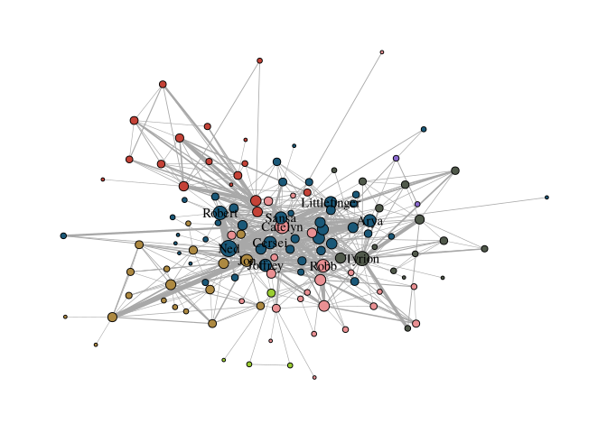

# Layout

The package `graphlayouts` provides a wide range of layout algorithms
that can be used with `ggraph`. The “stress” layout for example is
always a safe choice since it is deterministic and produces nice layouts
for most standard networks.

``` r
c(
  "layout_with_dh",
  "layout_with_drl",
  "layout_with_fr",
  "layout_with_gem",
  "layout_with_graphopt",
  "layout_with_kk",
  "layout_with_lgl",
  "layout_with_mds",
  "layout_with_sugiyama",
  "layout_as_bipartite",
  "layout_as_star",
  "layout_as_tree"
)
```

The layout can be precomputed

``` r
got_s1_layout <- create_layout(got_s1, "dh")

ggraph(got_s1_layout) +
  geom_edge_link0(aes(edge_linewidth = weight), edge_color = "grey66") +
  geom_node_point(aes(fill = clu, size = size), shape = 21) +
  geom_node_text(aes(filter = size >= 26, label = name), family = "serif") +
  scale_fill_manual(values = got_palette) +
  scale_edge_width(range = c(0.2, 3)) +
  scale_size(range = c(1, 6)) +
  theme_graph() +
  theme(legend.position = "none")
```

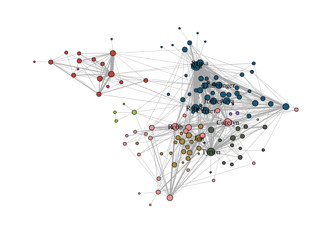

# Edges

```` markdown
```{r}
geom_edge_link0(aes(edge_linewidth = weight), edge_color = "grey66")
```
````

``` r
c(
  "geom_edge_arc",
  "geom_edge_arc0",
  "geom_edge_arc2",
  "geom_edge_bundle_force",
  "geom_edge_bundle_path",
  "geom_edge_density",
  "geom_edge_diagonal",
  "geom_edge_diagonal0",
  "geom_edge_diagonal2",
  "geom_edge_elbow",
  "geom_edge_elbow0",
  "geom_edge_elbow2",
  "geom_edge_fan",
  "geom_edge_fan0",
  "geom_edge_fan2",
  "geom_edge_hive",
  "geom_edge_hive0",
  "geom_edge_hive2",
  "geom_edge_link",
  "geom_edge_link0",
  "geom_edge_link2",
  "geom_edge_loop",
  "geom_edge_loop0",
  "geom_edge_parallel"
)
```

For standard plots, `geom_edge_link0` is preferred as it simply draws a
straight line between endpoints. For multiple edges between nodes, can
use `geom_edge_parallel()`.

``` r
g <- make_graph(c(1, 2, 1, 2, 1, 2))

ggraph(g, layout = "stress") +
  geom_edge_parallel(edge_color = "grey66", edge_linewidth = 0.5) +
  geom_node_point(size = 10) +
  theme_graph()
```

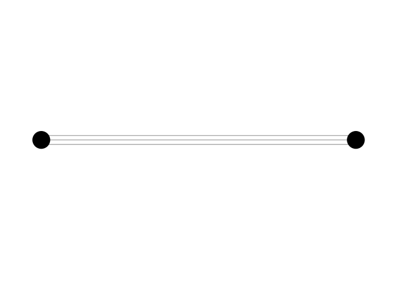

Or, curved

``` r
ggraph(g, layout = "stress") +
  geom_edge_fan(edge_color = "grey66", edge_linewidth = 0.5) +
  geom_node_point(size = 10) +
  theme_graph()
```

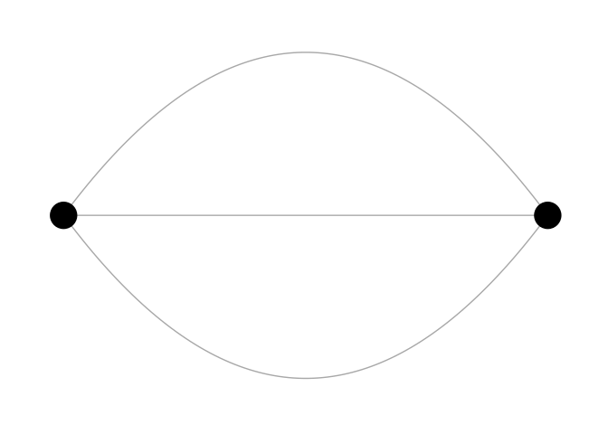

`geom_edge_link()` draws 100 dots on each edge, allowing for gradients
along the edges.

``` r
ggraph(got_s1, layout = "stress") +
  geom_edge_link(aes(alpha = after_stat(index)), edge_color = "black") +
  geom_node_point(aes(fill = clu, size = size), shape = 21) +
  scale_fill_manual(values = got_palette) +
  scale_edge_width_continuous(range = c(0.2, 3)) +
  scale_size_continuous(range = c(1, 6)) +
  theme_graph() +
  theme(legend.position = "none")
```

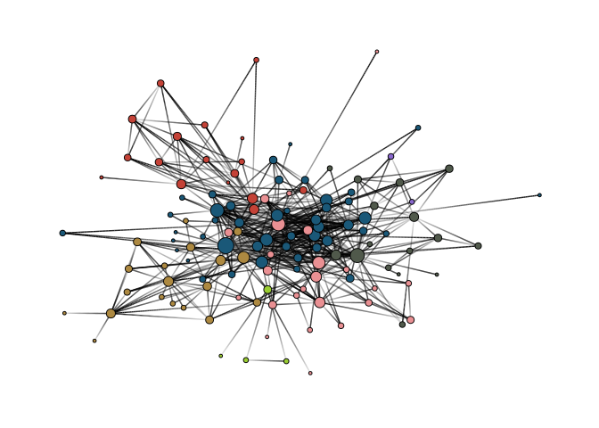

The following aesthetics can be used within geom_edge_link0 either
within aes() or globally:

- edge_color (color of the edge)
- edge_linewidth (width of the edge)
- edge_linetype (linetype of the edge, defaults to “solid”)
- edge_alpha (opacity; a value between 0 and 1)

## Arrows

The default is open, but closed is usually better. `end_cap` is a gap
that prevents the arrow head from overlapping the node.

``` r
g <- make_graph(c(1, 2, 2, 3), directed = TRUE)
xy <- matrix(c(0, 0, 1, 0, 2, 0), ncol = 2, byrow = TRUE)

ggraph(g, layout = "manual", x = xy[, 1], y = xy[, 2]) +
  geom_edge_link(
    edge_color = "grey66",
    edge_linewidth = 0.5,
    arrow = arrow(
      angle = 30,
      length = unit(0.15, "inches"),
      ends = "last",
      type = "closed"
    ),
    end_cap = circle(5, "pt")
  ) +
  geom_node_point(size = 5) +
  theme_graph()
```

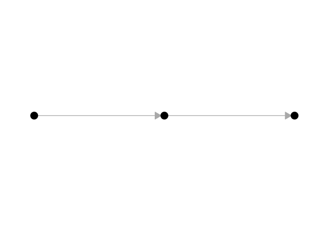

# Nodes

Always draw the node layer above the edge layer. Available geoms are

``` r
c(
  "geom_node_arc_bar",
  "geom_node_circle",
  "geom_node_label",
  "geom_node_point",
  "geom_node_text",
  "geom_node_tile",
  "geom_node_treemap"
)
```

Available shapes:


The following aesthetics can be used within geom_node_point() either
within aes() or globally:

- alpha (opacity; a value between 0 and 1)
- color (color of shapes 0-20 and border color for 21-25)
- fill (fill color for shape 21-25)
- shape (node shape; a value between 0 and 25)
- size (size of node)
- stroke (size of node border)

For geom_node_text(), there are a lot more options available, but the
most important ones are:

- label (attribute to be displayed as node label)
- color (text color)
- family (font to be used)
- size (font size)

A filter can be used in `aes()` to selectively apply the mappings,
especially useful for `geom_node_text`.

# Scales

``` r
scale_fill_manual(values = got_palette) +
  scale_edge_width_continuous(range = c(0.2, 3)) +
  scale_size_continuous(range = c(1, 6))
```

The following table gives an overview of which aesthetics can be used
for which variable type and some notes on when to use which aesthetic.

| aesthetic | variable type | notes |
|----|----|----|
| node size | continuous |  |
| edge width | continuous |  |
| node color/fill | categorical/continuous | use a gradient for continuous variables |
| edge color | continuous | categorical only if there are different types of edges |
| node shape | categorical | only if there are a few categories (1-5). Color should be the preferred choice |
| edge linetype | categorical | only if there are a few categories (1-5). Color should be the preferred choice |
| node/edge alpha | continuous |  |

While there are several parameters within
`scale_edge_width_continuous()` and scale_size_continuous(), the most
important one is “range” which fixes the minimum and maximum width and
size respectively.

For continuous variables which are mapped to node/edge color, one can
use scale_color_gradient() scale_color_gradient2() or
scale_color_gradientn() (add edge\_ before color for edge colors). The
difference between these functions is in how the gradient is
constructed.

- `gradient` creates a two color gradient (low-high). Two colors need to
  be specified (e.g. low = “blue”, high = “red”)
- `gradient2` creates a diverging color gradient (low-mid-high)
  (e.g. low = “blue”, mid = “white”, high = “red”)
- `gradientn` a gradient consisting of more than three colors (specified
  with the colors parameter).

For categorical variables that are mapped to node colors (or fill in our
example), one can use `scale_fill_manual()` to choose a color for each
category manually. To do so, create a vector of colors (like the
`got_palette`) and pass it to the function with the parameter values.

To avoid automatic assignment of colors, one can pass the vector of
colors as a named vector.

``` r
got_palette2 <- c(
  "5" = "#1A5878",
  "3" = "#C44237",
  "2" = "#AD8941",
  "1" = "#E99093",
  "4" = "#50594B",
  "7" = "#8968CD",
  "6" = "#9ACD32"
)
```

Using a manual color palette gives the network a unique touch but
`scale_*_brewer()` and `scale_*_viridis_*()` can also be used to apply
predefined color palettes.

``` r
ggraph(got_s1, layout = "stress") +
  geom_edge_link0(aes(edge_linewidth = weight), edge_color = "grey66") +
  geom_node_point(aes(fill = clu, size = size), shape = 21) +
  geom_node_text(aes(filter = size >= 26, label = name), family = "serif") +
  scale_fill_viridis_d() +
  scale_edge_width_continuous(range = c(0.2, 3)) +
  scale_size_continuous(range = c(1, 6)) +
  theme_graph() +
  theme(legend.position = "none")
```

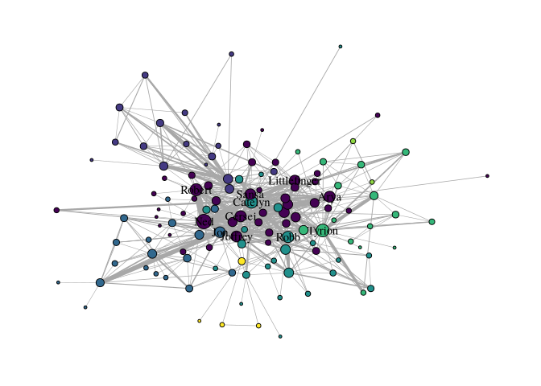

# Themes

``` r
theme_graph() +
  theme(legend.position = "none")
```

``` r
ggraph(got_s1, layout = "stress") +
  geom_edge_link0(aes(edge_linewidth = weight), edge_color = "grey66") +
  geom_node_point(aes(fill = clu, size = size), shape = 21) +
  geom_node_text(aes(filter = size >= 26, label = name), family = "serif") +
  scale_fill_manual(values = got_palette) +
  scale_edge_width_continuous(range = c(0.2, 3)) +
  scale_size_continuous(range = c(1, 6)) +
  theme_graph() +
  theme(legend.position = "bottom")
```

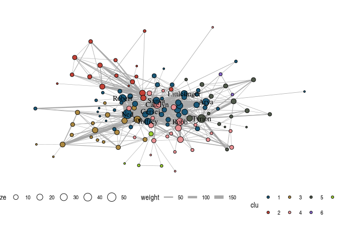

# Example - Political Blogs

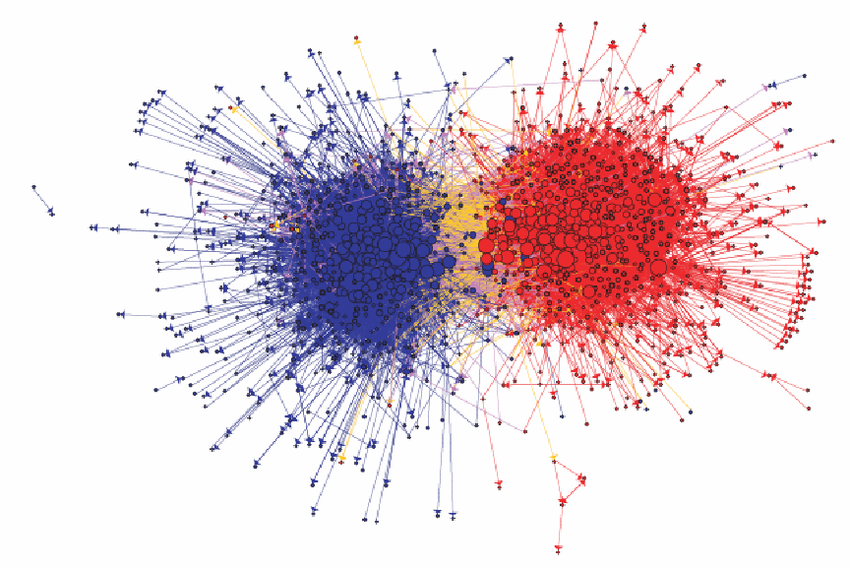

The network shows the linking between political blogs during the 2004
election in the US. Red nodes are conservative leaning blogs and blue
ones liberal.

Add a vertex attribute for indegree.

``` r
V(polblogs)$deg <- degree(polblogs, mode = "in")
```

``` r
layout <- create_layout(polblogs, "stress")

ggraph(layout) +
  geom_edge_link0(
    edge_linewidth = 0.2, edge_color = "grey66",
    arrow = arrow(
      length = unit(0.1, "inches"),
      ends = "last", type = "closed"
    )
  ) +
  geom_node_point()
```

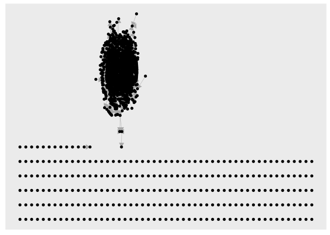

## Nodes

First, remove isolated nodes and the small disconnected component.

``` r
polblogs <- delete_vertices(
  polblogs, which(degree(polblogs) == 0)
)

comps <- components(polblogs)
polblogs <- delete_vertices(
  polblogs, which(comps$membership == which.min(comps$csize))
)

lay <- create_layout(polblogs, "stress")

ggraph(lay) +
  geom_edge_link0(
    edge_linewidth = 0.2,
    edge_color = "grey66",
    arrow = arrow(
      angle = 15,
      length = unit(0.1, "inches"),
      ends = "last",
      type = "closed"
    )
  ) +
  geom_node_point()
```

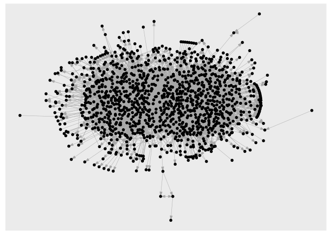

Map political orientation to node color and indegree to node size.

``` r
ggraph(lay) +
  geom_edge_link0(
    edge_linewidth = 0.2,
    edge_color = "grey66",
    arrow = arrow(
      angle = 15,
      length = unit(0.1, "inches"),
      ends = "last",
      type = "closed"
    )
  ) +
  geom_node_point(
    shape = 21,
    aes(fill = pol, size = deg),
    show.legend = FALSE
  ) +
  scale_fill_manual(values = c("left" = "#104E8B", "right" = "firebrick3")) +
  scale_size(range = c(0.5, 7))
```

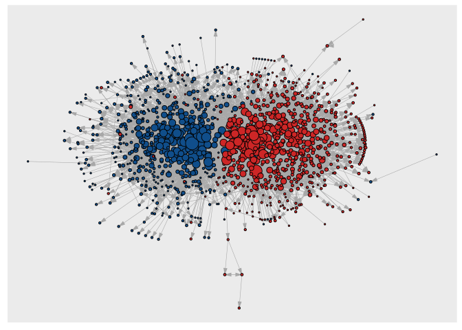

## Edges

First, create a variable indicating whether the edge is within or
between political parties.

``` r
pol_from <- V(polblogs)$pol[tail_of(polblogs, E(polblogs))]
pol_to <- V(polblogs)$pol[head_of(polblogs, E(polblogs))]
E(polblogs)$col <- ifelse(pol_from == pol_to, pol_from, "mixed")
```

``` r
lay <- create_layout(polblogs, "stress")
ggraph(lay) +
  geom_edge_link0(
    edge_linewidth = 0.2,
    aes(edge_color = col),
    arrow = arrow(
      angle = 15,
      length = unit(0.1, "inches"),
      ends = "last",
      type = "closed"
    )
  ) +
  geom_node_point(
    shape = 21,
    aes(fill = pol, size = deg),
    show.legend = FALSE
  ) +
  scale_fill_manual(values = c("left" = "#104E8B", "right" = "firebrick3")) +
  scale_edge_color_manual(
    values = c(
      "left" = "#104E8B",
      "mixed" = "goldenrod",
      "right" = "firebrick3"
    )
  )
```

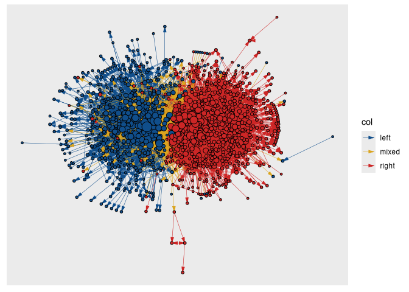

``` r
  scale_size(range = c(0.5, 7))
```

    <ScaleContinuous>
     Range:  
     Limits:    0 --    1

In the original visualization, blue edges run over yellow edges, unlike
here. One way to fix it is to add two link layers.

``` r
ggraph(lay) +
  geom_edge_link0(
    edge_linewidth = 0.2,
    aes(filter = (col == "mixed"), edge_color = col),
    arrow = arrow(
      angle = 10,
      length = unit(0.1, "inches"),
      ends = "last",
      type = "closed"
    ),
    show.legend = FALSE
  ) +
  geom_edge_link0(
    edge_linewidth = 0.2,
    aes(filter = (col != "mixed"), edge_color = col),
    arrow = arrow(
      angle = 10,
      length = unit(0.1, "inches"),
      ends = "last",
      type = "closed"
    ),
    show.legend = FALSE
  ) +
  geom_node_point(
    shape = 21,
    aes(fill = pol, size = deg),
    show.legend = FALSE
  ) +
  scale_fill_manual(values = c("left" = "#104E8B", "right" = "firebrick3")) +
  scale_edge_color_manual(
    values = c(
      "left" = "#104E8B",
      "mixed" = "goldenrod",
      "right" = "firebrick3"
    )
  ) +
  scale_size(range = c(0.5, 7)) +
  theme_graph()
```

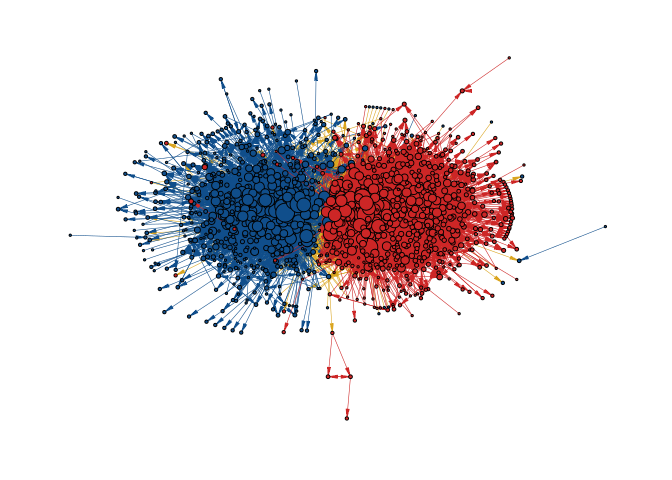
