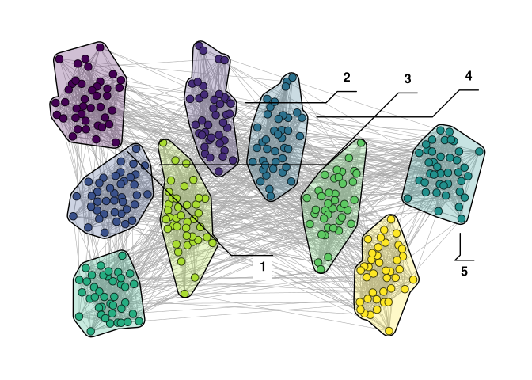
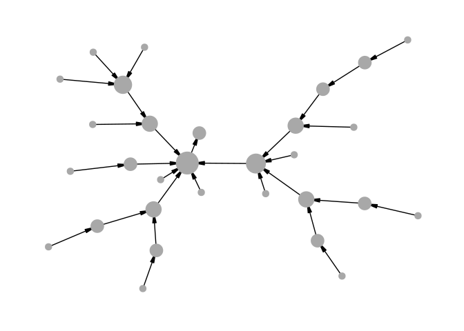
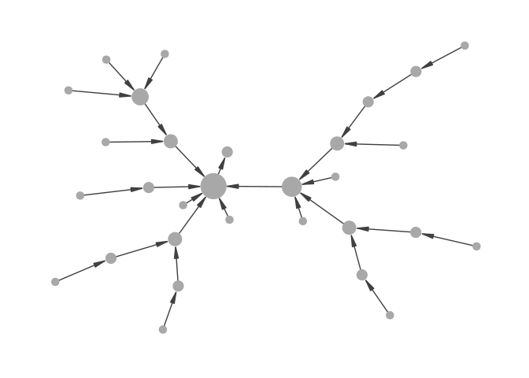
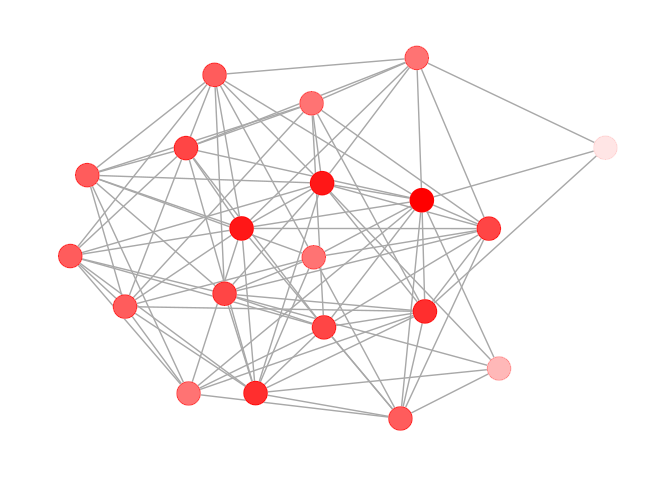
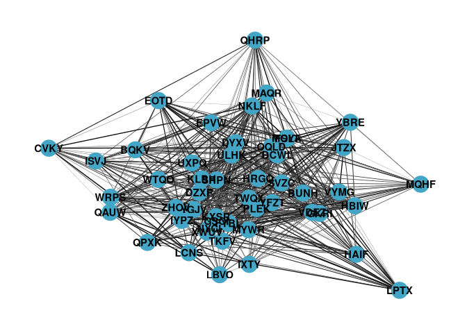
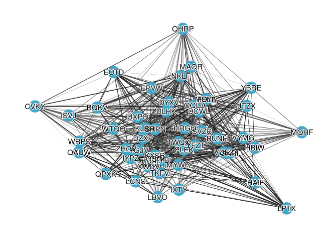

# Enhancing Visualizations


[Source](https://schochastics.github.io/R4SNA/visualization/enhance-viz.html)

``` r
options(paged.print = FALSE)
```

``` r
libraries <- list(
  "igraph", "ggraph", "graphlayouts",
  "ggforce", "networkdata", "tidyverse"
)
invisible(lapply(libraries, library, character.only = TRUE))
```

``` r
gotS1 <- got[[1]]

got_palette <- c(
  "#1A5878",
  "#C44237",
  "#AD8941",
  "#E99093",
  "#50594B",
  "#8968CD",
  "#9ACD32"
)

# compute a clustering for node colors
V(gotS1)$clu <- as.character(membership(cluster_louvain(gotS1)))

# compute degree as node size
```

# `ggraph` with `ggforce`

``` r
set.seed(1108)
g <- sample_islands(9, 40, 0.4, 15) %>% 
  simplify()
V(g)$grp <- as.character(rep(1:9, each = 40))
```

Use `geom_mark_*` to highlight clusters.

``` r
ggraph(g, layout = "backbone", keep = 0.4) +
  geom_edge_link0(edge_color = "grey66", edge_linewidth = 0.2) +
  geom_node_point(aes(fill = grp), shape = 21, size = 3) +
  geom_mark_hull(
    aes(x, y, group = grp, fill = grp),
    concavity = 4,
    expand = unit(2, "mm"),
    alpha = 0.25
  ) +
  scale_color_viridis_d() +
  scale_fill_viridis_d() +
  scale_edge_color_manual(values = c(rgb(0, 0, 0, 0.3),
                                     rgb(0, 0, 0, 1))) +
  theme_graph() +
  theme(legend.position = "none")
```


Add labels to clusters

``` r
ggraph(g, layout = "backbone", keep = 0.4) +
  geom_edge_link0(edge_color = "grey66", edge_linewidth = 0.2) +
  geom_node_point(aes(fill = grp), shape = 21, size = 3) +
  geom_mark_hull(
    aes(x, y, group = grp, fill = grp, label = grp),
    concavity = 4,
    expand = unit(2, "mm"),
    alpha = 0.25
  ) +
  scale_color_viridis_d() +
  scale_fill_viridis_d() +
  scale_edge_color_manual(values = c(rgb(0, 0, 0, 0.3),
                                     rgb(0, 0, 0, 1))) +
  theme_graph() +
  theme(legend.position = "none")
```



# Polishing Details

## Aligning arrow endpoints with node size

`end_cap` is set based on degree, but because `ggraph` maps the size
aesthetic through a scale, the actual rendered size of each node does
not match the value passed to `end_cap`.

``` r
set.seed(1108)
g <- sample_pa(30, 1)
V(g)$degree <- degree(g, mode = "in")

ggraph(g, "stress") +
  geom_edge_link(
    aes(end_cap = circle(node2.degree + 2, "pt")),
    edge_color = "black",
    arrow = arrow(
      angle = 10,
      length = unit(0.15, "inches"),
      ends = "last",
      type = "closed"
    )
  ) +
  geom_node_point(aes(size = degree), col = "grey66", show.legend = FALSE) +
  scale_size(range = c(3, 11)) +
  theme_graph()
```



A solution is to bypass the size scale entirely using base R’s `I()`
function, which passes values through “as is”. A node with value 5 will
be rendered at exactly 5 points. Because `I()` removes any automatic
rescaling, we need to normalise the degree values to the desired size
range beforehand.

``` r
normalise <- function(x, from = range(x), to = c(0, 1)) {
  x <- (x - from[1]) / (from[2] - from[1])
  if (!identical(to, c(0, 1))) {
    x <- x * (to[2] - to[1]) + to[1]
  }
  x
}

V(g)$degree <- normalise(V(g)$degree, to = c(3, 11))

ggraph(g, "stress") +
  geom_edge_link(
    aes(end_cap = circle(node2.degree + 2, "pt")),
    edge_color = "grey25",
    arrow = arrow(
      angle = 10,
      length = unit(0.15, "inches"),
      ends = "last",
      type = "closed"
    )
  ) +
  geom_node_point(aes(size = I(degree)), col = "grey66") +
  theme_graph()
```



## Transparent nodes without edge bleed-through

``` r
set.seed(1108)
g <- sample_gnp(20, 0.5)
V(g)$degree <- degree(g)

ggraph(g, "stress") +
  geom_edge_link(edge_color = "grey66") +
  geom_node_point(
    size = 8,
    aes(alpha = degree),
    col = "red",
    show.legend = FALSE
  ) +
  theme_graph()
```


The fix is to add an extra node layer between the edges and the
transparent nodes: a set of fully opaque points in the background color.
These act as masks that hide the edges underneath, while the colored
layer on top still shows the intended transparency effect.

``` r
ggraph(g, "stress") +
  geom_edge_link(edge_color = "grey66") +
  geom_node_point(size = 8, col = "white") +
  geom_node_point(
    aes(alpha = degree),
    size = 8,
    col = "red",
    show.legend = FALSE
  ) +
  theme_graph()
```



## Improve readibility of text

In dense networks, node labels can easily become unreadable when they
overlap with edges and other nodes.

``` r
set.seed(1108)
g <- sample_gnp(50, 0.5)
V(g)$name <- sapply(1:50, function(x) paste0(sample(LETTERS, 4), collapse = ""))
E(g)$weight <- runif(ecount(g))

ggraph(g, "stress") +
  geom_edge_link0(
    aes(edge_color = weight, edge_linewidth = weight),
    show.legend = FALSE
  ) +
  geom_node_point(size = 8, color = "#44a6c6") +
  geom_node_text(aes(label = name), fontface = "bold") +
  scale_edge_color_continuous(low = "grey66", high = "black") +
  scale_edge_width(range = c(0.1, 0.5)) +
  theme_graph()
```



With shadow text

``` r
ggraph(g, "stress") +
  geom_edge_link0(
    aes(edge_color = weight, edge_linewidth = weight),
    show.legend = FALSE
  ) +
  geom_node_point(size = 8, color = "#44a6c6") +
  shadowtext::geom_shadowtext(
    aes(x, y, label = name),
    color = "black",
    size = 4,
    bg.color = "white"
  ) +
  scale_edge_color_continuous(low = "grey66", high = "black") +
  scale_edge_width(range = c(0.1, 0.5)) +
  theme_graph()
```


