# Enhancing Visualizations


[Source](https://schochastics.github.io/R4SNA/visualization/interactive-viz.html)

``` r
options(paged.print = FALSE)
```

``` r
libraries <- list(
  "igraph", "visNetwork", "networkD3",
  "threejs", "networkdata", "g6R", "tidyverse"
)
invisible(lapply(libraries, library, character.only = TRUE))
```

# Data Preparation

We use the Florentine Families marriage network, introduced in earlier
chapters. With 16 families and 20 ties it is small enough that every
label, hull, and bubble in this chapter renders without clutter, and it
comes with a wealth attribute that gives us a meaningful categorical
grouping for later plugin demos. The disconnected Pucci family will be
removed.

``` r
flo <- subgraph(
  flo_marriage,
  components(flo_marriage)$membership ==
    which.max(components(flo_marriage)$csize)
)
```

Assign wealth tiers for grouping and degree for node sizes.

``` r
V(flo)$wealth_tier <- as.character(
  cut(
    V(flo)$wealth,
    breaks = quantile(V(flo)$wealth, probs = c(0, 1/3, 2/3, 1)),
    labels = c("low", "mid", "high"),
    include.lowest = TRUE
  )
)

V(flo)$degree <- degree(flo)


palette3 <- c(low = "#1A5878", mid = "#AD8941", high = "#C44237")
```

# Interactive Network Visualization Tools

Each of these packages has its place. `visNetwork` is mature and
full-featured, `networkD3` leverages the power of `D3.js`, and `threejs`
offers 3D rendering.

## visNetwork

Converting an igraph object requires mapping a few vertex attributes to
the column names that visNetwork expects.

``` r
V(flo)$label <- V(flo)$name
V(flo)$group <- V(flo)$wealth_tier
V(flo)$value <- V(flo)$degree

vis_data <- toVisNetworkData(flo)
visNetwork(
  vis_data$nodes, vis_data$edges,
  width = "100%", height = "400px"
) %>% 
  visOptions(highlightNearest = TRUE)
```

    file:////tmp/RtmpsR5hXG/filea3fe6d087b1e/widgeta3fe34dbe648.html screenshot completed

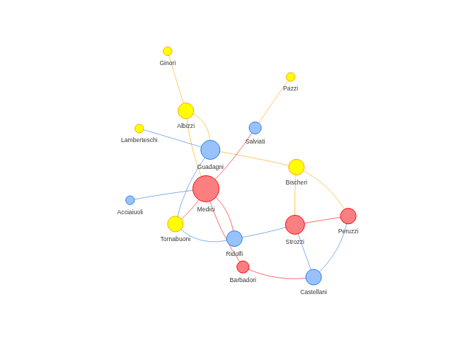

A simple, draggable and zoomable tool.

## networkD3

``` r
d3_data <- igraph_to_networkD3(flo, group = V(flo)$wealth_tier)

forceNetwork(
  Links = d3_data$links, Nodes = d3_data$nodes,
  Source = "source", Target = "target",
  NodeID = "name", Group = "group",
  opacity = 0.9, zoom = TRUE, fontSize = 12
)
```

    file:////tmp/RtmpsR5hXG/filea3fe5c283fbb/widgeta3fe78b0976.html screenshot completed

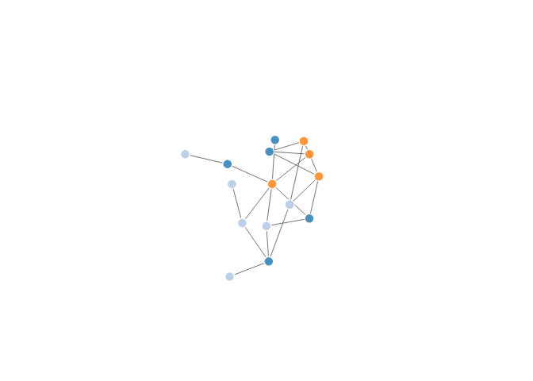

Hovering highlights connected nodes and fades others.

## threejs

3D rendering

``` r
graphjs(flo, vertex.size = 0.3 + 0.2 * V(flo)$degree)
```

    file:////tmp/RtmpsR5hXG/filea3fe2aa2f62d/widgeta3fe28acc0b1.html screenshot completed

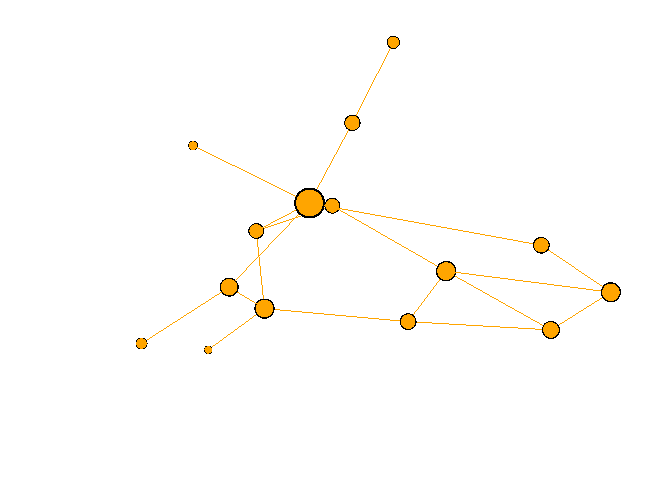

# g6R Basics

## Building nodes and edges

`g6R` offers a convenience function `g6_igraph` to convert an `igraph`
object to a g6 widget, but it is only good for a quick preview. To fully
control, must build the graph explicitly.

The g6 node is a list with at least an `id`, and optional `data` and
`style` slots. The edge is a list with `source` and `target` fields.

``` r
mk_node <- function(name, tier, deg) {
  g6_node(
    id = name,
    data = list(wealth_tier = tier, degree = deg),
    style = list(
      labelText = name,
      fill = palette3[[tier]],
      size = 14 + 2 * deg,
      stroke = "#555555",
      lineWidth = 1
    )
  )
}

nodes <- pmap(
  list(V(flo)$name, V(flo)$wealth_tier, V(flo)$degree),
  \(x, y, z) mk_node(x, y, z)
)
```

``` r
edges_df <- igraph::as_data_frame(flo, what = "edges")

mk_edge <- function(src, tgt) {
  g6_edge(
    source = src,
    target = tgt,
    style = list(stroke = "#cccccc", lineWidth = 1)
  )
}

edges <- map2(
  edges_df$from,
  edges_df$to,
  \(x, y) mk_edge(x, y)
) %>%
  unname() %>%
  sapply(g6_edges)
```

## First interactive network

``` r
g6(nodes, edges) %>% 
  g6_layout() %>% 
  g6_options(autoFit = "view", autoResize = TRUE)
```

    file:////tmp/RtmpsR5hXG/filea3fe4229f0fe/widgeta3fe28659130.html screenshot completed


# Layouts

The default layout in g6R is d3_force_layout(), which simulates physical
forces to position nodes: linked nodes attract each other while all
nodes repel, producing a layout that tends to place densely connected
groups close together.

Another force-directed option is force_atlas2_layout(), a variant of the
ForceAtlas2 algorithm popularized by Gephi. It produces a more compact
layout with less overlap, and the preventOverlap option can be set to
TRUE to further reduce node collisions at the cost of a longer layout
time. `kr` increases the repulsion strength.

``` r
g6(nodes, edges) %>% 
  g6_layout(force_atlas2_layout(preventOverlap = T, kr = 20)) %>% 
  g6_options(autoFit = "view", autoResize = T)
```

    file:////tmp/RtmpsR5hXG/filea3fe7b77a396/widgeta3fe593ae869.html screenshot completed

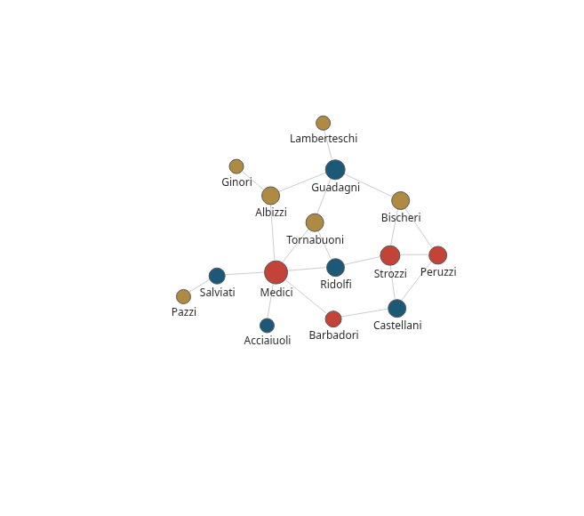

# Styling nodes and edges

Per-element styles, set in the style slot of each node or edge, give
every element its own color, size, and label as we did in the data
preparation above. Global defaults, set with g6_options(), apply to all
elements and can be overridden by per-element styles.

## Per-element styling

``` r
mk_node_bold <- function(name, tier, deg) {
  g6_node(
    id = name,
    data = list(wealth_tier = tier, degree = deg),
    style = list(
      labelText = name,
      fill = palette3[[tier]],
      size = 14 + 2 * deg,
      stroke = "#222222",
      lineWidth = 2.5
    )
  )
}

nodes_bold <- pmap(
  list(V(flo)$name, V(flo)$wealth_tier, V(flo)$degree),
  \(x, y, z) mk_node_bold(x, y, z)
)

g6(nodes_bold, edges) %>% 
  g6_layout(force_atlas2_layout(preventOverlap = T, kr = 20)) %>% 
  g6_options(autoFit = "view", autoResize = T)  
```

    file:////tmp/RtmpsR5hXG/filea3fe38cdf67a/widgeta3fe267fbc0f.html screenshot completed

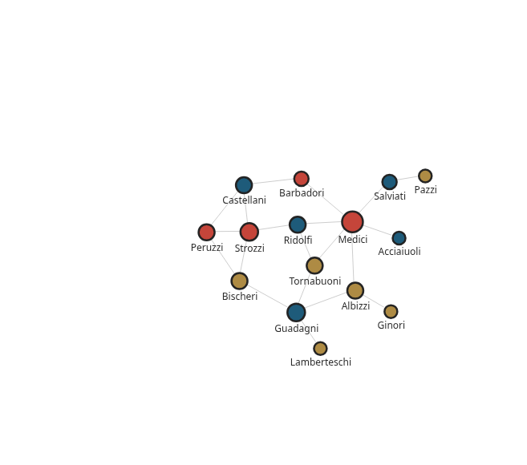

## Global defaults

Shrink the label font, move labels below nodes.

``` r
g6(nodes, edges) %>%
  g6_layout(force_atlas2_layout(preventOverlap = T, kr = 20)) %>%
  g6_options(
    node = node_options(
      style = node_style_options(
        labelFontSize = 11,
        labelPlacement = "bottom"
      )
    ),
    edge = edge_options(
      style = edge_style_options(
        stroke = "#bbbbbb",
        lineWidth = 0.8
      )
    ),
    autoFit = "view",
    autoResize = TRUE
  )
```

    file:////tmp/RtmpsR5hXG/filea3fe4011ece5/widgeta3fe3a50d164.html screenshot completed

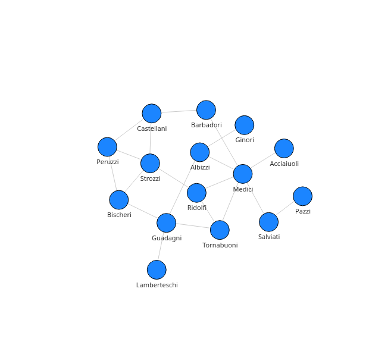

# Behaviors

## Navigation: drag and zoom

``` r
g6(nodes, edges) |>
  g6_layout(force_atlas2_layout(preventOverlap = TRUE, kr = 20)) |>
  g6_behaviors(drag_canvas(), zoom_canvas())
```

    file:////tmp/RtmpsR5hXG/filea3fe7bb6334b/widgeta3fe1ca61ce3.html screenshot completed

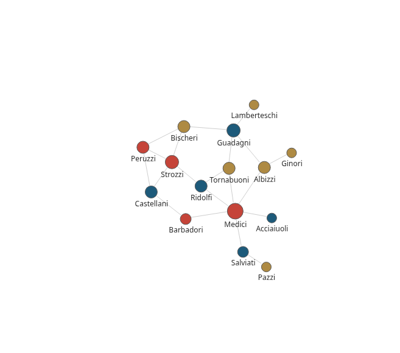

## Element interaction

``` r
g6(nodes, edges) %>% 
  g6_layout() %>% 
  g6_behaviors(
    drag_element_force(fixed = TRUE),
    hover_activate(degree = 1),
    click_select(multiple = TRUE)
  )
```

    file:////tmp/RtmpsR5hXG/filea3fe1f0c91f4/widgeta3fe151fe23c.html screenshot completed

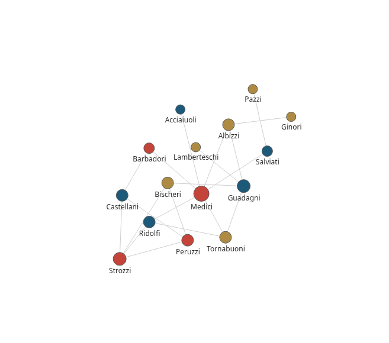

## Lasso and brush selection

``` r
g6(nodes, edges) |>
  g6_layout() |>
  g6_behaviors(
    lasso_select()
  )
```

    file:////tmp/RtmpsR5hXG/filea3fe6b6d4ba6/widgeta3fe6812636b.html screenshot completed


``` r
g6(nodes, edges) |>
  g6_layout() |>
  g6_behaviors(
    brush_select()
  )
```

    file:////tmp/RtmpsR5hXG/filea3fe1e79d7bd/widgeta3fe241d3f3c.html screenshot completed


# Plugins

## Visual grouping: hulls

``` r
tier_members <- split(V(flo)$name, V(flo)$wealth_tier)

g6(nodes, edges) %>% 
  g6_layout() %>% 
  g6_behaviors("drag-element") %>% 
  g6_options(
    animation = FALSE
  ) %>% 
  g6_plugins(
    hull(
      key = "hull-low", members = tier_members$low,
      fill = palette3[["low"]], stroke = palette3[["low"]]
    ),
    hull(
      key = "hull-mid", members = tier_members$mid,
      fill = palette3[["mid"]], stroke = palette3[["mid"]]
    ),
    hull(
      key = "hull-high", members = tier_members$high,
      fill = palette3[["high"]], stroke = palette3[["high"]]
    )
  )
```

    file:////tmp/RtmpsR5hXG/filea3fe65e9be13/widgeta3fe6af6655b.html screenshot completed

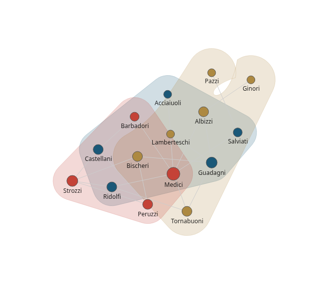

## Visual grouping: bubble sets

``` r
g6(nodes, edges) %>% 
  g6_layout() %>% 
  g6_behaviors("drag-element") %>% 
  g6_options(
    animation = FALSE
  ) %>% 
  g6_plugins(
    bubble_sets(
      key = "hull-low", members = tier_members$low,
      fill = palette3[["low"]], stroke = palette3[["low"]]
    ),
    bubble_sets(
      key = "hull-mid", members = tier_members$mid,
      fill = palette3[["mid"]], stroke = palette3[["mid"]]
    ),
    bubble_sets(
      key = "hull-high", members = tier_members$high,
      fill = palette3[["high"]], stroke = palette3[["high"]]
    )
  )
```

    file:////tmp/RtmpsR5hXG/filea3fe5422e29e/widgeta3fe267cb1dc.html screenshot completed

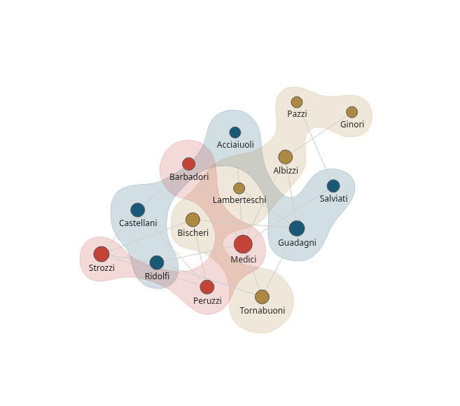

## Tooltips

The callback is a small JavaScript function, wrapped with JS() that
receives the hovered items and returns the HTML to render.

``` r
tooltip_content <- JS(
  "(event, items) => {
    let result = ``;
    items.forEach((item) => {
      result += `<h4>${item.id}</h4>`;
      result += `<p>wealth tier: ${item.data.wealth_tier}</p>`;
      result += `<p>degree: ${item.data.degree}</p>`;
    });
    return result;
  }"
)

g6(nodes, edges) |>
  g6_layout() |>
  g6_plugins(tooltips(trigger = "click",getContent = tooltip_content))
```

    file:////tmp/RtmpsR5hXG/filea3fe3a8ba160/widgeta3fe533b318.html screenshot completed

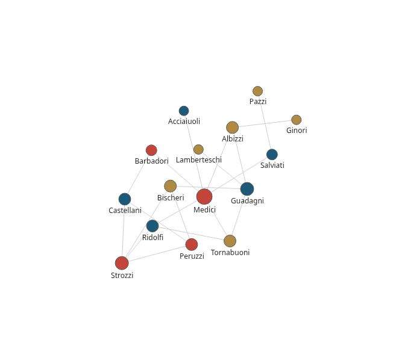

## Legend

``` r
g6(nodes, edges) |>
  g6_layout() |>
  g6_plugins(
    legend(
      nodeField = "wealth_tier",
      showTitle = TRUE, 
      titleText = "Wealth Tier", 
      position = "top"
    )
  )
```

    file:////tmp/RtmpsR5hXG/filea3fe496fa632/widgeta3fe712e34b7.html screenshot completed

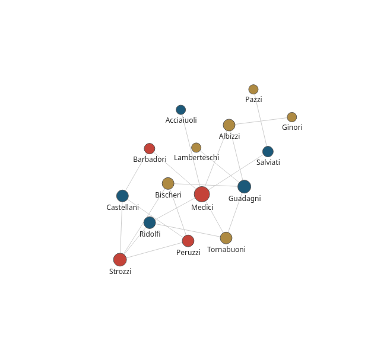

## Fisheye lens

``` r
g6(nodes, edges) |>
  g6_layout() |>
  g6_plugins(fish_eye())
```

    file:////tmp/RtmpsR5hXG/filea3fee24b3d6/widgeta3fe2ab075fa.html screenshot completed

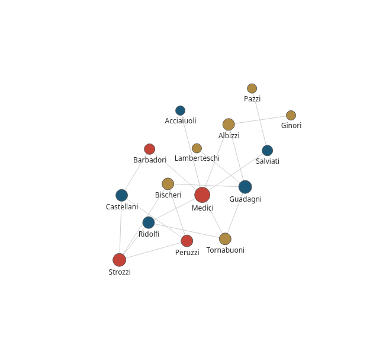

## Minimap

``` r
g6(nodes, edges) |>
  g6_layout() |>
  g6_plugins(minimap())
```

    file:////tmp/RtmpsR5hXG/filea3fe5018ad41/widgeta3fe2472474a.html screenshot completed

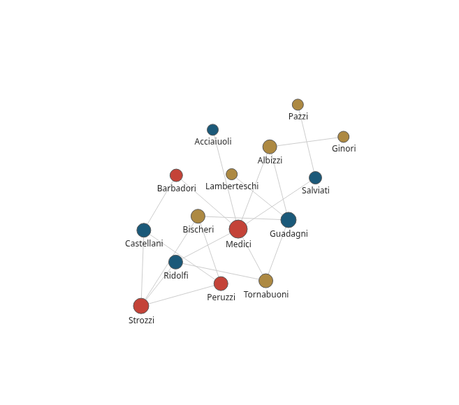
