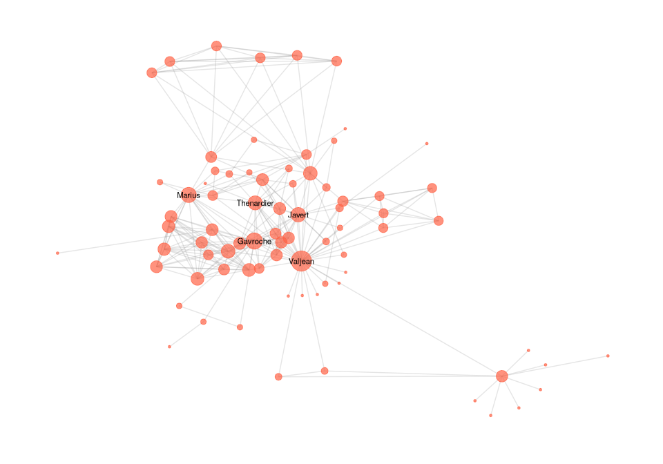
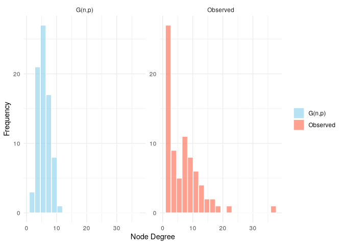
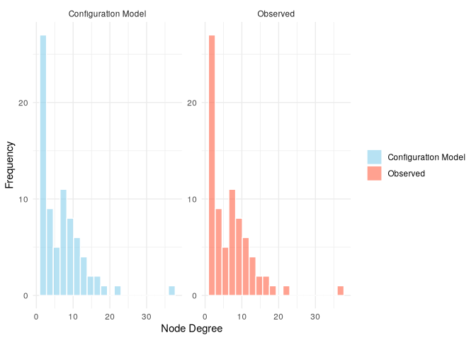
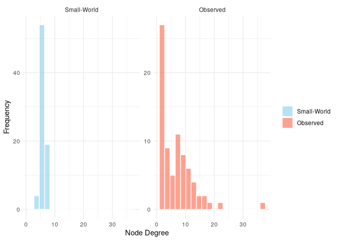
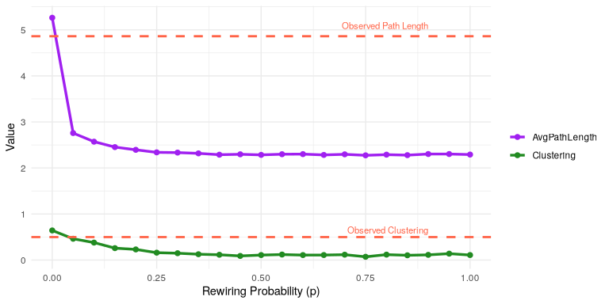

# Random Graph Models


[Source](https://schochastics.github.io/R4SNA/inferential/rgm.html)

``` r
options(paged.print = FALSE)
```

``` r
libraries <- list(
  "igraph", "ggraph","graphlayouts", 
  "networkdata", "knitr", "tidyverse"
)
invisible(lapply(libraries, library, character.only = TRUE))
```

# The Erdős–Rényi Model: $G(n, p)$

One of the earliest and most fundamental models. Graphs are constructed
from $n$ nodes with edges formed between each pair with a fixed
probability. The existence of a tie is not influenced by any other tie,
so the result is fully dyad-independent with homogenous probabilities.

The model defines a probability distribution over the entire space of
possible n-node graphs. The expected number of edges is
$\binom{n}{2} \cdot p$, and the degree of each node follows a binomial
distribution with parameters $(n-1,p)$, the expected degree of a node is
$(n-1) \cdot p$, and the degree distribution approaches normal as $n$
increases. The overall density is close to $p$.

The most natural estimate for $p$ is the edge density in the observed
network. For undirected networks, where $m = \sum_{i<j} y_{ij}$ is the
number of observed edges, the maximum likelihood estimate is
$\hat{p} = \frac{m}{\binom{n}{2}}$. For directed networks,
$m = \sum_{i \ne j} y_{ij}$ and $\hat{p} = \frac{m}{n(n-1)}$.

These models can provide a baseline, but fail to capture many features
in real-world networks such as clustering, reciprocity, community
structure, etc. At is also limited to one parameter. Can be used as a
null model for hypothesis testing.

## Example

A typical social or informational network displays three features that
are not captured well by : a right-skewed degree distribution (with
hubs), high clustering or triadic closure, and short average path
lengths. While can match the density of a network, it assumes a binomial
(or normal) degree distribution, minimal clustering, and does not
account for structural heterogeneity.

``` r
g_obs <- miserables

V(g_obs)$degree <- degree(g_obs)

ggraph(g_obs, layout = "stress") +
  geom_edge_link(alpha = 0.2, color = "gray50") +
  geom_node_point(aes(size = degree), color = "tomato", alpha = 0.7) +
  geom_node_text(
    aes(label = ifelse(degree > 15, name, "")),
    repel = FALSE,
    size = 3,
    color = "black"
  ) +
  scale_size_continuous(range = c(1, 10)) +
  theme_graph(base_family = "sans") +
  theme(legend.position = "none")
```



The network exhibits strong heterogeneity, with a few highly connected
hubs and many low-degree nodes, a feature not captured by simple random
graph models like $G(n, p)$.

Basic observed network stats

``` r
n <- vcount(g_obs)
m <- ecount(g_obs)
density_obs <- edge_density(g_obs)
deg_obs <- degree(g_obs)
clustering_obs <- transitivity(g_obs, "global")
dist_obs <- mean_distance(g_obs, directed = F, unconnected = T)
```

Generate G(n, p) graph with same density.

``` r
set.seed(1108)
g_gnp <- sample_gnp(n = n, p = density_obs, directed = F)
deg_gnp <- degree(g_gnp)
clustering_gnp <- transitivity(g_gnp, type = "global")
dist_gnp <- mean_distance(g_gnp, directed = F, unconnected = T)
```

``` r
(comparison <- data.frame(
  Model = c("Observed", "G(n, p)"),
  Clustering = c(clustering_obs, clustering_gnp),
  AvgPathLength = c(dist_obs, dist_gnp),
  MaxDegree = c(max(deg_obs), max(deg_gnp))
))
```

         Model Clustering AvgPathLength MaxDegree
    1 Observed 0.49893162      4.861244        36
    2  G(n, p) 0.07061688      2.658237        11

The observed network has some highly connected nodes and a much higher
clustering coefficient.

Examine the degree distributions. Empirical networks are often
right-skewed.

``` r
df_deg <- data.frame(
  Degree = c(deg_obs, deg_gnp),
  Type = rep(
    c("Observed", "G(n,p)"),
    times = c(length(deg_obs), length(deg_gnp))
  )
)

ggplot(df_deg, aes(x = Degree, fill = Type)) +
  geom_histogram(
    position = "identity",
    bins = 20,
    alpha = 0.6,
    color = "white"
  ) +
  facet_wrap(~Type, scales = "free_y") +
  labs(x = "Node Degree", y = "Frequency") +
  theme_minimal() +
  scale_fill_manual(values = c("skyblue", "tomato")) +
  theme(legend.title = element_blank())
```



This example underscores the need for more realistic network models that
can capture multiple structural properties simultaneously. In
particular, it fails to capture the heterogeneity observed in many
real-world systems, where some nodes act as hubs while others have very
few connections. To address this limitation, we turn to the
configuration model, which allows us to fix the degree sequence of the
network and thereby preserve node-level connectivity patterns.

> [!NOTE]
>
> ### $G(n, p)$ and CUG Given Density
>
> The $G(n, p)$ model is mathematically equivalent to a **Conditional
> Uniform Graph (CUG) test given density**. In both cases, edges are
> formed between node pairs independently with fixed probability $p$,
> and the overall network density is preserved on average across
> simulations.
>
> However, there are key differences in interpretation and usage:
>
> - The $G(n, p)$ model is a **generative model** used to define a
>   probability distribution over the space of graphs with $n$ nodes and
>   tie probability $p$. It is often used in theoretical network science
>   as a baseline or null model.
>
> - A **CUG test given density** is a **hypothesis testing framework**.
>   It conditions on the observed number of nodes and the expected
>   density, and tests whether an observed network statistic (e.g.,
>   mutual ties, clustering) deviates significantly from what would be
>   expected by chance.
>
> In practice, simulating random graphs under the $G(n, p)$ model is
> functionally identical to conducting a CUG test with fixed density.
> The distinction lies in whether the model is used for generative
> modeling or for evaluating the statistical significance of observed
> network features. :::

# Configuration Model

Generates random graphs while preserving the exact degree sequence of
the observed network. A node is randomly assigned the same number of
pairs as in the observed network. Because the assignments are random,
they may contain self-loops or multiple edges. The sum of the degree
sequence must be even.

## Example

Get the observed degree sequence and compute observed properties.

``` r
deg_seq <- degree(g_obs)
clustering_obs <- transitivity(g_obs, "global")
dist_obs <- mean_distance(g_obs, directed = F, unconnected = T)
```

Simulate configuration model and compute properties

``` r
set.seed(1108)
g_conf <- sample_degseq(deg_seq, method = "fast.heur.simple")
clustering_conf <- transitivity(g_conf, type = "global")
dist_conf <- mean_distance(g_conf, directed = FALSE, unconnected = TRUE)
deg_conf <- degree(g_conf)
```

Compare degree distribution

``` r
(conf_comparison <- data.frame(
  Model = c("Observed", "Configuration Model"),
  Clustering = c(clustering_obs, clustering_conf),
  AvgPathLength = c(dist_obs, dist_conf),
  MaxDegree = c(max(deg_seq), max(deg_conf))  
))
```

                    Model Clustering AvgPathLength MaxDegree
    1            Observed  0.4989316      4.861244        36
    2 Configuration Model  0.2179487      2.537936        36

``` r
deg_df <- data.frame(
  Degree = c(deg_seq, deg_conf),
  Type = rep(
    c("Observed", "Configuration Model"),
    times = c(length(deg_seq), length(deg_conf))
  )
)

ggplot(deg_df, aes(x = Degree, fill = Type)) +
  geom_histogram(
    position = "identity",
    bins = 20,
    alpha = 0.6,
    color = "white"
  ) +
  facet_wrap(~Type, scales = "free_y") +
  labs(x = "Node Degree", y = "Frequency") +
  scale_fill_manual(values = c("skyblue", "tomato")) +
  theme_minimal() +
  theme(legend.title = element_blank())
```



The degree distribution matches, as expected, but clustering is not
captured.

This is conceptually aligned with CUG given degree.

# Small-World Model

Many real networks have relatively short average path lengths yet are
highly clustered. This means that although nodes tend to form local
groups or neighborhoods, information or influence can still spread
efficiently through the network.

The model begins with a ring lattice with each node connected to a fixed
number of nearest neighbors on either side. It is regular with long
average path lengths. Randomness is introduced as path length is reduced
by rewiring each edge with a fixed probability. $p=0$ leaves the network
random, $p=1$ rewires all edges randomly resulting in a Bernoulli random
graph. For $0 \lt p \lt 0.5$, the result retains much local clustering
while dramatically lowering average path length.

However, in its basic form, all nodes have the same degree, which may be
unrealistic for empirical networks that have high degree heterogeneity.
It also loses small world structure as $p$ approaches 1.

## Example

We simulate a small-world graph using the same number of nodes and
approximate average degree as the Les Misérables co-appearance network.
We then compare the simulated graph to the observed one in terms of
degree distribution, clustering, and average path length.

We set to introduce moderate randomness while maintaining local
structure .

``` r
avg_deg_obs <- mean(deg_obs)
k <- round(avg_deg_obs / 2)
set.seed(1108)
g_sw <- sample_smallworld(dim = 1, size = n, nei = k, p = 0.05)
```

Compute properties

``` r
clustering_obs <- transitivity(g_obs, "global")
clustering_sw <- transitivity(g_sw, "global")
dist_obs <- mean_distance(g_obs, directed = FALSE, unconnected = TRUE)
dist_sw <- mean_distance(g_sw, directed = FALSE, unconnected = TRUE)
deg_sw <- degree(g_sw)
```

``` r
(sw_comparison <- data.frame(
  Model = c("Observed", "Small-World"),
  Clustering = c(clustering_obs, clustering_sw),
  AvgPathLength = c(dist_obs, dist_sw),
  MaxDegree = c(max(deg_obs), max(deg_sw))
))
```

            Model Clustering AvgPathLength MaxDegree
    1    Observed  0.4989316      4.861244        36
    2 Small-World  0.4116162      3.262816         8

``` r
# Degree distribution
deg_df <- data.frame(
  Degree = c(deg_sw, deg_obs),
  Type = rep(
    c("Small-World", "Observed"),
    times = c(length(deg_obs), length(deg_sw))
  )
)
# Reverse the factor levels
deg_df$Type <- factor(deg_df$Type, levels = c("Small-World", "Observed"))

ggplot(deg_df, aes(x = Degree, fill = Type)) +
  geom_histogram(
    position = "identity",
    bins = 20,
    alpha = 0.6,
    color = "white"
  ) +
  facet_wrap(~Type, scales = "free_y") +
  labs(x = "Node Degree", y = "Frequency") +
  scale_fill_manual(values = c("skyblue", "tomato")) +
  theme_minimal() +
  theme(legend.title = element_blank())
```



The model captures clustering and path length, but degree distribution
is very different.

Small values of $p$ are chosen to significantly reduce path length while
preserving high clustering. Too low and the network is too regular, too
high it is too random. In practice, $p$ is often selected empirically to
achieve small-world characteristics (high clustering and short average
path length) relative to the number of nodes and degree.

To illustrate how the small-world model transitions between regular and
random structure, we simulate multiple networks with the same number of
nodes as Les Misérables network with varying values of the rewiring
probability and track how two key properties (clustering and average
path length) change. This helps identify a “sweet spot” for where the
network retains high clustering but achieves short global paths,
capturing the essence of small-world structure.

``` r
# Parameters
n <- 77 # same as miserables
k <- 4 # number of nearest neighbors on each side
p_values <- seq(0, 1, by = 0.05)

# Simulate small-world networks over different p
set.seed(1108)
sw_stats <- lapply(p_values, function(p) {
  g <- sample_smallworld(dim = 1, size = n, nei = k, p = p)
  tibble(
    p = p,
    Clustering = transitivity(g, type = "global"),
    AvgPathLength = mean_distance(g, directed = FALSE, unconnected = TRUE)
  )
}) |>
  bind_rows()

# Reshape for plotting
sw_long <- sw_stats |>
  pivot_longer(
    cols = c(Clustering, AvgPathLength),
    names_to = "Metric",
    values_to = "Value"
  )

# Compute observed values
g_obs <- miserables
clustering_obs <- transitivity(g_obs, type = "global")
dist_obs <- mean_distance(g_obs, directed = FALSE, unconnected = TRUE)
```


