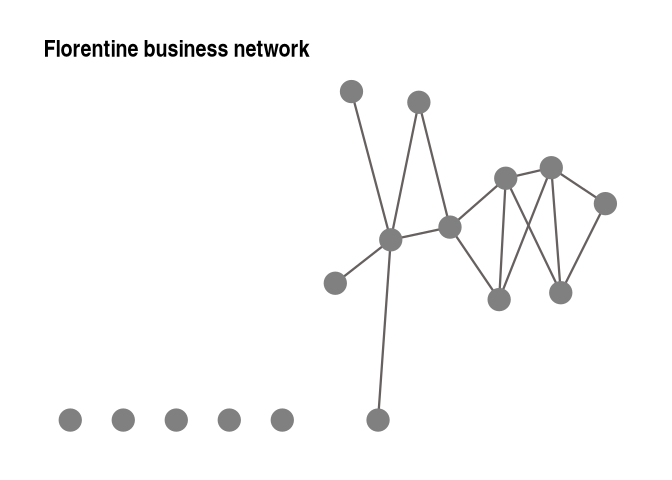
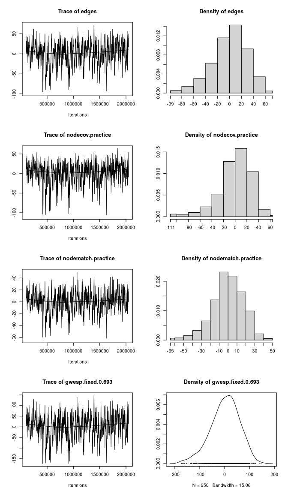
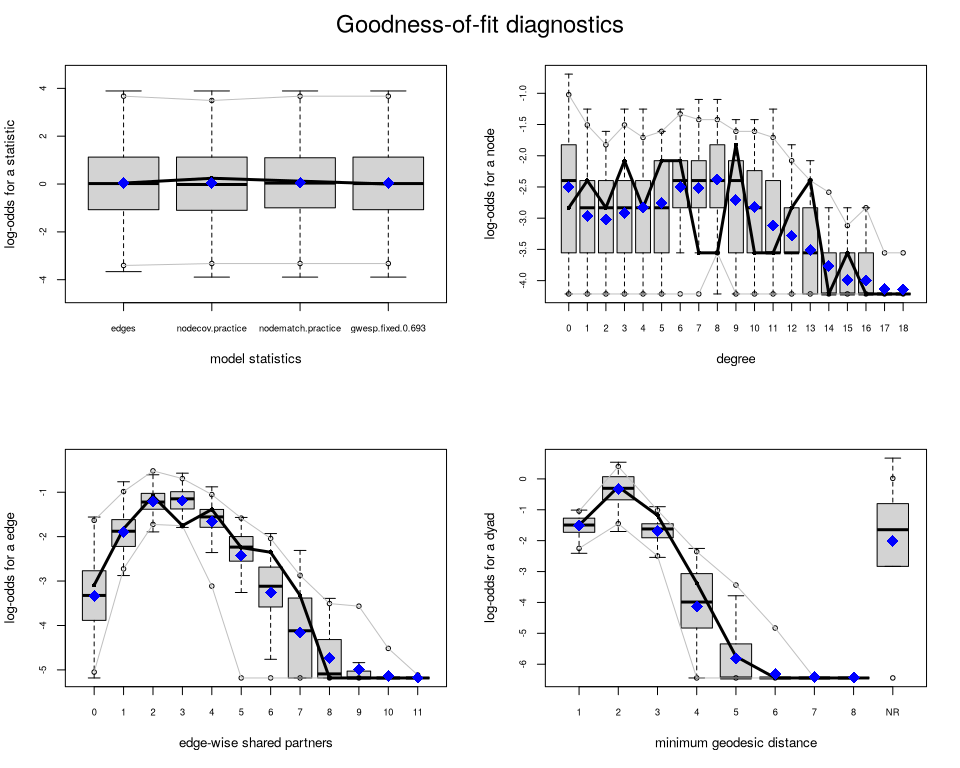

# Exponential Random Graph Models


[Source](https://schochastics.github.io/R4SNA/inferential/ergm.html)

``` r
options(paged.print = FALSE)
```

``` r
libraries <- list(
  "igraph", "ggraph","graphlayouts", "statnet",
  "networkdata", "intergraph", "tidyverse"
)
invisible(lapply(libraries, library, character.only = TRUE))
```

# ERGM Modeling Outline

ERGM models are designed to capture complex dependencies like
reciprocity or clustering by explicitly modeling how the presence of one
tie can affect the likelihood of others.

The core idea is as follows. ERGMs specify a probability distribution
over the set of all possible networks with a given number of nodes. The
probability of observing a particular graph $G$ is defined as:

$$P(G) = \frac{1}{\kappa} \exp\left( \sum_{k=1}^{K} \theta_k \cdot s_k(G) \right)$$

where

- $s_k(G)$ is a network statistic that counts a specific configuration
  (e.g., number of edges, mutual ties, triangles).
- $\theta_k$ is the parameter associated with statistic $s_k(G)$; it
  tells us how strongly that configuration influences tie formation.
- $\kappa$ is a normalizing constant ensuring that all possible graphs
  sum to a probability of 1:
  $$\kappa = \sum_{G'} \exp\left( \sum_{k=1}^{K} \theta_k \cdot s_k(G') \right)$$

This formulation makes clear that networks with more of the structures
positively weighted by $\theta_k$ are more probable. For instance, a
large positive $\theta_{\text{mutual}}$ implies that the observed
network contains more reciprocated ties than expected by chance.

In general, we interpret the parameters as follows:

- A positive $\theta_k$ means that the corresponding configuration
  (e.g., triangles) is overrepresented in the observed network relative
  to what is expected by chance.
- A negative $\theta_k$ indicates that the configuration is
  underrepresented relative to what is expected by chance.
- A value of $\theta_k = 0$ implies that the configuration occurs at
  chance levels.

The statistics $s_k$ are network configurations. As mentioned, ERGMs
rely on small, interpretable network configurations to explain
structure. These include:

- **Edges**: baseline tendency for tie formation (controls overall
  density)
- **Mutual**: reciprocity in directed networks
- **Triangles**: clustering or transitivity (friends of friends)
- **Stars**: centralization or popularity (many ties to a node)
- **Homophily**: ties between nodes with similar attributes

Each of these configurations reflects a hypothesized mechanism that may
drive the evolution of network structure. We formalize some of the
standard statistics in the following.

# Model Specification

## Dyadic Indepence: Edges and Homophily

The Bernoulli ERGM assumes all possible edges form independently of one
another. If $Y_{ij}$ is a binary random variable indicating the presence
or absence of a tie between nodes $i$ and $j$, and $G$ the graph
represented by the adjacency matrix $Y$. The probability of observing a
network $G$ would be

$$P(G) = \frac{1}{\kappa} \exp\left( \sum_{i<j} \theta_{ij} y_{ij} \right)$$

This model is impractical because of the number of estimations to be
made. Relying on the **homogeneity assumption** and assume
$\theta_{ij} = \theta \quad \text{for all } (i, j)$, the model becomes

$$P(G) = \frac{1}{\kappa} \exp(\theta \cdot L)$$

where $L$ is the total number of edges in the network and $\kappa$ is a
normalizing constant to ensure all probabilities sum to 1.

This structure implies that each potential tie forms independently with
the same probability, much like in a $G(n, p)$ random graph. Here, the
parameter $\theta$ governs the log-odds of a tie between any two nodes.
More formally, the relationship between $\theta$ and the tie probability
$p$ (i.e., the density of the network) is:

$$\theta = \log\left( \frac{p}{1 - p} \right) \quad \Leftrightarrow \quad p = \frac{e^\theta}{1 + e^\theta}$$

This means that:

- When $\theta = 0$, the expected density is $p = 0.5$
- When $\theta < 0$, the expected density is less than 0.5 (a sparse
  network)
- When $\theta > 0$, the expected density is greater than 0.5

So, the edge parameter directly controls the overall density of the
network. In practice, real-world social networks tend to be sparse, so
$\theta$ is typically negative. This relationship also means that if you
estimate a Bernoulli ERGM and obtain an edge coefficient $\hat{\theta}$,
you can compute the implied expected density using:

$$\hat{p} = \frac{e^{\hat{\theta}}}{1 + e^{\hat{\theta}}}$$

This makes the edge parameter easy to interpret: it is just the
logit-transformed density.

A parameter estimate is considered statistically significant if the
absolute value of the estimate is greater than approximately twice its
standard error.

### Example - Coleman Friendship

``` r
coleman_g <- coleman[[1]]
coleman_mat <- as_adjacency_matrix(coleman_g, sparse = F)
```

Fit Bernoulli ERGM with only the edge term

``` r
model_bern <- ergm(coleman_mat ~ edges)
summary(model_bern)
```

    Call:
    ergm(formula = coleman_mat ~ edges)

    Maximum Likelihood Results:

          Estimate Std. Error MCMC % z value Pr(>|z|)    
    edges -3.02673    0.06569      0  -46.08   <1e-04 ***
    ---
    Signif. codes:  0 '***' 0.001 '**' 0.01 '*' 0.05 '.' 0.1 ' ' 1

         Null Deviance: 7286  on 5256  degrees of freedom
     Residual Deviance: 1969  on 5255  degrees of freedom
     
    AIC: 1971  BIC: 1977  (Smaller is better. MC Std. Err. = 0)

The edge term is strongly negative, suggesting the probability of ties
are low, which is typical of real-world social networks.
$\hat{\theta}_{\text{edges}} = -3.02673$ reflects the log-odds of a tie
forming between any two nodes. To convert into an expected tie
probability, apply the inverse logit function

$$p = \frac{e^{\hat{\theta}}}{1 + e^{\hat{\theta}}}$$

``` r
exp(-3.02673) / (1 + exp(-3.02673))
```

    [1] 0.04623281

``` r
edge_density(coleman_g)
```

    [1] 0.04623288

To model homophily, let each node in the network have a categorical
attribute $v_i \in \{1, \dots, C\}$ which assigns each actor $i$ to one
of $C$ categories. The statistic that counts the number of ties between
actors who share the same attribute value is then

$$m_v(G) = \sum_{i<j} y_{ij} \cdot \mathbf{1}(v_i = v_j)$$

where $m_v(G)$ is the number of edges where both endpoints belong to the
same category. Adding the statistic to the model gives

$$P(G) = \frac{1}{\kappa} \exp\left( \theta_1 \cdot L + \theta_2 \cdot m_v(G) \right)$$

We interpret the homophily parameter as follows:

- $\theta_2 > 0$: Ties between similar nodes are more likely (homophily)
- $\theta_2 < 0$: Ties between dissimilar nodes are more likely
  (heterophily)
- $\theta_2 = 0$: No effect of similarity

### Example - Teenage Friends and Lifestyle Study

``` r
s50_g <- s50[[3]]

(s50_net <- asNetwork(s50_g))
```

     Network attributes:
      vertices = 50 
      directed = FALSE 
      hyper = FALSE 
      loops = FALSE 
      multiple = FALSE 
      bipartite = FALSE 
      total edges= 77 
        missing edges= 0 
        non-missing edges= 77 

     Vertex attribute names: 
        smoke vertex.names 

    No edge attributes

We now test whether students tend to form friendships with others who
have the same smoking behavior. The s50 dataset includes a categorical
node attribute called smoke, with three levels: non-smoker (1),
occasional smoker (2), and regular smoker (3). To test for smoking-based
homophily, we fit an ERGM that includes an edge term and a
nodematch(“smoke”) term.

``` r
model_smoke <- ergm(s50_net ~ edges + nodematch("smoke"))
```

    Starting maximum pseudolikelihood estimation (MPLE):

    Obtaining the responsible dyads.

    Evaluating the predictor and response matrix.

    Maximizing the pseudolikelihood.

    Finished MPLE.

    Evaluating log-likelihood at the estimate. 

``` r
summary(model_smoke)
```

    Call:
    ergm(formula = s50_net ~ edges + nodematch("smoke"))

    Maximum Likelihood Results:

                    Estimate Std. Error MCMC % z value Pr(>|z|)    
    edges            -3.0196     0.1902      0 -15.878   <1e-04 ***
    nodematch.smoke   0.5736     0.2425      0   2.365    0.018 *  
    ---
    Signif. codes:  0 '***' 0.001 '**' 0.01 '*' 0.05 '.' 0.1 ' ' 1

         Null Deviance: 1698.2  on 1225  degrees of freedom
     Residual Deviance:  569.4  on 1223  degrees of freedom
     
    AIC: 573.4  BIC: 583.6  (Smaller is better. MC Std. Err. = 0)

We interpret the output as follows. The edges term gives the baseline
log-odds of a tie between two students, regardless of smoking behavior.
The `nodematch("smoke")` term estimates the additional log-odds of a tie
when two students share the same smoking status. Since the coefficient
for `nodematch("smoke")` is positive and significant, we see that
students tend to form ties with peers who have similar smoking habits
(homophily).

## Dyadic Dependence: Reciprocity

**Dyadic dependence** is the statistical relationship between the
presence or absence of ties within pairs of nodes. This is particularly
important in directed graphs to capture reciprocity. This term counts
the number of mutually connected dyads where both $y_{ij} = 1$ and
$y_{ji}$. An ERGM with both edge and reciprocity is specified as:

$$P(G) = \frac{1}{\kappa} \exp\left(\theta_1 \cdot L + \theta_2 \cdot R\right)$$

where

- $L = \sum_{i \neq j} y_{ij}$ is the total number of directed ties
  (edges),
- $R = \sum_{i < j} y_{ij} \cdot y_{ji}$ is the number of reciprocated
  dyads.

A positive value for $\theta_2$ indicates a tendency toward
reciprocation, while a negative value suggests an avoidance of mutual
ties.

### Example - Coleman Friendship

``` r
model_rec <- ergm(coleman_mat ~ edges + mutual)
summary(model_rec)
```

    Call:
    ergm(formula = coleman_mat ~ edges + mutual)

    Monte Carlo Maximum Likelihood Results:

           Estimate Std. Error MCMC % z value Pr(>|z|)    
    edges  -3.71914    0.09791      0  -37.99   <1e-04 ***
    mutual  3.76506    0.23186      0   16.24   <1e-04 ***
    ---
    Signif. codes:  0 '***' 0.001 '**' 0.01 '*' 0.05 '.' 0.1 ' ' 1

         Null Deviance: 7286  on 5256  degrees of freedom
     Residual Deviance: 1719  on 5254  degrees of freedom
     
    AIC: 1723  BIC: 1736  (Smaller is better. MC Std. Err. = 1.662)

Ties are generally infrequent as indicated by the strong negative edges
coefficient, while reciprocated ties are more likely than expected by
chance.

## Markov Dependence: Triangles and Stars

**Markov dependence** assumes that the presence or abscence of ties
depend only on locally adjacent ties, specifically those that share a
node. ERGMs are specified using **edges**, **k-stars** amd
**triangles**.


In ERGM terms, a triangle statistic is defined as

$$T = \sum_{i < j < \ell} y_{ij} \cdot y_{i\ell} \cdot y_{j\ell}$$

The triangle term tests for **transitivity**. A positive coefficient
suggests a tendency toward forming coefficients, negative indicates
avoideance of closure.

In **directed networks**, we distinguish between:

- **Transitive triads**: if $i \to j$ and $j \to \ell$, then
  $i \to \ell$
- **Cyclic triads**: if $i \to j$, $j \to \ell$, and $\ell \to i$

**Star configurations** capture the tendency for nodes to have many
ties, i.e., to be “popular” or “active” in the network. A $k$-star is a
configuration where a single node is connected to $k$ others. The star
statistic of order $k$ is:

$$S_k = \sum_{i} \sum_{\substack{j_1 < \dots < j_k \\ j_m \neq i}} 
y_{i j_1} \cdot \dots \cdot y_{i j_k}$$

where all $j_1,\dots,j_k$ are distinct and different from $i$. Including
star terms allows the model to capture degree heterogeneity, reflecting
whether some individuals tend to form many more ties than others. Note
that in directed networks, we can specify:

- **Out-stars** (activity): a node sending many ties
- **In-stars** (popularity): a node receiving many ties

A positive parameter on star terms suggests that nodes with many
connections are more likely to gain additional ties, a form of
preferential attachment or “rich-get-richer” dynamics.

### Example - Florentine Business Network

``` r
flob_g <- flo_business

(flob_p <- ggraph(flob_g, layout = "stress") +
  geom_edge_link0(
    edge_color = "#666060",
    edge_width = 0.8,
    edge_alpha = 1
  ) +
  geom_node_point(
    fill = "#808080",
    color = "#808080",
    size = 7,
    shape = 21,
    stroke = 0.9
  ) +
  theme_graph() +
  theme(legend.position = "none") +
  ggtitle("Florentine business network"))
```



The ERGM includes

- `edges` to capture baseline tie propensity (density)
- `kstar(2)` and `kstar(3)` to model degree centralization
- `trangle` to capture transitivity (triadic closure)

``` r
flob_net <- flo_business %>% 
  asNetwork()
class(flob_net)
```

    [1] "network"

``` r
set.seed(1108)
model_markov <- ergm(
  flob_net ~ edges + kstar(2) + kstar(3) + triangle
)
```

    Starting maximum pseudolikelihood estimation (MPLE):

    Obtaining the responsible dyads.

    Evaluating the predictor and response matrix.

    Maximizing the pseudolikelihood.

    Finished MPLE.

    Starting Monte Carlo maximum likelihood estimation (MCMLE):

    Iteration 1 of at most 60:

    1 Optimizing with step length 1.0000.
    The log-likelihood improved by 2.4087.
    Estimating equations are not within tolerance region.
    Iteration 2 of at most 60:
    1 Optimizing with step length 1.0000.
    The log-likelihood improved by 1.1237.
    Estimating equations are not within tolerance region.
    Iteration 3 of at most 60:
    1 Optimizing with step length 1.0000.
    The log-likelihood improved by 0.3018.
    Estimating equations are not within tolerance region.
    Iteration 4 of at most 60:
    1 Optimizing with step length 1.0000.
    The log-likelihood improved by 0.1207.
    Estimating equations are not within tolerance region.
    Iteration 5 of at most 60:
    1 Optimizing with step length 1.0000.
    The log-likelihood improved by 0.0610.
    Convergence test p-value: 0.4417. Not converged with 99% confidence; increasing sample size.
    Iteration 6 of at most 60:
    1 Optimizing with step length 1.0000.
    The log-likelihood improved by 0.0160.
    Convergence test p-value: 0.0085. Converged with 99% confidence.
    Finished MCMLE.
    Evaluating log-likelihood at the estimate. Fitting the dyad-independent submodel...
    Bridging between the dyad-independent submodel and the full model...
    Setting up bridge sampling...
    Using 16 bridges: 1 2 3 4 5 6 7 8 9 10 11 12 13 14 15 16 .
    Bridging finished.

    This model was fit using MCMC.  To examine model diagnostics and check
    for degeneracy, use the mcmc.diagnostics() function.

``` r
summary(model_markov)
```

    Call:
    ergm(formula = flob_net ~ edges + kstar(2) + kstar(3) + triangle)

    Monte Carlo Maximum Likelihood Results:

             Estimate Std. Error MCMC % z value Pr(>|z|)    
    edges     -4.1930     1.1897      0  -3.524 0.000424 ***
    kstar2     1.0377     0.6613      0   1.569 0.116566    
    kstar3    -0.6378     0.4053      0  -1.574 0.115568    
    triangle   1.3268     0.6348      0   2.090 0.036605 *  
    ---
    Signif. codes:  0 '***' 0.001 '**' 0.01 '*' 0.05 '.' 0.1 ' ' 1

         Null Deviance: 166.36  on 120  degrees of freedom
     Residual Deviance:  79.02  on 116  degrees of freedom
     
    AIC: 87.02  BIC: 98.17  (Smaller is better. MC Std. Err. = 0.3806)

`edges` is significantly negeative, indicating relatively sparse ties
overal. `kstars` aren’t statistically significant. A strong tendency to
triadic closure is indicated.

The network’s structure reflects a preference for mutual interdependence
rather than hierarchical dominance.

While Markov random graph models offer a powerful way to represent local
dependence through structures like edges, stars, and triangles, they
come with a significant challenge: **model degeneracy**. Model
degeneracy occurs when an ERGM assigns overwhelming probability to a
small set of unrealistic graph configurations, such as the empty graph
(no ties) or the complete graph (every possible tie), even though the
observed network lies somewhere in between.

The degeneracy problem highlights a key limitation of Markov dependence:
*not all local dependence assumptions lead to coherent global models*.
Particularly when clustering is strong, models relying solely on Markov
terms (edges, stars, triangles) can become computationally fragile or
even mathematically incoherent.

## Social Circuit Dependence - GWESP

Extends Markov dependence by restricting it to occur only when two ties
would complete a **4-cycle**. Under social circuit dependence, network
ties are assumed to self-organize through 4-cycles, i.e., closed paths
involving four distinct nodes. Two potential ties are considered
conditionally dependent only if they would complete a 4-cycle in the
network. In other words, the existence of a tie between $(i,j)$ is only
dependent on a tie between $(l,m)$ if adding both would close such a
circuit.


The **Geometrically Weighted Edgewise Shared Partner (GWESP)** statistic
is a commonly used term in ERGMs to capture triadic closure, the
tendency for connected nodes to have shared partners. Unlike a simple
triangle count, GWESP down-weights the contribution of additional shared
partners to help prevent model degeneracy and improve stability.


To formalize this, we let:

- $y_{ij} = 1$ if there is a tie between nodes $i$ and $j$,
- $p_{ij}$ be the number of shared partners between nodes $i$ and $j$,
  i.e.,
  $$p_{ij} = \sum_{\ell \neq i,j} y_{i\ell} \cdot y_{j\ell},$$
- $\alpha$ be a decay parameter (usually a small positive number, e.g.,
  0.25).

Then the GWESP statistic is defined as:

$$\text{GWESP}(G; \alpha) = \sum_{i < j} y_{ij} \cdot \left(1 - (1 - e^{-\alpha})^{p_{ij}} \right)$$

- This formula sums over all existing ties in the graph.
- For each tie $(i, j)$, it calculates a weighted function of the number
  of their shared partners.
- The decay parameter $\alpha$ controls how quickly the contribution of
  additional shared partners diminishes.

When $\alpha$ is close to zero, the statistic approaches a simple count
of edges with at least one shared partner. When $\alpha$ is larger, the
contribution of each additional shared partner is increasingly
discounted.

A commonly used value for $\alpha$ is 0.693, which is approximately
$\log(2)$. This choice has a convenient and interpretable consequence:
With $\alpha = \log(2)$, each additional shared partner contributes
about half as much as the one before.

In some models, it may be beneficial to fix to a value based on theory
or prior experience (common in applied work), or estimate directly from
the data (fixed = FALSE in gwesp()), though this can lead to convergence
issues or overfitting. In practice, using gwesp(0.693, fixed = TRUE) is
often a safe and interpretable starting point.

### Example - Lawyers Network - Cowork Among Partners

We want to check whether or not the partners of the firm more frequently
work together with other partners having the same practice, whilst also
including a statistic related to triadic clustering.

This example includes the following statistics:

- `edges`: baseline tie probability,
- `nodecov("practice")`: effect of practice area on tie activity,
- `nodematch("practice")`: homophily within practice areas,
- `gwesp(0.693, fixed = TRUE)`: transitive closure (triadic clustering).

The `nodecov("...")` term in an ERGM includes a **node-level covariate**
effect, where the probability of forming a tie is modeled as a function
of the attribute value for each node. Specifically, for an undirected
network, it sums the attribute values of both nodes involved in each
dyad. A positive coefficient indicates that nodes with higher values on
the given attribute are more active in forming ties (i.e., they tend to
have higher degree). If you’re modeling a binary categorical attribute
(e.g., practice = 0 or 1), then the statistic tests whether being in
group 1 (e.g., corporate practice) increases a lawyer’s general tendency
to form ties, regardless of whom they connect with.

Symmetrize the matrix to create and undirected graph

``` r
law_mat_cwdir <- as_adjacency_matrix(law_cowork, sparse = F)
law_mat_cwdir <- law_mat_cwdir[1:36, 1:36]
law_mat_cw <- (
  law_mat_cwdir == t(law_mat_cwdir) & law_mat_cwdir == 1) + 0
```

save the binary attribute ‘practice’ (1 = litigation, 2 = corporate)
from the graph object as a vector

``` r
law_attr.pract <- vertex_attr(law_cowork)$pract[1:36] -1
```

Create a network object and add the binary node attribute ‘practice’:

``` r
law_net <- as.network(law_mat_cw, directed = F)
law_net %v% "practice" <- law_attr.pract
```

Fit ERGM with attribute and structural terms

``` r
set.seed(1984)
model_sc <- ergm(
  law_net ~
    edges +
    nodecov("practice") +
    nodematch("practice") +
    gwesp(0.693, fixed = TRUE)
)
summary(model_sc)
```

    Call:
    ergm(formula = law_net ~ edges + nodecov("practice") + nodematch("practice") + 
        gwesp(0.693, fixed = TRUE))

    Monte Carlo Maximum Likelihood Results:

                       Estimate Std. Error MCMC % z value Pr(>|z|)    
    edges              -4.39963    0.30348      0 -14.497  < 1e-04 ***
    nodecov.practice    0.18064    0.07316      0   2.469 0.013540 *  
    nodematch.practice  0.61014    0.17019      0   3.585 0.000337 ***
    gwesp.fixed.0.693   1.14628    0.15511      0   7.390  < 1e-04 ***
    ---
    Signif. codes:  0 '***' 0.001 '**' 0.01 '*' 0.05 '.' 0.1 ' ' 1

         Null Deviance: 873.4  on 630  degrees of freedom
     Residual Deviance: 502.9  on 626  degrees of freedom
     
    AIC: 510.9  BIC: 528.7  (Smaller is better. MC Std. Err. = 0.3377)

Let’s interpret the output: The fitted model includes four terms:
`edges`, `nodecov("practice")`, `nodematch("practice")`, and
`gwesp(0.693, fixed = TRUE)`. Each coefficient represents the log-odds
change in the probability of a tie associated with that network
statistic, controlling for the others. What do these estimates tell us?

- `edges` ($\hat\theta = -4.41$, *p* \< 0.001): Ties are rare overall;
  the network is sparse.
- `nodecov("practice")` ($\hat\theta = 0.18$, *p* \< 0.05): Lawyers from
  a given practice area (e.g., corporate) are slightly more likely to
  form ties overall.
- `nodematch("practice")` ($\hat\theta = 0.61$, *p* \< 0.001): Strong
  evidence of homophily, lawyers are significantly more likely to
  collaborate within their own practice area.
- `gwesp(0.693)` ($\hat\theta = 1.15$, *p* \< 0.001): High and
  significant triadic closure effect, indicating a strong tendency for
  collaboration among those with shared partners consistent with social
  circuit dependence.

Taken together, the results indicate that processes of attribute-related
activity, assortative mixing by attribute (homophily), and structural
closure (via triadic dependence) operate concurrently in shaping tie
formation within the Lazega co-working network.

# Model Estimation

Estimating the parameters of an Exponential Random Graph Model (ERGM)
involves finding the parameter vector $\boldsymbol{\theta}$ that
maximizes the likelihood of observing the network $G_{\text{obs}}$:

$$\hat{\boldsymbol{\theta}} = \arg\max_{\boldsymbol{\theta}} \, P(G_{\text{obs}} \mid \boldsymbol{\theta})$$

Under the ERGM specification, this likelihood is given by:

$$P(G_{\text{obs}} \mid \boldsymbol{\theta}) =
\frac{\exp\left( \boldsymbol{\theta}^\top \mathbf{s}(G_{\text{obs}}) \right)}{\kappa(\boldsymbol{\theta})}$$

Here, $\mathbf{s}(G) = (s_1(G), \dots, s_K(G))^\top$ is a vector of
network statistics (e.g., number of edges, mutual ties, triangles), and
$\kappa(\boldsymbol{\theta})$ is a normalizing constant that sums the
exponential terms over all possible networks with the same number of
nodes:

$$\kappa(\boldsymbol{\theta}) = \sum_{G'} \exp\left( \boldsymbol{\theta}^\top \mathbf{s}(G') \right)$$

This computation is analytically intractable for all but the smallest
networks due to the exponential number of possible configurations.

Instead use **Markov Chain Monte Carlo Maximum Likelihood Estimation
(MCMCMLE)**. Simulates many networks, updating the parameter estimates
so they converge to the observed ones. The process is

1.  \*\*Initial Parameter Estimation (MPLE) - Estimate $\theta$ with
    maximum pseudo-likelihood estimate.
2.  Simulate networks with MCMC methods
3.  Simulated networks used to approximate log-likelihood gradient,
    which is used to update $\theta$
4.  Reiterate 2 and 3 to minimize the difference between observed and
    expected statistics until convergence

Because ERGMs rely on MCMC simulation to estimate model parameters, it
is important to check whether the estimation process has properly
converged. MCMC diagnostics help assess whether the Markov chain has
explored the space of possible networks sufficiently and whether the
simulated networks reflect a stable distribution. Poor convergence can
lead to unreliable parameter estimates and misleading inferences. Key
diagnostics include

- trace plots (to check stability of simulated statistics over time)
- autocorrelation plots (to assess dependence between samples)
- and comparisons between observed and simulated statistics.

## Instability and degeneracy

Can give unrealistic results with extreme graphs or multi-modal prob
distributions.

Signs include:

- Simulated networks that are always empty or complete, regardless of
  the observed data.
- Poor convergence of MCMC chains, or failure to reach a stable
  equilibrium (stationary distribution).
- Large gaps between observed and simulated statistics, especially for
  higher-order configurations like triangles.

Problems occur when

- Burn-in period too short
- Post-burn-in sampling too sparse
- The model includes strong dependence terms without sufficient
  balancing components

After fitting an ERGM, use `mcmc.diagnostics()` to evaluate whether the
MCMC estimation has converged and whether the Markov chain has mixed
well.

### Example - Lawyers Network - Cowork among partners

``` r
mcmc.diagnostics(model_sc, which = "plots")
```


    Note: MCMC diagnostics shown here are from the last round of
      simulation, prior to computation of final parameter estimates.
      Because the final estimates are refinements of those used for this
      simulation run, these diagnostics may understate model performance.
      To directly assess the performance of the final model on in-model
      statistics, please use the GOF command: gof(ergmFitObject,
      GOF=~model).

<div id="fig-mcmc">



Figure 1: MCMC trace and density plots for ERGM parameter estimates. The
trace plots (left) show the sampled values of the score function across
iterations for each model term. Good mixing is indicated by irregular,
stationary fluctuations around zero. The density plots (right) display
the distribution of these values; approximately symmetric and centered
curves suggest that the MCMC sampler has reached a stable equilibrium
and is drawing from the target distribution.

</div>

``` r
mcmc.diagnostics(model_sc, which = "texts")
```

    Sample statistics summary:

    Iterations = 104448:2048000
    Thinning interval = 2048 
    Number of chains = 1 
    Sample size per chain = 950 

    1. Empirical mean and standard deviation for each variable,
       plus standard error of the mean:

                         Mean    SD Naive SE Time-series SE
    edges              0.8368 29.32   0.9511          2.310
    nodecov.practice   0.8874 27.64   0.8969          1.858
    nodematch.practice 0.3200 17.86   0.5796          1.349
    gwesp.fixed.0.693  1.6550 57.24   1.8572          4.313

    2. Quantiles for each variable:

                          2.5%    25%   50%   75% 97.5%
    edges               -65.28 -17.00 3.000 21.00 50.00
    nodecov.practice    -69.00 -12.00 4.500 20.00 43.00
    nodematch.practice  -40.00 -10.00 1.000 12.00 31.00
    gwesp.fixed.0.693  -125.60 -33.88 5.445 41.15 99.37


    Are sample statistics significantly different from observed?
                   edges nodecov.practice nodematch.practice gwesp.fixed.0.693
    diff.      0.8368421        0.8873684          0.3200000         1.6550360
    test stat. 0.3622294        0.4776634          0.2371778         0.3837468
    P-val.     0.7171806        0.6328898          0.8125189         0.7011661
                  (Omni)
    diff.             NA
    test stat. 0.9848859
    P-val.     0.9128774

    Sample statistics cross-correlations:
                           edges nodecov.practice nodematch.practice
    edges              1.0000000        0.8614529          0.9437226
    nodecov.practice   0.8614529        1.0000000          0.8214615
    nodematch.practice 0.9437226        0.8214615          1.0000000
    gwesp.fixed.0.693  0.9932599        0.8685039          0.9407069
                       gwesp.fixed.0.693
    edges                      0.9932599
    nodecov.practice           0.8685039
    nodematch.practice         0.9407069
    gwesp.fixed.0.693          1.0000000

    Sample statistics auto-correlation:
    Chain 1 
                  edges nodecov.practice nodematch.practice gwesp.fixed.0.693
    Lag 0     1.0000000        1.0000000          1.0000000         1.0000000
    Lag 2048  0.7098675        0.5864363          0.6463953         0.6868744
    Lag 4096  0.5001225        0.3798866          0.4613107         0.4798948
    Lag 6144  0.3538890        0.2663781          0.3419302         0.3430250
    Lag 8192  0.2397655        0.1781826          0.2224020         0.2319087
    Lag 10240 0.1487008        0.1136008          0.1463211         0.1394070

    Sample statistics burn-in diagnostic (Geweke):
    Chain 1 

    Fraction in 1st window = 0.1
    Fraction in 2nd window = 0.5 

                 edges   nodecov.practice nodematch.practice  gwesp.fixed.0.693 
              1.467780           1.942210           1.948669           1.519405 

    Individual P-values (lower = worse):
                 edges   nodecov.practice nodematch.practice  gwesp.fixed.0.693 
            0.14216408         0.05211174         0.05133494         0.12866052 
    Joint P-value (lower = worse):  0.4220978 

    Note: MCMC diagnostics shown here are from the last round of
      simulation, prior to computation of final parameter estimates.
      Because the final estimates are refinements of those used for this
      simulation run, these diagnostics may understate model performance.
      To directly assess the performance of the final model on in-model
      statistics, please use the GOF command: gof(ergmFitObject,
      GOF=~model).

## Model Fit

While MCMC diagnostics ensure that parameter estimates are stable and
reliable, they do not tell us whether the model is substantively
adequate, that is, whether it captures the essential structure of the
network. For this, we turn to **goodness-of-fit (GOF)** diagnostics.

Did the model reproduce the terms in the formula, and did it reproduce
broader structural properties of the network?

### Example: Lawyers Network - Cowork Among Partners

Without `plotlogodds` the y axis shows proportions.

``` r
gof_sc <- gof(model_sc)
par(mfrow = c(2,2))
plot(gof_sc, plotlogodds = T)
```



In the GOF plots generated by the ergm package, the meaning of the black
line and blue diamond differs slightly depending on the panel:

- Model statistics plot:
  - Blue diamond: The observed value of each modeled statistic in the
    empirical network.
  - Black line: The mean value of that statistic across the simulated
    networks.
- Other GOF plots (e.g., degree, geodesic distance, ESP):
  - Black line: The observed distribution of the statistic (e.g., degree
    counts) in the empirical network.
  - Blue diamonds: The mean of the simulated distributions at each value
    or bin.

Good model fit is indicated when the black line lies within the range of
the simulated distributions (shown as boxplots or shaded areas), and
aligns closely with the blue diamonds.

``` r
gof_sc
```


    Goodness-of-fit for degree 

             obs min mean max MC p-value
    degree0    2   0 3.57  12       0.78
    degree1    3   0 2.21   8       0.74
    degree2    2   0 1.95   6       1.00
    degree3    4   0 2.22   8       0.32
    degree4    2   0 2.39   8       1.00
    degree5    4   0 2.58   6       0.56
    degree6    4   0 3.25   8       0.84
    degree7    1   0 3.17   9       0.36
    degree8    1   0 3.44   9       0.22
    degree9    5   0 2.65   7       0.18
    degree10   1   0 2.44   7       0.64
    degree11   1   0 1.85   8       1.00
    degree12   2   0 1.50   5       0.86
    degree13   3   0 1.07   4       0.18
    degree14   0   0 0.67   3       1.00
    degree15   1   0 0.34   3       0.60
    degree16   0   0 0.33   2       1.00
    degree17   0   0 0.11   2       1.00
    degree18   0   0 0.11   2       1.00
    degree19   0   0 0.07   1       1.00
    degree20   0   0 0.04   1       1.00
    degree21   0   0 0.03   1       1.00
    degree22   0   0 0.01   1       1.00

    Goodness-of-fit for edgewise shared partner 

          obs min  mean max MC p-value
    esp0    5   0  4.52  17       0.92
    esp1   16   6 15.11  31       0.90
    esp2   29  10 26.60  42       0.82
    esp3   17   6 27.87  51       0.30
    esp4   23   1 20.30  49       0.76
    esp5   11   0 11.49  29       0.98
    esp6   10   0  5.76  20       0.30
    esp7    4   0  2.51  13       0.64
    esp8    0   0  0.95   4       0.96
    esp9    0   0  0.46   4       1.00
    esp10   0   0  0.14   4       1.00
    esp11   0   0  0.04   1       1.00
    esp12   0   0  0.02   1       1.00

    Goodness-of-fit for minimum geodesic distance 

        obs min   mean max MC p-value
    1   115  46 115.77 168       1.00
    2   275  72 267.29 398       0.94
    3   148  39 101.99 182       0.22
    4    21   0  17.59  60       0.68
    5     2   0   3.25  44       0.62
    6     0   0   0.72  30       1.00
    7     0   0   0.21  14       1.00
    8     0   0   0.04   4       1.00
    Inf  69   0 123.14 417       0.78

    Goodness-of-fit for model statistics 

                            obs      min     mean      max MC p-value
    edges              115.0000 46.00000 115.7700 168.0000       1.00
    nodecov.practice   129.0000 53.00000 131.2900 184.0000       0.90
    nodematch.practice  72.0000 26.00000  73.1000 112.0000       0.96
    gwesp.fixed.0.693  181.2969 48.49753 183.6225 294.6455       1.00

All statistics at all levels show high p-values, indicating the model
performs well. Since the model has also passed MCMC convergence
diagnostics, we can conclude that the ERGM is both well-estimated and
substantively valid in representing the network-generating processes in
the Lazega law firm.
