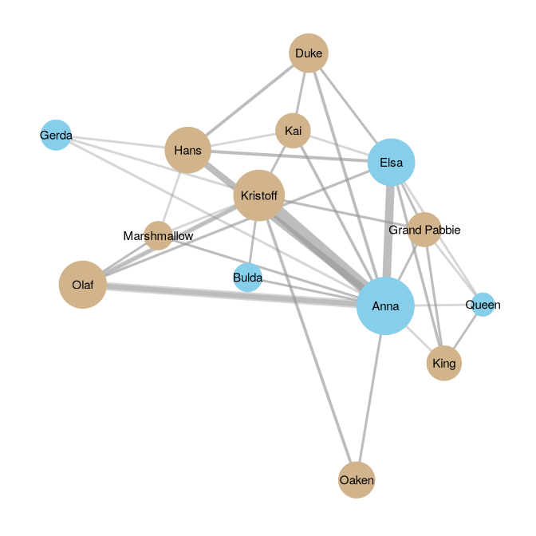
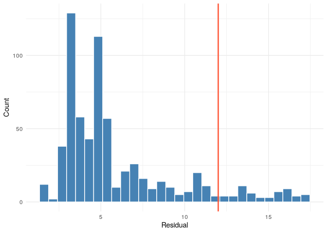

# Relational Event Models (REMs)


[Source](https://schochastics.github.io/R4SNA/inferential/saom.html)

``` r
options(paged.print = FALSE)
```

``` r
libraries <- list(
  "relevent", "ggraph","tidygraph", "tidyverse", "zeallot"
)
invisible(lapply(libraries, library, character.only = TRUE))
```

# REMs in R

REMs focus on the sequential development of ties based on actors’
choices. How likely will actor $i$ direct an event to actor $j$?

Relational Event Models pursue two central analytic objectives:

1.  **Prediction**: Accurately predict who will send a message to whom,
    given the prior sequence of events.
2.  **Explanation**: Identify the factors that influence the propensity
    for interaction between two actors.

These factors may include:

- **Node attributes** (e.g., status, role, demographic characteristics)
- **Dyadic attributes** (e.g., similarity, shared group membership)
- **Historical patterns of communication** (e.g., reciprocity,
  repetition, transitive closure)
- **Environmental or contextual factors** (e.g., time constraints,
  institutional settings)

# Model Specification

Edges are ordered. REM is a variation of the Cox proportional hazard
model. Rather than modeling the exact timing of events, we instead model
the relative rate (or intensity) at which a particular interaction
occurs next, given the prior history of events.

## Specification

Let $\lambda_{ij}(t)$ denote the intensity of an event from actor $i$ to
actor $j$ at time $t$, given the history of past events $H_t$. The model
is specified as

$$\lambda_{ij}(t \mid H_t) = \lambda_0(t)\exp(\theta^\top s_{ij}(t))$$

where:

- $\lambda_{ij}(t)$ is the **event intensity** for interaction
  $i \rightarrow j$ at time $t$,
- $\lambda_0(t)$ is the **baseline rate** of events,
- $s_{ij}(t)$ is a vector of **statistics** describing the event (e.g.,
  actor attributes, dyadic covariates, or history-based structural
  effects),
- $\theta$ is a vector of **model parameters**.

The statistics $s_{ij}(t)$ are typically functions of the event history,
meaning they evolve as new interactions occur.

When only the *order* of events is observed (rather than exact
timestamps), inference can proceed using the partial likelihood, which
compares the intensity of the observed event with the intensities of all
other possible events in the risk set $R_t$. The probability that a
specific event $i \rightarrow j$ occurs next is therefore

$$P(i \rightarrow j \text{ occurs next}) =
\frac{\exp(\theta^\top s_{ij}(t))}
{\sum_{(p,q)\in R_t}\exp(\theta^\top s_{pq}(t))}$$

where $R_t$ denotes the set of all interactions that could occur at time
$t$.

This formulation shows that relational event models explain which
interaction occurs next by comparing the relative intensities of all
competing events in the risk set.

## REM Data Structure

Each observation includes a `sender`, `receiver`, and `time`. `time` is
a unique, ordered integer.

# Modeling Procedure

These steps transform the sequence of observed interactions into a
dataset that can be estimated using a Cox-type likelihood.

### Construct risk sets

At each point in the event sequence, one interaction is observed, but
many other interactions were possible and did not occur. All dyads that
could potentially interact at that moment form the risk set. For each
observed interaction, we identify all dyads that were eligible to
interact at that time. We then augment the dataset by adding all
unobserved but possible events corresponding to that risk set. This
transforms the event history into a series of choice sets consisting of
one observed event and multiple non-events at each step in the sequence.

### Compute event statistics

For both observed and unobserved events, we compute a set of statistics
that capture factors influencing the likelihood of interaction. These
statistics serve as explanatory variables in the relational event model.

The statistics can capture several types of mechanisms, including:

- **Endogenous structural effects**, derived from the history of
  previous interactions,
- **Node-level attributes**, describing characteristics of the actors
  involved,
- **Dyadic covariates**, capturing properties of the sender–receiver
  pair,
- **Contextual variables**, describing features of the environment in
  which interactions occur.

All statistics are evaluated *dynamically*, meaning they are
recalculated at each event step to reflect the evolving interaction
history.

### Estimate the model

Event occurrence is treated as the dependent variable, while the
computed statistics serve as explanatory variables. Estimation relies on
the partial likelihood, which compares the intensity of the observed
event with the intensities of all other possible events within the same
risk set.

## Endogenous statistics

Can capture patterns that arise from the history of interactions. These
statistics represent mechanisms through which past events influence the
likelihood of future events.

Assume we have $n$ actors indexed by $i,j \in \{1,\dots,n\}$ with
$i \neq j$. A potential relational event at time $t$ is an ordered pair
$(i,j)$, where actor $i$ is the sender and actor $j$ is the receiver.

Let $Y_{ij}(t) \in \{0,1\}$ be an indicator such that $Y_{ij}(t)=1$ if
the event $i \rightarrow j$ occurs at time $t$, and $0$ otherwise.
Further, let

$$N_{ij}(t) = \sum_{\tau \le t} Y_{ij}(\tau)$$

denote the cumulative number of events from actor $i$ to actor $j$ up to
time $t$. All statistics below are evaluated based on the event history
up to time $t-1$.

<div id="tbl-endstats">

Table 1: Summary of some endogenous statistics used in relational event
models.

| Statistic | Description | Formula |
|----|----|----|
| Reciprocity | Immediate response to previous interaction | $Y_{ij}(t-1)Y_{ji}(t)$ |
| Repetition | Same sender repeats interaction | $Y_{ij}(t-1)Y_{ij}(t)$ |
| Past interaction | Proportion of sender’s past interactions directed toward receiver | $\frac{N_{ij}(t-1)}{\sum_k N_{ik}(t-1)+\sum_k N_{ki}(t-1)}$ |
| Sender activity | Proportion of past events sent by the sender | $\frac{\sum_k N_{ik}(t-1)}{\sum_{p\ne q}N_{pq}(t-1)}$ |
| Sender popularity | Proportion of past events received by the sender | $\frac{\sum_k N_{ki}(t-1)}{\sum_{p\ne q}N_{pq}(t-1)}$ |
| Receiver activity | Proportion of past events sent by the receiver | $\frac{\sum_k N_{jk}(t-1)}{\sum_{p\ne q}N_{pq}(t-1)}$ |
| Receiver popularity | Proportion of past events received by the receiver | $\frac{\sum_k N_{kj}(t-1)}{\sum_{p\ne q}N_{pq}(t-1)}$ |

</div>

## Exogenous covariates

These variables capture attributes of actors or dyads that may influence
the likelihood of interactions but are not themselves determined by the
evolving sequence of events.

Exogenous covariates may include **actor-level attributes** (e.g.,
demographic characteristics, roles, or status), **dyadic attributes**
(e.g., similarity or shared group membership), or other contextual
variables describing the environment in which interactions occur.

Using this attribute, several covariates can be constructed for a
potential event $i \rightarrow j$. For example:

- **Sender attribute**: indicates whether the sender possesses the
  attribute  
- **Receiver attribute**: indicates whether the receiver possesses the
  attribute  
- **Sender–receiver interaction**: indicates whether both sender and
  receiver possess the attribute  

# REMs in R

``` r
names(frozenlines)[4:ncol(frozenlines)] <- frozenchars$characterID
receiver_cols <- 4:ncol(frozenlines)

edges <- list()
k <- 1

for (i in 1:nrow(frozenlines)) {
  sender <- frozenlines$speakerID[i]
  event <- frozenlines$eventID[i]

  # find receivers with value 1
  receivers <- receiver_cols[frozenlines[i, receiver_cols] == 1]

  if (length(receivers) > 0) {
    for (r in receivers) {
      edges[[k]] <- data.frame(
        time = event,
        sender = sender,
        receiver = as.integer(names(frozenlines)[r])
      )
      k <- k + 1
    }
  }
}
```

``` r
# Combine all edges
edgelist <- do.call(rbind, edges)

# Sort by event order
edgelist <- edgelist[order(edgelist$time), ]

# make sure each event is unique (this can be a manual fix from networkdata)
edgelist <- edgelist[order(edgelist$time), ]
edgelist$time <- 1:nrow(edgelist)

edgelist <- as.matrix(edgelist)
# ---- Network size ----
n_actors <- nrow(frozenchars)
```

``` r
head(edgelist, 10)
```

       time sender receiver
    1     1      1        2
    2     2      1        2
    3     3      2        1
    4     4      1        2
    5     5      2        1
    6     6      1        2
    7     7      1        2
    8     8      1        2
    9     9      1        2
    10   10      2        1

``` r
# Aggregate interactions
agg_edges <- as.data.frame(table(edgelist[, 2], edgelist[, 3]))
colnames(agg_edges) <- c("sender", "receiver", "weight")

agg_edges <- agg_edges %>% 
  filter(weight > 0)

# Node data
nodes <- frozenchars |>
  arrange(characterID) |>
  mutate(
    gender = ifelse(charfem == 1, "Female", "Male")
  )

# Build graph
g <- tbl_graph(
  nodes = nodes,
  edges = agg_edges,
  directed = TRUE
)


ggraph(g, layout = "stress") +
  geom_edge_link(
    aes(width = weight),
    alpha = 0.4,
    color = "grey60",
    show.legend = FALSE
  ) +
  geom_node_point(
    aes(size = nlines, color = gender)
  ) +
  geom_node_text(
    aes(label = character.name),
    repel = F,
    size = 4
  ) +
  scale_color_manual(
    values = c("Female" = "skyblue", "Male" = "tan")
  ) +
  scale_size(
    range = c(10, 25),
    transform = "sqrt"
  ) +
  guides(
    color = "none",
    size = "none"
  ) +
  theme_graph()
```

<div id="fig-frozen">



Figure 1: Aggregated dialogue network of Frozen characters. Node color
indicates gender, node size reflects the number of dialogue lines
spoken, and edge width reflects interaction frequency.

</div>

## Model 1 - Reciprocity and Repetition

These effects capture two basic conversational dynamics: turn-taking
behavior and the persistence of interactions between the same pair of
characters. Including these mechanisms allows the model to account for
simple structural patterns in the dialogue sequence before introducing
additional explanatory variables, such as actor attributes or contextual
factors, in later models.

Formally, the event intensity for a potential interaction
$i \rightarrow j$ at time $t$ is given by

$$\lambda_{ij}(t \mid H_t) =
\lambda_0(t)e^\left(
\theta_1\,\text{Reciprocity}_{ij}(t) +
\theta_2\,\text{Repetition}_{ij}(t)
\right)$$

where $\lambda_{ij}(t \mid H_t)$ denotes the rate at which actor $i$
directs an interaction to actor $j$ at time $t$, given the event history
$H_t$. The statistics capture the following mechanisms:

- $\text{Reciprocity}_{ij}(t)$ indicates whether the previous
  interaction was $j \rightarrow i$.
- $\text{Repetition}_{ij}(t)$ indicates whether the previous interaction
  was $i \rightarrow j$.

Reciprocity is `RRecSnd`, repetition is `RSndSnd`. Because the dialogue
data record only the order of interactions rather than precise
timestamps, the model is estimated with `ordinal = TRUE`. In this
setting, the relational event model compares the intensity of the
observed interaction to the intensities of all other possible
interactions in the risk set, which consists of all possible
sender–receiver pairs at that moment. The argument `hessian = TRUE`
instructs the model to compute the Hessian matrix, allowing standard
errors and statistical tests to be obtained.

``` r
model1 <- rem.dyad(
  edgelist = edgelist,
  n = n_actors,
  effects = c("RRecSnd", "RSndSnd"),
  ordinal = TRUE,
  hessian = TRUE
)
```

    Prepping edgelist.
    Checking/prepping covariates.
    Computing preliminary statistics
    Fitting model
    Obtaining goodness-of-fit statistics

``` r
summary(model1)
```

    Relational Event Model (Ordinal Likelihood)

            Estimate Std.Err Z value  Pr(>|z|)    
    RRecSnd  3.57036 0.14991  23.816 < 2.2e-16 ***
    RSndSnd  2.24439 0.13296  16.881 < 2.2e-16 ***
    ---
    Signif. codes:  0 '***' 0.001 '**' 0.01 '*' 0.05 '.' 0.1 ' ' 1
    Null deviance: 6879.697 on 661 degrees of freedom
    Residual deviance: 3995.745 on 659 degrees of freedom
        Chi-square: 2883.952 on 2 degrees of freedom, asymptotic p-value 0 
    AIC: 3999.745 AICC: 3999.763 BIC: 4008.732 

### Interpretation

Both endogenous effects are positive and highly statistically
significant. The reciprocity coefficient indicates a strong tendency for
characters to respond to those who have just spoken. A reciprocating
interaction is $e^{3.57} \approx 35.6$ times more likely for this to
occur in the abscence of this dynamic. The repetition coefficient
suggests it is $e{2.24} \approx 9.4$ more likely than otherwise. Once a
conversational exchange begins, it often persists for multiple lines.

## Model 2 - Gender as exogenous covariate

The gender information is taken from the character data, where the
variable charfem indicates whether a character is female (1) or not (0).
The gender indicator is first constructed as an actor-level covariate
aligned with the character IDs.

``` r
female <- matrix(
  frozenchars$charfem[order(frozenchars$characterID)],
  ncol = 1
)
```

Formally, the event intensity for a potential interaction
$i \rightarrow j$ at time $t$ is given by

$$\begin{split}
\lambda_{ij}(t \mid H_t)  & =
\lambda_0(t)\exp\Big(
\theta_1\,\text{Reciprocity}_{ij}(t) +
\theta_2\,\text{Repetition}_{ij}(t)   \\ & \qquad \qquad \qquad 
+\theta_3\,\text{SenderFemale}_{ij} \\ & \qquad \qquad \qquad
+ \theta_4\,\text{ReceiverFemale}_{ij}
\Big)
\end{split}$$

where:

- $\text{Reciprocity}_{ij}(t)$ indicates whether the previous
  interaction was $j \rightarrow i$,
- $\text{Repetition}_{ij}(t)$ indicates whether the previous interaction
  was $i \rightarrow j$,
- $\text{SenderFemale}_{ij}$ equals 1 if the sender $i$ is female,
- $\text{ReceiverFemale}_{ij}$ equals 1 if the receiver $j$ is female.

The parameters $\theta_3$ and $\theta_4$ therefore capture whether
female characters are more or less likely to initiate dialogue or be
addressed by others, respectively.

`CovSnd` tests whether female characters are more likely to initiate
interactions, `CovRec` indicates if females receive more interactions.

``` r
model2 <- rem.dyad(
  edgelist = edgelist, n = n_actors,
  effects = c("RRecSnd", "RSndSnd", "CovSnd", "CovRec"),
  covar = list(
    CovSnd = female,
    CovRec = female
  ),
  ordinal = T, hessian = T
)
```

    Prepping edgelist.
    Checking/prepping covariates.
    Computing preliminary statistics
    Fitting model
    Obtaining goodness-of-fit statistics

``` r
summary(model2)
```

    Relational Event Model (Ordinal Likelihood)

             Estimate  Std.Err Z value Pr(>|z|)    
    RRecSnd  3.669317 0.149300 24.5768   <2e-16 ***
    RSndSnd  2.171290 0.132459 16.3922   <2e-16 ***
    CovSnd.1 0.797348 0.082131  9.7083   <2e-16 ***
    CovRec.1 0.106776 0.085729  1.2455   0.2129    
    ---
    Signif. codes:  0 '***' 0.001 '**' 0.01 '*' 0.05 '.' 0.1 ' ' 1
    Null deviance: 6879.697 on 661 degrees of freedom
    Residual deviance: 3902.631 on 657 degrees of freedom
        Chi-square: 2977.066 on 4 degrees of freedom, asymptotic p-value 0 
    AIC: 3910.631 AICC: 3910.692 BIC: 3928.606 

The endogenous variables are similar to above. `CovSnd` implies that
female characters initiate conversation at a rate
$e^{.080} \approx 2.22$ times higher than male characters. The receiver
coefficient is not significant, there is no strong evidence that female
characters are more likely to be addressed.

## Model 3 - Gender interaction

Do interactions between females occur at an unexpected rate?

Formally, the event intensity for a potential interaction
$i \rightarrow j$ at time $t$ is given by

$$\begin{split}
\lambda_{ij}(t \mid H_t) & =
\lambda_0(t)\exp\Big(
\theta_1\,\text{Reciprocity}_{ij}(t) +
\theta_2\,\text{Repetition}_{ij}(t)  \\ & \qquad \qquad \qquad 
+ \theta_3\,\text{SenderFemale}_{ij} +
\theta_4\,\text{ReceiverFemale}_{ij} \\ & \qquad \qquad \qquad
+ \theta_5\,\text{FemaleInteraction}_{ij}
\Big)
\end{split}$$

where

- $\text{Reciprocity}_{ij}(t)$ indicates whether the previous
  interaction was $j \rightarrow i$,
- $\text{Repetition}_{ij}(t)$ indicates whether the previous interaction
  was $i \rightarrow j$,
- $\text{SenderFemale}_{ij}$ equals 1 if the sender $i$ is female,
- $\text{ReceiverFemale}_{ij}$ equals 1 if the receiver $j$ is female,
- $\text{FemaleInteraction}_{ij}$ equals 1 if both the sender and
  receiver are female.

The interaction effect therefore captures whether conversations between
female characters occur more or less frequently than would be expected
based solely on sender and receiver gender effects.

The interaction effect (CovInt) captures whether interactions between
female characters occur at a higher or lower rate than would be expected
from these individual effects.

Importantly, these effects are estimated while controlling for the
conversational dynamics captured by reciprocity and repetition. This
allows us to examine whether gender-based interaction patterns persist
once basic conversational mechanisms are taken into account.

``` r
model3 <- rem.dyad(
  edgelist = edgelist, n = n_actors,
  effects = c("RRecSnd", "RSndSnd", "CovSnd", "CovRec", "CovInt"),
  covar = list(
    CovSnd = female,
    CovRec = female,
    CovInt = female
  ),
  ordinal = TRUE, hessian = TRUE
)
```

    Prepping edgelist.
    Checking/prepping covariates.
    Computing preliminary statistics
    Fitting model
    Obtaining goodness-of-fit statistics

``` r
summary(model3)
```

    Relational Event Model (Ordinal Likelihood)

             Estimate  Std.Err Z value Pr(>|z|)    
    RRecSnd   3.66899  0.14930 24.5738   <2e-16 ***
    RSndSnd   2.17218  0.13247 16.3972   <2e-16 ***
    CovSnd.1  0.49623 51.25309  0.0097   0.9923    
    CovRec.1 -0.19459 51.25309 -0.0038   0.9970    
    CovInt.1  0.30076 51.25307  0.0059   0.9953    
    ---
    Signif. codes:  0 '***' 0.001 '**' 0.01 '*' 0.05 '.' 0.1 ' ' 1
    Null deviance: 6879.697 on 661 degrees of freedom
    Residual deviance: 3902.631 on 656 degrees of freedom
        Chi-square: 2977.066 on 5 degrees of freedom, asymptotic p-value 0 
    AIC: 3912.631 AICC: 3912.723 BIC: 3935.1 

Substantively, this suggests that once the interaction effect between
sender and receiver gender is introduced, the model is unable to
distinguish clear gender-based patterns in the dialogue sequence. In
contrast to Model 2, where female characters appeared more likely to
initiate dialogue, the additional interaction term absorbs much of the
variation associated with gender and results in unstable estimates for
the gender effects.

Taken together, these results reinforce the conclusion that the primary
structure of the dialogue network is driven by conversational dynamics
(specifically reciprocity and repetition) while gender-based interaction
patterns are not strongly identified once interaction effects are
included in the model.

## Goodness of Fit

### Actual vs Predicted

``` r
head(model3$predicted.match)
```

      sender receiver
    1   TRUE     TRUE
    2  FALSE    FALSE
    3   TRUE     TRUE
    4   TRUE     TRUE
    5  FALSE    FALSE
    6   TRUE     TRUE

``` r
(match_table <- table(
  model3$predicted.match[, "sender"],
  model3$predicted.match[, "receiver"]
))
```

           
            FALSE TRUE
      FALSE   370  135
      TRUE     13  143

``` r
prop.table(match_table)
```

           
                 FALSE       TRUE
      FALSE 0.55975794 0.20423601
      TRUE  0.01966717 0.21633888

These results show that the model exactly predicts both the sender and
receiver in roughly 22% of the dialogue events, while in approximately
56% of cases it fails to predict either component correctly. In the
remaining events, the model correctly identifies either the sender or
the receiver but not both.

### Residual Diagnostics

``` r
(res <- summary(model3$residuals))
```

       Min. 1st Qu.  Median    Mean 3rd Qu.    Max. 
      1.678   3.320   4.646   5.904   6.944  17.265 

While many events will typically have residuals close to zero, larger
values may indicate interactions that the model has difficulty
explaining. To identify potential outliers, we can locate events with
particularly large residuals. For illustration, we define outlying cases
as those with residuals greater than 12
$(\approx  Q_3 + 1.5 \times IQR)$.

``` r
as.numeric(res[5]) + 1.5 * IQR(model3$residuals)
```

    [1] 12.38093

``` r
high_resids <- which(model3$residuals > 12)
```

``` r
res_df <- data.frame(residual = model3$residuals)

ggplot(res_df, aes(x = residual)) +
  geom_histogram(bins = 30, fill = "steelblue", color = "white") +
  geom_vline(xintercept = 12, color = "tomato", linewidth = 1) +
  labs(
    x = "Residual",
    y = "Count"
  ) +
  theme_minimal()
```

<div id="fig-rem-residuals">



Figure 2: Distribution of residuals from Model 3 of the relational event
model. The red vertical line indicates the threshold (residual = 12)
used to identify unusually poorly predicted interaction events.

</div>

``` r
edgelist[high_resids, ] %>% head()
```

       time sender receiver
    12   12      1        3
    18   18      2        4
    19   19      2        5
    21   21      5        1
    24   24      2        5
    25   25      5        4

Examining such cases can help identify systematic patterns that are not
adequately captured by the model specification. For example, certain
characters may appear disproportionately often in events with large
residuals, suggesting that their interaction behavior differs from what
would be expected based on the included effects.

Residual diagnostics can therefore be a useful tool for guiding further
model development. If particular actors, dyads, or types of interactions
repeatedly appear among the high-residual cases, this may indicate the
need to include additional actor attributes, dyadic covariates, or
contextual variables in the model. In narrative interaction networks
such as film dialogue, for instance, conversational patterns may also be
shaped by scene structure, narrative roles, or other contextual factors
that are not currently included in the model.

## Comparing models

``` r
c(
  Model1_BIC = model1$BIC,
  Model2_BIC = model2$BIC,
  Model3_BIC = model3$BIC
)
```

    Model1_BIC Model2_BIC Model3_BIC 
      4008.732   3928.606   3935.100 

Model 2 is an improvement over model 1. Model 3 is penalized for the
additional variable.
