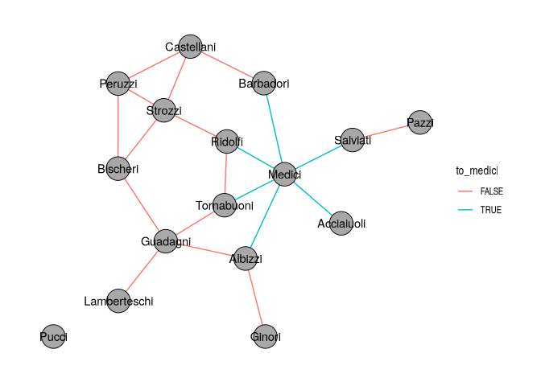
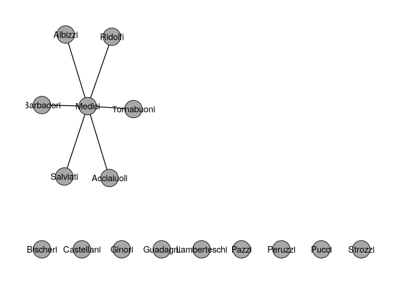
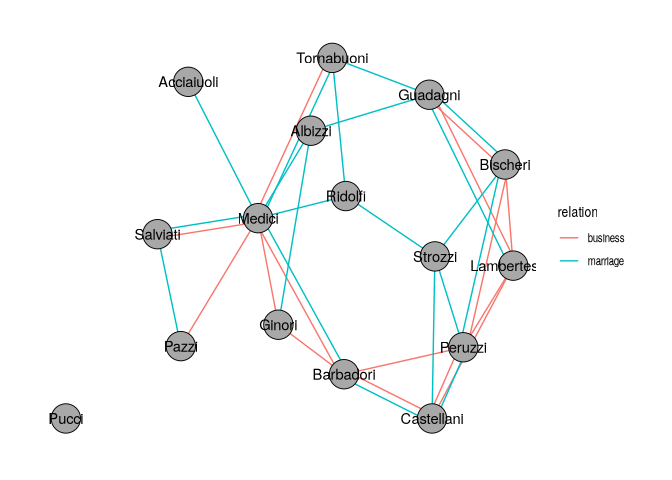
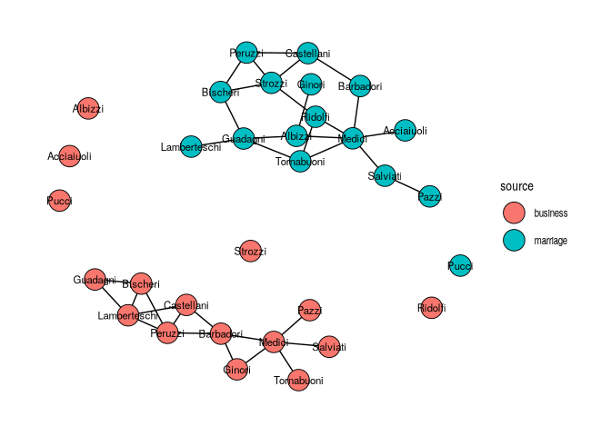

# Basics of tidygraph


[Source](https://schochastics.github.io/R4SNA/tidy/tidygraph-basics.html)

``` r
options(paged.print = FALSE)
```

``` r
libraries <- list(
  "tidygraph", "networkdata", "tidyverse", "ggraph", "zeallot"
)
invisible(lapply(libraries, library, character.only = TRUE))
```

# Graph Structures

``` r
(flo_tidy <- as_tbl_graph(flo_marriage))
```

    # A tbl_graph: 16 nodes and 20 edges
    #
    # An undirected simple graph with 2 components
    #
    # Node Data: 16 × 4 (active)
       name         wealth priors  ties
       <chr>         <dbl>  <dbl> <dbl>
     1 Acciaiuoli       10     53     2
     2 Albizzi          36     65     3
     3 Barbadori        55      0    14
     4 Bischeri         44     12     9
     5 Castellani       20     22    18
     6 Ginori           32      0     9
     7 Guadagni          8     21    14
     8 Lamberteschi     42      0    14
     9 Medici          103     53    54
    10 Pazzi            48      0     7
    11 Peruzzi          49     42    32
    12 Pucci             3      0     1
    13 Ridolfi          27     38     4
    14 Salviati         10     35     5
    15 Strozzi         146     74    29
    16 Tornabuoni       48      0     7
    #
    # Edge Data: 20 × 2
       from    to
      <int> <int>
    1     1     9
    2     2     6
    3     2     7
    # ℹ 17 more rows

``` r
class(flo_tidy)
```

    [1] "tbl_graph" "igraph"   

If you need to build a network from scratch, `tbl_graph()` takes the two
data frames directly and is essentially the tidy counterpart of
`graph_from_data_frame()`. For the common random graph generators, the
`create_*()` family produces deterministic graphs (lattices, stars,
rings) and `play_*()` produces stochastic ones (Erdős–Rényi,
preferential attachment, island models).

``` r
create_ring(5)
```

    # A tbl_graph: 5 nodes and 5 edges
    #
    # An undirected simple graph with 1 component
    #
    # Node Data: 5 × 0 (active)
    #
    # Edge Data: 5 × 2
       from    to
      <int> <int>
    1     1     2
    2     2     3
    3     3     4
    # ℹ 2 more rows

``` r
play_gnp(10, 0.3)
```

    # A tbl_graph: 10 nodes and 23 edges
    #
    # A directed simple graph with 1 component
    #
    # Node Data: 10 × 0 (active)
    #
    # Edge Data: 23 × 2
       from    to
      <int> <int>
    1     5     1
    2     7     1
    3     8     1
    # ℹ 20 more rows

``` r
play_barabasi_albert(10, 2)
```

    # A tbl_graph: 10 nodes and 9 edges
    #
    # A rooted tree
    #
    # Node Data: 10 × 0 (active)
    #
    # Edge Data: 9 × 2
       from    to
      <int> <int>
    1     2     1
    2     3     1
    3     4     1
    # ℹ 6 more rows

# Standard verbs

Verbs work on the active table (nodes or edges), set with `activate`.

``` r
flo_tidy %>% activate(edges)
```

    # A tbl_graph: 16 nodes and 20 edges
    #
    # An undirected simple graph with 2 components
    #
    # Edge Data: 20 × 2 (active)
        from    to
       <int> <int>
     1     1     9
     2     2     6
     3     2     7
     4     2     9
     5     3     5
     6     3     9
     7     4     7
     8     4    11
     9     4    15
    10     5    11
    11     5    15
    12     7     8
    13     7    16
    14     9    13
    15     9    14
    16     9    16
    17    10    14
    18    11    15
    19    13    15
    20    13    16
    #
    # Node Data: 16 × 4
      name       wealth priors  ties
      <chr>       <dbl>  <dbl> <dbl>
    1 Acciaiuoli     10     53     2
    2 Albizzi        36     65     3
    3 Barbadori      55      0    14
    # ℹ 13 more rows

A useful trick when you need information from the other table is `.N()`
and `.E()`: `.N()` returns the node table while edges are active, and
`.E()` returns the edge table while nodes are active.

``` r
(flo_medi <- flo_tidy %>% 
  activate("edges") %>% 
  mutate(
    to_medici = (.N()$name[from] == "Medici" |
                   .N()$name[to] == "Medici")
  ))
```

    # A tbl_graph: 16 nodes and 20 edges
    #
    # An undirected simple graph with 2 components
    #
    # Edge Data: 20 × 3 (active)
        from    to to_medici
       <int> <int> <lgl>    
     1     1     9 TRUE     
     2     2     6 FALSE    
     3     2     7 FALSE    
     4     2     9 TRUE     
     5     3     5 FALSE    
     6     3     9 TRUE     
     7     4     7 FALSE    
     8     4    11 FALSE    
     9     4    15 FALSE    
    10     5    11 FALSE    
    11     5    15 FALSE    
    12     7     8 FALSE    
    13     7    16 FALSE    
    14     9    13 TRUE     
    15     9    14 TRUE     
    16     9    16 TRUE     
    17    10    14 FALSE    
    18    11    15 FALSE    
    19    13    15 FALSE    
    20    13    16 FALSE    
    #
    # Node Data: 16 × 4
      name       wealth priors  ties
      <chr>       <dbl>  <dbl> <dbl>
    1 Acciaiuoli     10     53     2
    2 Albizzi        36     65     3
    3 Barbadori      55      0    14
    # ℹ 13 more rows

``` r
ggraph(flo_medi, "stress") +
  geom_edge_link0(aes(edge_colour = to_medici)) +
  geom_node_point(shape = 21, size = 10, fill = "grey66") +
  geom_node_text(aes(label = name)) +
  theme_graph()
```



Filtering on nodes also drops every edge that was incident to a removed
node; filtering on edges leaves the node set intact.

``` r
flo_medi %>% 
  activate("edges") %>% 
  filter(to_medici) %>% 
  ggraph("stress", bbox = 10) +
  geom_edge_link0(edge_color = "black") +
  geom_node_point(shape = 21, size = 10, fill = "grey66") +
  geom_node_text(aes(label = name)) +
  theme_graph()  
```



# Joins

`graph_join()` merges two `tbl_graph` objects on a shared node key (by
default the `name` column). Nodes that appear in both graphs are
identified; edges from both graphs are kept.

``` r
flo_business_tidy <- as_tbl_graph(flo_business)
```

``` r
c(marriage_rel, business_rel) %<-%
  map2(list(flo_tidy, flo_business_tidy),
      list("marriage", "business"),
      \(x, y) x %>% 
        activate("edges") %>% 
        mutate(relation = y))

marriage_rel %>% 
  graph_join(business_rel, by = "name") %>% 
  ggraph("stress") +
  geom_edge_parallel0(aes(edge_color = relation)) +
  geom_node_point(shape = 21, size = 10, fill = "grey66") +
  geom_node_text(aes(label = name)) +
  theme_graph()
```



When the goal is instead to keep two networks side by side, for example
to lay them out together without merging their node sets,
`bind_graphs()` returns the disjoint union.

``` r
bind_graphs(
  flo_tidy %>% activate("nodes") %>% mutate(source = "marriage"),
  flo_business_tidy %>% activate("nodes") %>% mutate(source = "business")
) %>% 
  ggraph("kk") +
  geom_edge_link0() +
  geom_node_point(aes(fill = source), shape = 21, size = 8) +
  geom_node_text(aes(label = name), size = 3) +
  theme_graph()
```



Two more verbs, bind_nodes() and bind_edges(), append rows to the active
table and are the tidygraph analogues of dplyr::bind_rows(). They are
useful when new nodes or edges arrive as a plain data frame.

This is the path of least resistance for attaching an external attribute
table keyed on the node name.

``` r
family_estate <- data.frame(
  name = c("Medici", "Strozzi", "Peruzzi", "Guadagni"),
  estate = c(15, 14, 2, 2)
)

flo_tidy %>% 
  activate("nodes") %>% 
  left_join(family_estate, by = "name")
```

    # A tbl_graph: 16 nodes and 20 edges
    #
    # An undirected simple graph with 2 components
    #
    # Node Data: 16 × 5 (active)
       name         wealth priors  ties estate
       <chr>         <dbl>  <dbl> <dbl>  <dbl>
     1 Acciaiuoli       10     53     2     NA
     2 Albizzi          36     65     3     NA
     3 Barbadori        55      0    14     NA
     4 Bischeri         44     12     9     NA
     5 Castellani       20     22    18     NA
     6 Ginori           32      0     9     NA
     7 Guadagni          8     21    14      2
     8 Lamberteschi     42      0    14     NA
     9 Medici          103     53    54     15
    10 Pazzi            48      0     7     NA
    11 Peruzzi          49     42    32      2
    12 Pucci             3      0     1     NA
    13 Ridolfi          27     38     4     NA
    14 Salviati         10     35     5     NA
    15 Strozzi         146     74    29     14
    16 Tornabuoni       48      0     7     NA
    #
    # Edge Data: 20 × 2
       from    to
      <int> <int>
    1     1     9
    2     2     6
    3     2     7
    # ℹ 17 more rows

# Special graph verbs

`morph()`: A morph temporarily reshapes a graph into a different
representation, for example the connected components, the shortest path
between two nodes, the line graph, or the minimum spanning tree, without
committing to that change. Verbs chained after morph() run on the
morphed representation, and unmorph() returns to the original graph,
propagating any attributes that were added inside the morph back onto
the original nodes or edges.

As a first example, we attach the size of each connected component to
every node. Inside the to_components morph the graph is effectively
split into one sub-graph per component, so graph_order() evaluates
separately for each.

``` r
flo_tidy %>% 
  activate("nodes") %>% 
  morph(to_components) %>% 
  mutate(component_size = graph_order()) %>% 
  unmorph()
```

    # A tbl_graph: 16 nodes and 20 edges
    #
    # An undirected simple graph with 2 components
    #
    # Node Data: 16 × 5 (active)
       name         wealth priors  ties component_size
       <chr>         <dbl>  <dbl> <dbl>          <dbl>
     1 Acciaiuoli       10     53     2             15
     2 Albizzi          36     65     3             15
     3 Barbadori        55      0    14             15
     4 Bischeri         44     12     9             15
     5 Castellani       20     22    18             15
     6 Ginori           32      0     9             15
     7 Guadagni          8     21    14             15
     8 Lamberteschi     42      0    14             15
     9 Medici          103     53    54             15
    10 Pazzi            48      0     7             15
    11 Peruzzi          49     42    32             15
    12 Pucci             3      0     1              1
    13 Ridolfi          27     38     4             15
    14 Salviati         10     35     5             15
    15 Strozzi         146     74    29             15
    16 Tornabuoni       48      0     7             15
    #
    # Edge Data: 20 × 2
       from    to
      <int> <int>
    1     1     9
    2     2     6
    3     2     7
    # ℹ 17 more rows

`convert` is used if you don’t want to `unmorph`.

``` r
medici_id <- which(igraph::V(flo_tidy)$name == "Medici")
pazzi_id <- which(igraph::V(flo_tidy)$name == "Pazzi")

flo_tidy %>% 
  convert(to_shortest_path, medici_id, pazzi_id)
```

    # A tbl_graph: 3 nodes and 2 edges
    #
    # An unrooted tree
    #
    # Node Data: 3 × 5 (active)
      name     wealth priors  ties .tidygraph_node_index
      <chr>     <dbl>  <dbl> <dbl>                 <int>
    1 Medici      103     53    54                     9
    2 Pazzi        48      0     7                    10
    3 Salviati     10     35     5                    14
    #
    # Edge Data: 2 × 3
       from    to .tidygraph_edge_index
      <int> <int>                 <int>
    1     1     3                    15
    2     2     3                    17

A related verb, `crystallise()`, is worth knowing for morphs that
naturally return multiple graphs, for instance `to_components` again, or
`to_local_neighborhood` called on several nodes at once. It materialises
the morph as a tibble with one row per sub-graph, which is convenient
when you want to iterate.

The catalogue of morphers is large: `to_undirected`, `to_directed`,
`to_simple`, `to_subgraph`, `to_contracted`, `to_complement`,
`to_minimum_spanning_tree`, `to_dominator_tree`, `to_linegraph`,
`to_subcomponent`, and more. Rather than enumerate them all, the
recommendation is to browse `?morphers` once so you know what is
available and reach for it when the shape of your problem calls for a
transformed graph.
