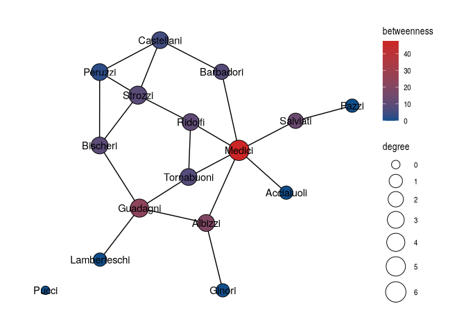
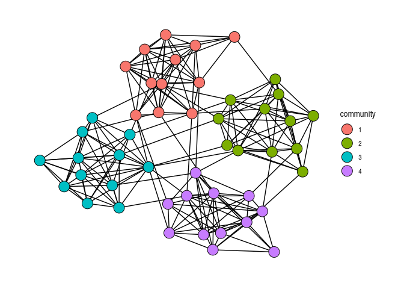
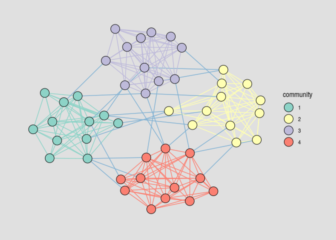
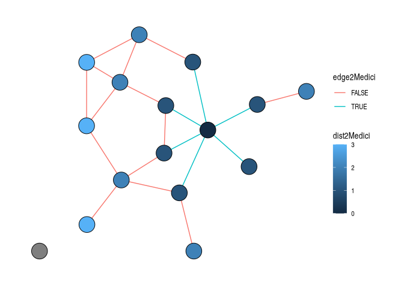

# Descriptive Network Analysis


[Source](https://schochastics.github.io/R4SNA/tidy/tidygraph-descriptive.html)

``` r
options(paged.print = FALSE)
```

``` r
libraries <- list(
  "tidygraph", "networkdata", "tidyverse", 
  "ggraph", "zeallot", "graphlayouts"
)
invisible(lapply(libraries, library, character.only = TRUE))
```

``` r
flo_tidy <- as_tbl_graph(flo_marriage)
```

# Centrality

Centrality indices live in the centrality\_\*() function family. The
family covers everything implemented in igraph — degree, closeness,
betweenness, eigenvector, PageRank, Katz, hub and authority scores —
together with the richer catalogue exposed by the netrankr package.

``` r
flo_tidy %>% 
  activate("nodes") %>% 
  mutate(
    degree = centrality_degree(),
    betweenness = centrality_betweenness()
  ) %>% 
  ggraph("stress", bbox = 10) +
  geom_edge_link0(edge_color = "black") +
  geom_node_point(aes(size = degree, fill = betweenness), shape = 21) +
  geom_node_text(aes(label = name)) +
  scale_fill_gradient(low = "#104E8B", high = "#CD2626") +
  scale_size(range = c(4, 10)) +
  theme_graph()
```

<div id="fig-centrality-example">



Figure 1: Florentine marriage network with node size scaled to degree
centrality and fill scaled to betweenness centrality.

</div>

# Clustering

Community detection algorithms are exposed through the parallel
`group_*()` family: `group_louvain`, `group_infomap`,
`group_edge_betweenness`, `group_walktrap`, `group_leading_eigen`,
`group_fast_greedy`, `group_label_prop`, `group_spinglass`,
`group_components`, `group_biconnected_component`, and a few more. Each
returns an integer membership vector the length of the node table, which
means the idiomatic usage is `mutate(community = as.factor(group_*()))`
— coerce to factor so the result becomes a natural input to a `fill` or
`color` aesthetic.

``` r
play_islands(4, 12, 0.8, 4) %>% 
  mutate(community = as.factor(group_louvain())) %>% 
  ggraph("stress") +
  geom_edge_link0() +
  geom_node_point(aes(fill = community), shape = 21, size = 6) +
  theme_graph()
```

<div id="fig-clustering-louvain">



Figure 2: Louvain community detection applied to a graph with planted
community structure generated by `play_islands()`. Node fill encodes the
recovered community membership.

</div>

Color edges by community.

``` r
play_islands(4, 12, 0.8, 4) %>% 
  mutate(community = as.factor(group_louvain())) %>% 
  activate("edges") %>% 
  mutate(
    community = as.factor(ifelse(
      .N()$community[from] == .N()$community[to],
      .N()$community[from], 5
    ))
  ) %>% 
  ggraph("stress") +
  geom_edge_link0(aes(edge_colour = community), show.legend = F) +
  geom_node_point(aes(fill = community), shape = 21, size = 6) +
  scale_fill_brewer(palette = "Set3") +
  scale_edge_color_brewer(palette = "Set3") +
  theme_graph(background = "grey88")
```

<div id="fig-clustering-bridges">



Figure 3: Same graph as in
<a href="#fig-clustering-louvain" class="quarto-xref">Figure 2</a>, with
edges additionally colored to distinguish intra-community ties from
bridges between communities.

</div>

# Other node or edge level functions

Beyond centrality and grouping, tidygraph harmonises a long list of
node- and edge-level measures behind two mirror-image function families:
`node_*()` returns a vector of length `vcount()`, and `edge_*()` returns
a vector of length `ecount()`. Which family you reach for is determined
by which table you have activated. The families cover distance
(`node_distance_to`, `node_distance_from`, `node_eccentricity`), local
structure (`node_triangles`, `node_coreness`,
`node_local_transitivity`), and tests on edges (`edge_is_loop`,
`edge_is_multiple`, `edge_is_mutual`, `edge_is_incident`), among many
others. As with the centrality and group families, typing `node_` or
`edge_` at the prompt and pressing Tab gives the full list.

``` r
flo_tidy %>% 
  activate("nodes") %>% 
  mutate(dist2Medici = node_distance_to(nodes = 9)) %>% 
  activate("edges") %>% 
  mutate(edge2Medici = edge_is_incident(9)) %>% 
  ggraph("stress") +
  geom_edge_link0(aes(edge_color = edge2Medici)) +
  geom_node_point(aes(fill = dist2Medici), size = 9, shape = 21) +
  theme_graph()
```

<div id="fig-distance-medici">



Figure 4: Florentine marriage network with node fill encoding the
geodesic distance to the Medici family and edge color flagging ties
incident to the Medici.

</div>

The node id 9 refers to the Medici, which happens to be the ninth row of
the node table. Passing the index directly is the quickest way when you
already know the position; for a name-based lookup you can equally write
nodes = which(.N()\$name == “Medici”).
